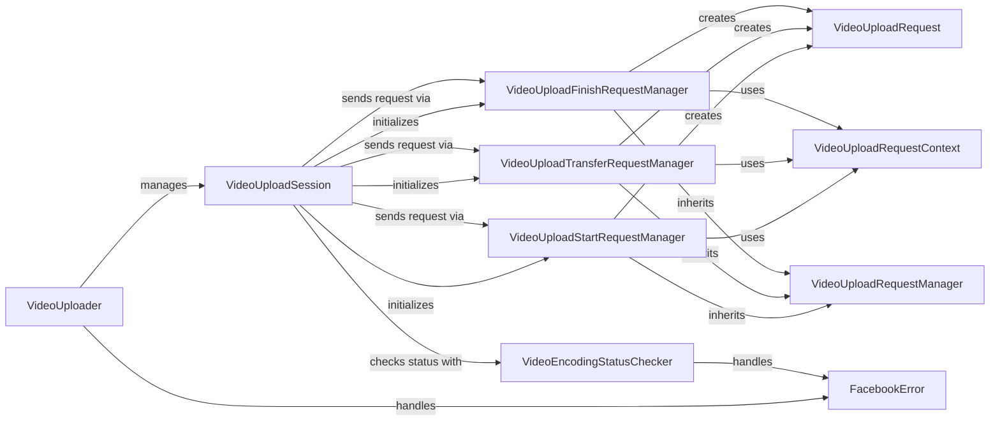

## Component Details

### VideoUploader
The VideoUploader component is responsible for orchestrating the entire video uploading process to Facebook. It initializes and manages the VideoUploadSession, handling the high-level logic of starting, transferring, and finalizing the video upload. It also handles potential exceptions that may arise during the process, ensuring a robust and reliable upload experience.
- **Related Classes/Methods**: `facebook_business.video_uploader.VideoUploader`

### VideoUploadSession
The VideoUploadSession component manages a single video upload session. It coordinates the sequence of requests required to upload a video, including starting the session, transferring video data in chunks, and finishing the upload. It also integrates with the VideoEncodingStatusChecker to monitor the encoding status of the uploaded video.
- **Related Classes/Methods**: `facebook_business.video_uploader.VideoUploadSession`

### VideoUploadRequestManager
The VideoUploadRequestManager component serves as an abstract base class for managing different types of video upload requests. Concrete subclasses, such as VideoUploadStartRequestManager, VideoUploadTransferRequestManager, and VideoUploadFinishRequestManager, inherit from this class and implement specific logic for creating and sending their respective requests. It centralizes common request management functionalities.
- **Related Classes/Methods**: `facebook_business.video_uploader.VideoUploadRequestManager`

### VideoUploadStartRequestManager
The VideoUploadStartRequestManager component is responsible for managing the request to initiate a video upload session. It creates a VideoUploadRequest with the appropriate parameters and sends it to the Facebook API. It uses the VideoUploadRequestContext to provide the necessary context for the request.
- **Related Classes/Methods**: `facebook_business.video_uploader.VideoUploadStartRequestManager`

### VideoUploadTransferRequestManager
The VideoUploadTransferRequestManager component handles the transfer of video data chunks to Facebook. It creates VideoUploadRequest objects for each chunk of data and sends them to the API. It also utilizes the VideoUploadRequestContext to ensure the requests are properly configured.
- **Related Classes/Methods**: `facebook_business.video_uploader.VideoUploadTransferRequestManager`

### VideoUploadFinishRequestManager
The VideoUploadFinishRequestManager component manages the final request to complete the video upload session. It creates a VideoUploadRequest to signal the end of the upload and sends it to the Facebook API, using the VideoUploadRequestContext for context.
- **Related Classes/Methods**: `facebook_business.video_uploader.VideoUploadFinishRequestManager`

### VideoUploadRequest
The VideoUploadRequest component encapsulates a single video upload request to the Facebook API. It sets the necessary parameters for the request and sends it to the API endpoint. It is used by the different request managers to send start, transfer, and finish requests.
- **Related Classes/Methods**: `facebook_business.video_uploader.VideoUploadRequest`

### VideoUploadRequestContext
The VideoUploadRequestContext component provides the context required for video upload requests. It stores information such as the upload session ID and other relevant parameters that are needed to properly configure the requests.
- **Related Classes/Methods**: `facebook_business.video_uploader.VideoUploadRequestContext`

### VideoEncodingStatusChecker
The VideoEncodingStatusChecker component is responsible for monitoring the encoding status of the uploaded video. It periodically checks the status of the video until it is ready for use. It handles potential FacebookError exceptions that may occur during the status checking process.
- **Related Classes/Methods**: `facebook_business.video_uploader.VideoEncodingStatusChecker`
