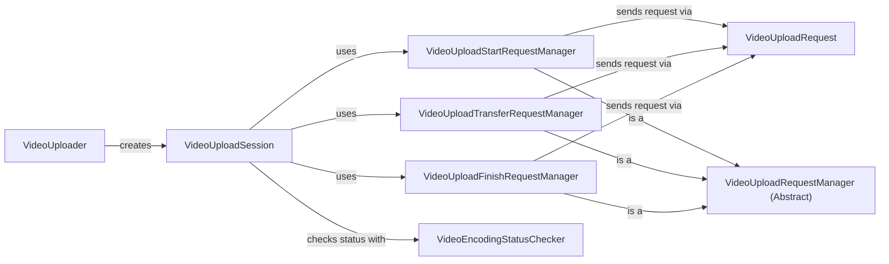

## Component Details

### VideoUploader
The VideoUploader component serves as the entry point for uploading video content to Facebook. It initializes and manages the video upload session, orchestrating the entire process from start to finish. It takes an AdVideo object and a flag to wait for encoding, creates a VideoUploadSession, and calls its start method to begin the upload.
- **Related Classes/Methods**: `facebook_business.video_uploader.VideoUploader:upload`

### VideoUploadSession
The VideoUploadSession component manages a single video upload session. It coordinates the start, transfer, and finish requests, ensuring that the video is successfully uploaded to Facebook. It utilizes VideoUploadStartRequestManager, VideoUploadTransferRequestManager, and VideoUploadFinishRequestManager to handle the different stages of the upload process. It also uses VideoEncodingStatusChecker to monitor the video's encoding status.
- **Related Classes/Methods**: `facebook_business.video_uploader.VideoUploadSession:__init__`, `facebook_business.video_uploader.VideoUploadSession:start`, `facebook_business.video_uploader.VideoUploadSession:getStartRequestContext`, `facebook_business.video_uploader.VideoUploadSession:getTransferRequestContext`, `facebook_business.video_uploader.VideoUploadSession:getFinishRequestContext`

### VideoUploadRequestManager (Abstract)
This abstract component defines the interface for managing video upload requests. Concrete implementations, such as VideoUploadStartRequestManager, VideoUploadTransferRequestManager, and VideoUploadFinishRequestManager, handle the specific details of each type of request. They are responsible for creating and sending the requests to the Facebook API.
- **Related Classes/Methods**: _None_

### VideoUploadStartRequestManager
The VideoUploadStartRequestManager component manages the sending of the video upload start request. It creates a VideoUploadRequest, sets its parameters using getParamsFromContext, and sends the request to the Facebook API. This component initiates the video upload session.
- **Related Classes/Methods**: `facebook_business.video_uploader.VideoUploadStartRequestManager:send_request`, `facebook_business.video_uploader.VideoUploadStartRequestManager:getParamsFromContext`

### VideoUploadTransferRequestManager
The VideoUploadTransferRequestManager component manages the sending of video data chunks. It reads the video file in chunks and sends each chunk to the Facebook API using a VideoUploadRequest. It handles retries on transient errors and manages offsets based on the API response. This component is responsible for transferring the video data to Facebook.
- **Related Classes/Methods**: `facebook_business.video_uploader.VideoUploadTransferRequestManager:send_request`, `facebook_business.video_uploader.VideoUploadTransferRequestManager:getParamsFromContext`

### VideoUploadFinishRequestManager
The VideoUploadFinishRequestManager component manages the sending of the video upload finish request. It creates a VideoUploadRequest, sets its parameters using getParamsFromContext, and sends the request to the Facebook API. This component finalizes the video upload session.
- **Related Classes/Methods**: `facebook_business.video_uploader.VideoUploadFinishRequestManager:send_request`, `facebook_business.video_uploader.VideoUploadFinishRequestManager:getParamsFromContext`

### VideoUploadRequest
The VideoUploadRequest component encapsulates a single video upload request to the Facebook API. It sets parameters and sends the request. It is used by the different request managers to send the start, transfer, and finish requests.
- **Related Classes/Methods**: `facebook_business.video_uploader.VideoUploadRequest`, `facebook_business.video_uploader.VideoUploadRequest.setParams`, `facebook_business.video_uploader.VideoUploadRequest.send`

### VideoEncodingStatusChecker
The VideoEncodingStatusChecker component checks the encoding status of the uploaded video until it's ready. It polls the Facebook API for the video's status until it becomes 'ready' or a timeout occurs. It retrieves the video's status from the Facebook API.
- **Related Classes/Methods**: `facebook_business.video_uploader.VideoEncodingStatusChecker:waitUntilReady`, `facebook_business.video_uploader.VideoEncodingStatusChecker:getStatus`
