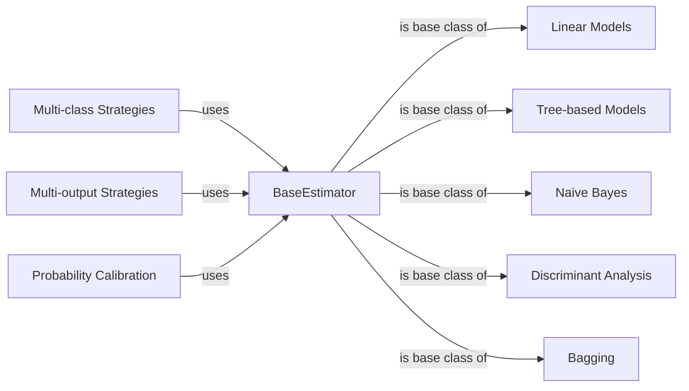

## Component Details

The Core Model Training and Prediction component encompasses a diverse set of machine learning algorithms for classification, regression, and clustering. It provides a wide array of estimators, including linear models, tree-based models, and neural networks, each equipped with fit and predict methods. The primary function of this component is to learn patterns from training data and generate predictions on new, unseen data. It also includes meta-estimators for multi-class, multi-output, and probability calibration tasks.

### BaseEstimator
The BaseEstimator serves as the foundation for all estimators in scikit-learn, providing common methods for setting and retrieving parameters. It encapsulates the basic functionality required for model training and prediction, ensuring consistency across different estimator types. It is the parent class for all the other components.
- **Related Classes/Methods**: `sklearn.base.BaseEstimator`

### Linear Models
This component includes various linear models for regression and classification, such as LinearRegression, LogisticRegression, and Ridge. These models learn linear relationships between features and target variables, providing efficient and interpretable solutions for a wide range of problems. They inherit from `BaseEstimator` and implement `fit` and `predict` methods.
- **Related Classes/Methods**: `sklearn.linear_model`

### Tree-based Models
This component encompasses decision tree-based models like DecisionTreeClassifier, DecisionTreeRegressor, RandomForestClassifier, and GradientBoostingClassifier. These models partition the feature space into regions and make predictions based on the region a data point falls into. They are versatile and can capture non-linear relationships. They inherit from `BaseEstimator` and implement `fit` and `predict` methods.
- **Related Classes/Methods**: `sklearn.tree._classes`, `sklearn.ensemble._forest`, `sklearn.ensemble._gb`

### Naive Bayes
This component includes Naive Bayes classifiers such as GaussianNB, MultinomialNB, and BernoulliNB. These models apply Bayes' theorem with strong (naive) independence assumptions between the features. They are computationally efficient and perform well in high-dimensional spaces. They inherit from `BaseEstimator` and implement `fit` and `predict` methods.
- **Related Classes/Methods**: `sklearn.naive_bayes`

### Discriminant Analysis
This component includes LinearDiscriminantAnalysis and QuadraticDiscriminantAnalysis, which are used for classification and dimensionality reduction. They model the class-conditional distributions of the data and use Bayes' rule to make predictions. They inherit from `BaseEstimator` and implement `fit` and `predict` methods.
- **Related Classes/Methods**: `sklearn.discriminant_analysis`

### Multi-class Strategies
This component includes meta-estimators like OneVsRestClassifier and OneVsOneClassifier, which extend binary classifiers to handle multi-class classification problems. They train multiple binary classifiers and combine their predictions to make multi-class predictions. They use the `fit` and `predict` methods of the underlying estimators.
- **Related Classes/Methods**: `sklearn.multiclass`

### Multi-output Strategies
This component includes meta-estimators like MultiOutputClassifier and MultiOutputRegressor, which extend single-output classifiers and regressors to handle multi-label classification and multi-target regression problems. They train one estimator per target variable. They use the `fit` and `predict` methods of the underlying estimators.
- **Related Classes/Methods**: `sklearn.multioutput`

### Probability Calibration
This component includes CalibratedClassifierCV, which calibrates the predicted probabilities of a classifier using cross-validation. It improves the reliability of probability estimates, which is important for decision-making. It uses the `fit` and `predict` methods of the underlying estimators.
- **Related Classes/Methods**: `sklearn.calibration`

### Bagging
This component includes BaggingClassifier and BaggingRegressor, which implement bagging ensembles. They inherit from `BaseBagging` and create base estimators using `_get_estimator`. Bagging involves training multiple instances of the same estimator on different subsets of the training data and averaging their predictions to reduce variance and improve generalization.
- **Related Classes/Methods**: `sklearn.ensemble._bagging`
