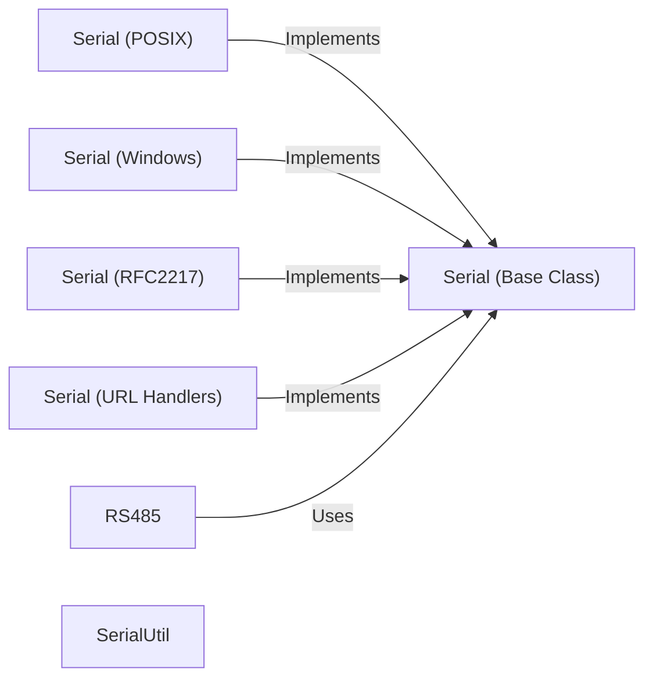

## Component Details

The PySerial library provides a consistent interface for serial port communication across different operating systems. It abstracts the platform-specific details of serial port access, allowing applications to read and write data to serial ports using a unified API. The core functionality is provided by the `SerialBase` class, which defines the common interface, while platform-specific implementations (`Serial` in `serialposix`, `serialwin32`, etc.) handle the actual port communication using system calls or APIs. Utility functions and exception classes in `serialutil` support the core functionality. Higher-level features like RFC2217 support and RS485 control are built on top of the core serial port interface.

### Serial (Base Class)
The base class `SerialBase` in `serialutil` defines the common interface for serial port communication, including methods for reading, writing, and configuring the port. It provides default implementations for some methods and raises `NotImplementedError` for platform-specific methods.
- **Related Classes/Methods**: `serial/serialutil.py`

### Serial (POSIX)
The `Serial` class in `serialposix` provides a POSIX-specific implementation of the serial port interface, using system calls like `read`, `write`, `tcgetattr`, and `tcsetattr` to interact with the serial port. It handles port opening, closing, configuration, and data transfer on POSIX systems.
- **Related Classes/Methods**: `serial/serialposix.py`

### Serial (Windows)
The `Serial` class in `serialwin32` provides a Windows-specific implementation of the serial port interface, using the Win32 API to interact with the serial port. It handles port opening, closing, configuration, and data transfer on Windows systems.
- **Related Classes/Methods**: `serial/serialwin32.py`

### Serial (RFC2217)
The `Serial` class in `rfc2217` implements the RFC2217 protocol for communicating with serial ports over a network. It handles the Telnet-based protocol for configuring and transferring data to a remote serial port.
- **Related Classes/Methods**: `serial/rfc2217.py`

### Serial (URL Handlers)
The `urlhandler` subpackage provides classes for opening serial ports using URLs. Different protocols are supported, such as `loop` (loopback), `socket` (TCP socket), `cp2110` (Silicon Labs CP2110 USB-to-UART bridge), and `spy` (protocol spy). Each protocol has its own `Serial` class that implements the specific communication logic.
- **Related Classes/Methods**: `serial/urlhandler/protocol_loop.py`, `serial/urlhandler/protocol_socket.py`, `serial/urlhandler/protocol_cp2110.py`, `serial/urlhandler/protocol_spy.py`

### RS485
The `RS485` class in `rs485` provides support for RS485 communication, including control over the transmit enable (RTS) pin. It allows applications to easily manage the direction of data flow in RS485 networks.
- **Related Classes/Methods**: `serial/rs485.py`

### SerialUtil
The `serialutil` module provides utility functions and constants used throughout the PySerial library, such as the `SerialException` class and the `PortNotOpenError` class.
- **Related Classes/Methods**: `serial/serialutil.py`
