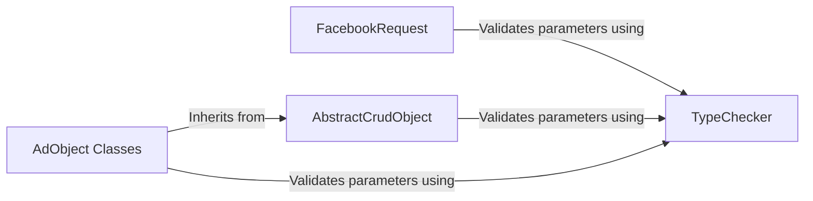

## Component Details

### TypeChecker
The TypeChecker class is responsible for validating the types of parameters passed to the Facebook API. It maintains type information and enum data, providing methods to verify if a parameter key is valid, if a value matches the expected type, and to convert string values to primitive types. It plays a crucial role in ensuring data integrity by validating parameters before they are sent to the API.
- **Related Classes/Methods**: `facebook_business.typechecker.TypeChecker`

### FacebookRequest
The FacebookRequest class encapsulates an HTTP request to the Facebook Graph API. It leverages the TypeChecker to validate request parameters before sending the request to the API. This ensures that all parameters conform to the expected format and structure, contributing to the overall data integrity of the system.
- **Related Classes/Methods**: `facebook_business.api.FacebookRequest`

### AbstractCrudObject
The AbstractCrudObject class provides the foundation for CRUD (Create, Read, Update, Delete) operations on Facebook API objects. Classes like AdAccount, AdSet, and Campaign inherit from this class. It utilizes the TypeChecker to validate parameters associated with these operations, ensuring data consistency and correctness.
- **Related Classes/Methods**: `facebook_business.adobjects.abstractcrudobject.AbstractCrudObject`

### AdObject Classes
AdObject Classes, including AdAccount, Campaign, and AdSet, represent specific Facebook objects. These classes inherit from AbstractCrudObject and rely on the TypeChecker to validate parameters during object creation, updates, and retrieval. This ensures that data associated with these objects adheres to the expected format and structure, maintaining data integrity.
- **Related Classes/Methods**: `facebook_business.adobjects.adaccount.AdAccount`, `facebook_business.adobjects.campaign.Campaign`, `facebook_business.adobjects.adset.AdSet`, `facebook_business.adobjects.productcatalog.ProductCatalog`, `facebook_business.adobjects.flight.Flight`, `facebook_business.adobjects.pagebroadcast.PageBroadcast`, `facebook_business.adobjects.advainstance.AdvAInstance`, `facebook_business.adobjects.stories.Stories`, `facebook_business.adobjects.businessuser.BusinessUser`, `facebook_business.adobjects.adsreportbuildersavedreport.AdsReportBuilderSavedReport`, `facebook_business.adobjects.catalogwebsitesettings.CatalogWebsiteSettings`, `facebook_business.adobjects.adspivotrules.AdsPivotRules`, `facebook_business.adobjects.igbcadspermission.IGBCAdsPermission`, `facebook_business.adobjects.igupcomingevent.IGUpcomingEvent`, `facebook_business.adobjects.offlinetermsofservice.OfflineTermsOfService`, `facebook_business.adobjects.hotel.Hotel`
