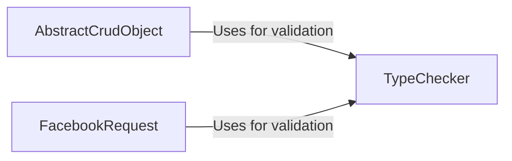

## Component Details

### TypeChecker
The TypeChecker component is responsible for validating the types and values of parameters passed to the Facebook API. It defines various validation methods for different data types and structures, ensuring data integrity and preventing errors due to incorrect data formats. It acts as a central point for all data validation within the SDK.
- **Related Classes/Methods**: `facebook_business.typechecker.TypeChecker`

### AbstractCrudObject
The AbstractCrudObject component serves as a base class for various Facebook API objects, providing common CRUD (Create, Read, Update, Delete) operations. It defines methods for making API requests, handling responses, and managing object properties. It relies on the TypeChecker to validate the parameters before making API calls, ensuring data consistency.
- **Related Classes/Methods**: `facebook_business.adobjects.abstractcrudobject.AbstractCrudObject`

### FacebookRequest
The FacebookRequest component encapsulates an HTTP request to the Facebook Graph API. It handles parameter addition, request execution, and error handling. Before sending the request to the API, it utilizes the TypeChecker to validate the request parameters, ensuring that only valid data is sent to the Facebook API.
- **Related Classes/Methods**: `facebook_business.api.FacebookRequest`
