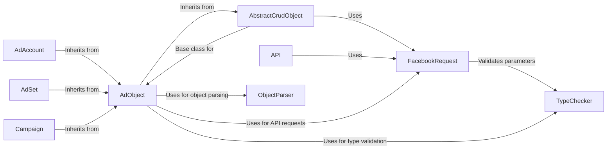

## Component Details

### AdObject
The AdObject class serves as a base class for various Facebook Ads objects, providing common functionalities and attributes. It provides a foundation for interacting with different data entities within the Facebook ecosystem.
- **Related Classes/Methods**: `facebook_business.adobjects.adobject.AdObject`

### AbstractCrudObject
Abstract class providing common CRUD (Create, Read, Update, Delete) operations for Facebook objects. It defines the basic interface for managing data entities within the Facebook ecosystem.
- **Related Classes/Methods**: `facebook_business.adobjects.abstractcrudobject.AbstractCrudObject`

### FacebookRequest
Encapsulates a request to the Facebook API, handling parameters, fields, and execution. It's used by other components to interact with the Facebook API, providing a standardized way to send requests and receive responses.
- **Related Classes/Methods**: `facebook_business.api.FacebookRequest`

### API
The API module is responsible for making the calls to the Facebook Graph API. It handles authentication, request construction, and response parsing, acting as the primary interface for communicating with the Facebook platform.
- **Related Classes/Methods**: `facebook_business.api`

### TypeChecker
Validates the types of parameters passed to the Facebook API. It ensures that the data being sent to Facebook is of the correct type, maintaining data integrity and preventing errors.
- **Related Classes/Methods**: `facebook_business.typechecker.TypeChecker`

### ObjectParser
Parses objects returned from the Facebook API. It transforms the raw data received from Facebook into usable Python objects, facilitating data access and manipulation.
- **Related Classes/Methods**: `facebook_business.adobjects.objectparser.ObjectParser`

### AdAccount
Represents a Facebook Ad Account, providing methods to interact with the ad account's data, such as creating, reading, updating, and deleting campaigns, ad sets, and ads.
- **Related Classes/Methods**: `facebook_business.adobjects.adaccount.AdAccount`

### AdSet
Represents a Facebook Ad Set, providing methods to interact with the ad set's data, such as creating, reading, updating, and deleting ads, and managing targeting and budget.
- **Related Classes/Methods**: `facebook_business.adobjects.adset.AdSet`

### Campaign
Represents a Facebook Campaign, providing methods to interact with the campaign's data, such as creating, reading, updating, and deleting ad sets, and managing campaign objectives and budget.
- **Related Classes/Methods**: `facebook_business.adobjects.campaign.Campaign`
