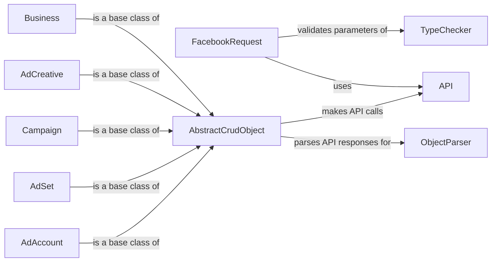

## Component Details

### API
The API component is responsible for handling the communication with the Facebook Graph API. It encapsulates the authentication process, constructs the requests, sends them to Facebook, and parses the responses. It provides a low-level interface for interacting with the API.
- **Related Classes/Methods**: `facebook_business.api.API`

### FacebookRequest
The FacebookRequest component encapsulates a single request to the Facebook API. It manages the parameters, fields, and HTTP method for the request. It uses the API component to execute the request and handles potential errors or exceptions.
- **Related Classes/Methods**: `facebook_business.api.FacebookRequest`

### TypeChecker
The TypeChecker component is responsible for validating the data types of parameters passed to the Facebook API. It ensures that the data being sent to Facebook conforms to the expected types, preventing errors and maintaining data integrity. It is used by the FacebookRequest component before sending a request.
- **Related Classes/Methods**: `facebook_business.typechecker.TypeChecker`

### AbstractCrudObject
The AbstractCrudObject component is an abstract base class that provides common CRUD (Create, Read, Update, Delete) operations for Facebook objects. It defines the basic structure and methods for interacting with Facebook objects, such as retrieving data, creating new objects, updating existing objects, and deleting objects. Concrete Facebook objects inherit from this class.
- **Related Classes/Methods**: `facebook_business.adobjects.abstractcrudobject.AbstractCrudObject`

### ObjectParser
The ObjectParser component is responsible for parsing the responses received from the Facebook API and converting them into Python objects. It takes the raw JSON data returned by the API and transforms it into instances of the appropriate classes, making it easier to work with the data in Python. It is used by AbstractCrudObject and its subclasses.
- **Related Classes/Methods**: `facebook_business.adobjects.objectparser.ObjectParser`

### AdAccount
The AdAccount component represents a Facebook Ad Account. It inherits from AbstractCrudObject and provides methods for managing ad campaigns, ad sets, ads, and other advertising-related entities within the ad account. It uses the API component to interact with the Facebook API.
- **Related Classes/Methods**: `facebook_business.adobjects.adaccount.AdAccount`

### AdSet
The AdSet component represents a Facebook Ad Set. It inherits from AbstractCrudObject and provides methods for managing targeting, budget, and schedule for a group of ads. It uses the API component to interact with the Facebook API.
- **Related Classes/Methods**: `facebook_business.adobjects.adset.AdSet`

### Campaign
The Campaign component represents a Facebook Campaign. It inherits from AbstractCrudObject and provides methods for managing the overall advertising objective and strategy. It uses the API component to interact with the Facebook API.
- **Related Classes/Methods**: `facebook_business.adobjects.campaign.Campaign`

### AdCreative
The AdCreative component represents a Facebook Ad Creative. It inherits from AbstractCrudObject and provides methods for managing the visual and textual content of an ad. It uses the API component to interact with the Facebook API.
- **Related Classes/Methods**: `facebook_business.adobjects.adcreative.AdCreative`

### Business
The Business component represents a Facebook Business. It inherits from AbstractCrudObject and provides methods for managing business assets, such as ad accounts, pages, and users. It uses the API component to interact with the Facebook API.
- **Related Classes/Methods**: `facebook_business.adobjects.business.Business`
