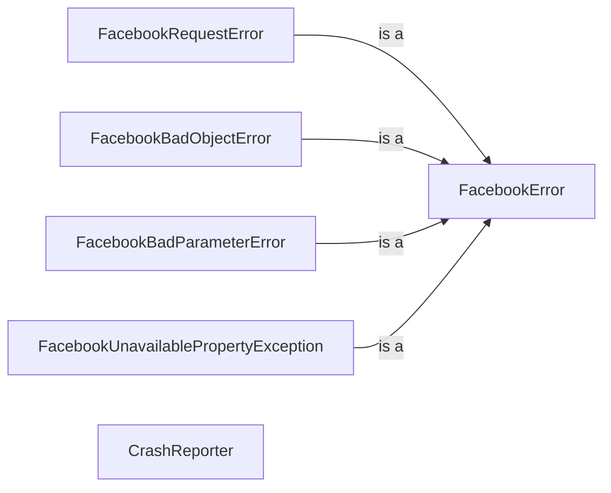

## Component Details

### FacebookError
Base class for all exceptions in the SDK. It serves as a common ancestor for all custom exceptions, providing a consistent interface for error handling throughout the library. It typically includes attributes for storing error codes and messages.
- **Related Classes/Methods**: `facebook_business.exceptions.FacebookError`

### FacebookRequestError
Represents an error returned by the Facebook API. This exception is raised when an API request fails, encapsulating details such as the error code, subcode, message, and HTTP status code. It allows developers to handle API-specific errors gracefully.
- **Related Classes/Methods**: `facebook_business.exceptions.FacebookRequestError`

### FacebookBadObjectError
Represents an error when an object is invalid. This exception is raised when the SDK detects an issue with an object being used, such as missing required fields or incorrect data types. It helps ensure data integrity and prevents unexpected behavior.
- **Related Classes/Methods**: `facebook_business.exceptions.FacebookBadObjectError`

### FacebookBadParameterError
Represents an error when a parameter is invalid. This exception is raised when a parameter passed to an API method is not valid, such as an incorrect format or value. It helps validate input and prevent errors caused by invalid parameters.
- **Related Classes/Methods**: `facebook_business.exceptions.FacebookBadParameterError`

### FacebookUnavailablePropertyException
Represents an error when a property is unavailable. This exception is raised when attempting to access a property that does not exist or is not accessible for the given object. It helps handle cases where properties are missing or restricted.
- **Related Classes/Methods**: `facebook_business.exceptions.FacebookUnavailablePropertyException`

### CrashReporter
Handles reporting crashes and exceptions to Facebook. It can be enabled to automatically catch and report exceptions, aiding in debugging and issue resolution. It interacts with the Facebook Ads API to send crash reports, providing valuable insights into application stability.
- **Related Classes/Methods**: `facebook_business.crashreporter.CrashReporter`
