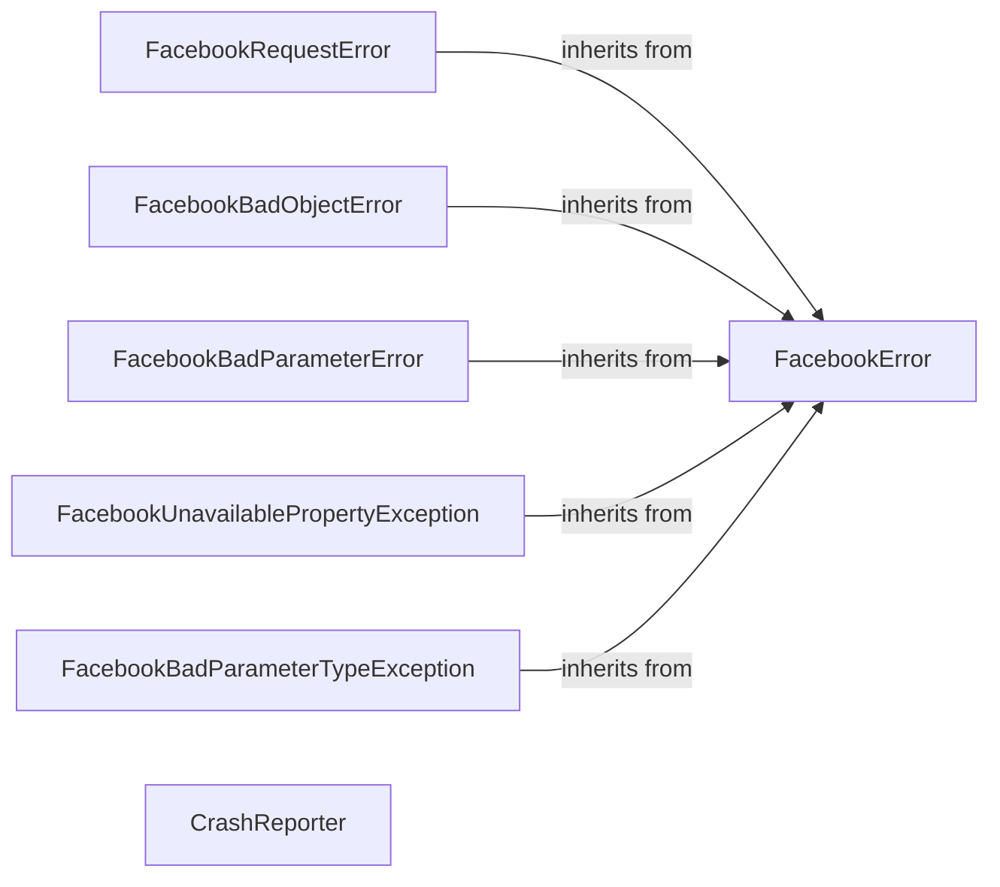

## Component Details

### FacebookError
The base exception class for the Facebook Business SDK. All custom exceptions inherit from this class, providing a common interface for handling errors within the SDK. It serves as a foundation for more specific error types.
- **Related Classes/Methods**: `facebook_business.exceptions.FacebookError`

### FacebookRequestError
Represents an error returned by the Facebook API. It encapsulates information about the error, including the error code, subcode, and message, allowing developers to handle API-specific errors effectively. It inherits from FacebookError.
- **Related Classes/Methods**: `facebook_business.exceptions.FacebookRequestError`

### FacebookBadObjectError
Represents an error when an object is invalid. This exception is raised when there is something wrong with the object being accessed or manipulated. It inherits from FacebookError.
- **Related Classes/Methods**: `facebook_business.exceptions.FacebookBadObjectError`

### FacebookBadParameterError
Represents an error when a parameter is invalid. This exception is raised when a parameter passed to an API call is not valid. It inherits from FacebookError.
- **Related Classes/Methods**: `facebook_business.exceptions.FacebookBadParameterError`

### FacebookUnavailablePropertyException
Represents an error when a property is unavailable. This exception is raised when trying to access a property that does not exist or is not accessible. It inherits from FacebookError.
- **Related Classes/Methods**: `facebook_business.exceptions.FacebookUnavailablePropertyException`

### FacebookBadParameterTypeException
Represents an error when a parameter has an invalid type. This exception is raised when a parameter passed to an API call has an incorrect data type. It inherits from FacebookError.
- **Related Classes/Methods**: `facebook_business.exceptions.FacebookBadParameterTypeException`

### CrashReporter
Reports crashes and exceptions to Facebook. It provides methods to enable, disable, and handle exceptions, building and sending crash reports to Facebook for debugging and issue resolution. It interacts with the Facebook Ads API to send crash reports.
- **Related Classes/Methods**: `facebook_business.crashreporter.CrashReporter`
