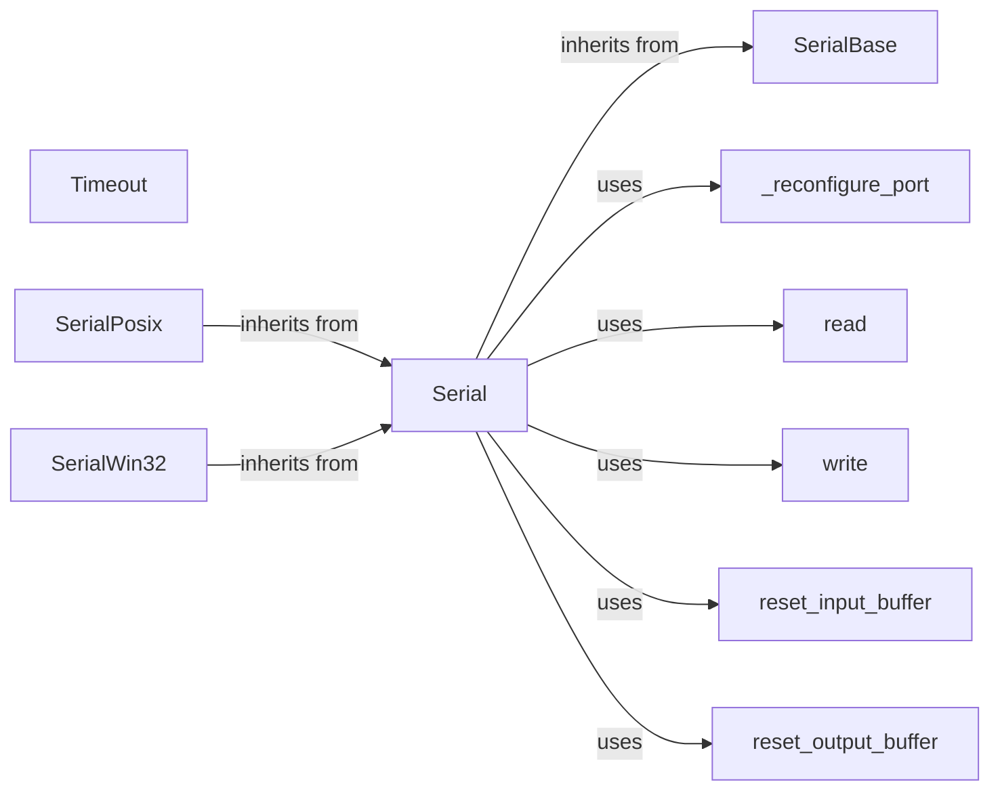

## Component Details

The Serial Port Core provides the fundamental building blocks for serial communication in the pyserial library. It defines the base class `SerialBase` with common attributes and methods, and platform-specific implementations (`SerialPosix`, `SerialWin32`, `SerialJava`, `SerialCLI`) that inherit from `SerialBase` and implement the low-level details of serial communication on different operating systems. The `Serial` class acts as the main interface for users, providing methods for opening, closing, configuring, reading from, and writing to serial ports. Timeouts are managed using the `Timeout` utility class. The core handles port configuration, data transfer, and buffer management.

### Serial
The main class for interacting with serial ports. It provides methods for opening, closing, reading, writing, and configuring the serial port. It inherits from SerialBase and is implemented differently on each platform.
- **Related Classes/Methods**: `pyserial.serial.serialposix.Serial`, `pyserial.serial.serialwin32.Serial`, `pyserial.serial.serialjava.Serial`, `pyserial.serial.serialcli.Serial`

### SerialBase
A base class for the Serial class that provides common functionality and attributes. It defines the basic interface for serial port communication.
- **Related Classes/Methods**: `pyserial.serial.serialutil.SerialBase`

### _reconfigure_port
A method responsible for reconfiguring the serial port with the current settings. This includes setting the baud rate, parity, stop bits, and other parameters. It is implemented differently on each platform.
- **Related Classes/Methods**: `pyserial.serial.serialposix.Serial:_reconfigure_port`, `pyserial.serial.serialwin32.Serial:_reconfigure_port`, `pyserial.serial.serialjava.Serial:_reconfigurePort`, `pyserial.serial.serialcli.Serial:_reconfigure_port`

### read
A method for reading data from the serial port. It reads a specified number of bytes or until a timeout occurs. It is implemented differently on each platform.
- **Related Classes/Methods**: `pyserial.serial.serialposix.Serial:read`, `pyserial.serial.serialwin32.Serial:read`, `pyserial.serial.serialjava.Serial:read`, `pyserial.serial.serialcli.Serial:read`

### write
A method for writing data to the serial port. It sends the provided bytes to the serial port. It is implemented differently on each platform.
- **Related Classes/Methods**: `pyserial.serial.serialposix.Serial:write`, `pyserial.serial.serialwin32.Serial:write`, `pyserial.serial.serialjava.Serial:write`, `pyserial.serial.serialcli.Serial:write`

### reset_input_buffer
A method to discard all data in the input buffer. It is implemented differently on each platform.
- **Related Classes/Methods**: `pyserial.serial.serialposix.Serial:reset_input_buffer`, `pyserial.serial.serialwin32.Serial:reset_input_buffer`, `pyserial.serial.serialjava.Serial:reset_input_buffer`, `pyserial.serial.serialcli.Serial:reset_input_buffer`

### reset_output_buffer
A method to discard all data in the output buffer. It is implemented differently on each platform.
- **Related Classes/Methods**: `pyserial.serial.serialposix.Serial:reset_output_buffer`, `pyserial.serial.serialwin32.Serial:reset_output_buffer`, `pyserial.serial.serialjava.Serial:reset_output_buffer`, `pyserial.serial.serialcli.Serial:reset_output_buffer`

### Timeout
A utility class for managing timeouts during serial port operations.
- **Related Classes/Methods**: `pyserial.serial.serialutil.Timeout`

### SerialPosix
Platform-specific implementation of the Serial class for POSIX systems (Linux, macOS).
- **Related Classes/Methods**: `pyserial/serialposix.py`

### SerialWin32
Platform-specific implementation of the Serial class for Windows.
- **Related Classes/Methods**: `pyserial/serialwin32.py`
