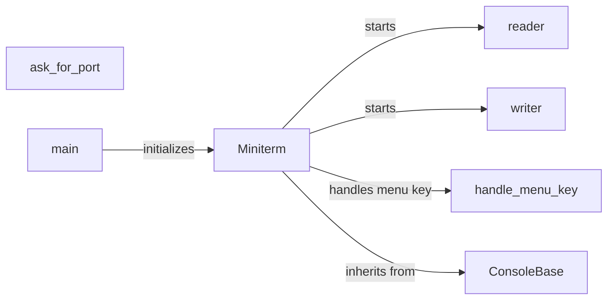

## Component Details

The terminal interface, implemented in `miniterm.py`, provides a command-line tool for interacting with serial ports. It allows users to send and receive data, configure port settings such as baud rate and encoding, and monitor serial communication. The `Miniterm` class is the core component, managing the serial port, console, and reader/writer threads. The `main` function parses arguments and starts the terminal, while `ConsoleBase` provides an abstract base for console implementations. User input is handled to send data, change settings via menu keys, and apply filters to received data. Overall, it's a versatile tool for testing and debugging serial communication.

### Miniterm
The central class that manages the terminal functionality. It initializes the serial port, sets up the console for input and output, and starts the reader and writer threads for asynchronous communication. It also handles user input for sending data and changing settings like baud rate, encoding, and filters.
- **Related Classes/Methods**: `pyserial.serial.tools.miniterm.Miniterm`

### ask_for_port
This function prompts the user to enter a serial port if one is not provided as a command-line argument. It ensures that the program can run even if the user doesn't specify the port initially.
- **Related Classes/Methods**: `pyserial.serial.tools.miniterm.ask_for_port`

### main
The main function that serves as the entry point of the script. It parses command-line arguments using `argparse`, initializes the `Miniterm` object with the provided or default settings, and starts the terminal by calling the `exit()` method on the `Miniterm` instance.
- **Related Classes/Methods**: `pyserial.serial.tools.miniterm.main`

### ConsoleBase
An abstract base class for console implementations. It provides basic functionality for handling console input and output, defining methods for reading characters and writing to the console.
- **Related Classes/Methods**: `pyserial.serial.tools.miniterm.ConsoleBase`

### reader
This method of the `Miniterm` class continuously reads data from the serial port and displays it on the console. It runs in a separate thread to avoid blocking the main thread and ensures that incoming data is immediately displayed to the user.
- **Related Classes/Methods**: `pyserial.serial.tools.miniterm.Miniterm.reader`

### writer
This method of the `Miniterm` class writes data to the serial port. It takes user input from the console and sends it through the serial port. It also runs in a separate thread to avoid blocking the main thread.
- **Related Classes/Methods**: `pyserial.serial.tools.miniterm.Miniterm.writer`

### handle_menu_key
This method of the `Miniterm` class handles menu key presses to change settings. It allows the user to interactively modify the terminal's configuration, such as baud rate, encoding, and filters, by pressing specific keys.
- **Related Classes/Methods**: `pyserial.serial.tools.miniterm.Miniterm.handle_menu_key`
