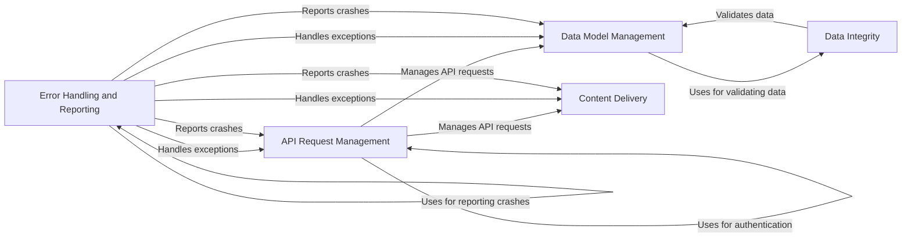

## Component Details

### API Request Management
This component is responsible for handling all API requests to the Facebook Business SDK. It encompasses request creation, execution, batch processing, pagination via cursors, and session management, including authentication. It serves as the central communication layer between the SDK and Facebook's API endpoints.
- **Related Classes/Methods**: `facebook_business.api.FacebookAdsApi`, `facebook_business.api.FacebookAdsApiBatch`, `facebook_business.api.FacebookRequest`, `facebook_business.api.Cursor`, `facebook_business.api.FacebookResponse`, `facebook_business.session.FacebookSession`

### Data Model Management
This component defines and manages the structure and behavior of various Facebook Ads objects and business assets. It includes functionalities for creating, reading, updating, and deleting objects like AdAccounts, AdSets, Campaigns, AdCreatives, Businesses, Users, Pages, and Product Catalogs. It provides a unified interface for interacting with different data entities within the Facebook ecosystem.
- **Related Classes/Methods**: `facebook_business.adobjects.ad.Ad`, `facebook_business.adobjects.adaccount.AdAccount`, `facebook_business.adobjects.adset.AdSet`, `facebook_business.adobjects.campaign.Campaign`, `facebook_business.adobjects.adcreative.AdCreative`, `facebook_business.adobjects.adsinsights.AdsInsights`, `facebook_business.adobjects.customaudience.CustomAudience`, `facebook_business.adobjects.business.Business`, `facebook_business.adobjects.businessuser.BusinessUser`, `facebook_business.adobjects.systemuser.SystemUser`, `facebook_business.adobjects.page.Page`, `facebook_business.adobjects.productcatalog.ProductCatalog`, `facebook_business.adobjects.productfeed.ProductFeed`, `facebook_business.adobjects.productitem.ProductItem`, `facebook_business.adobjects.productset.ProductSet`

### Content Delivery
This component focuses on delivering rich media content, specifically video, to Facebook. It manages the entire video uploading process, including session creation, request management, encoding status checks, and exception handling. It provides a streamlined solution for uploading video assets to the platform.
- **Related Classes/Methods**: `facebook_business.video_uploader.VideoUploader`, `facebook_business.video_uploader.VideoUploadSession`, `facebook_business.video_uploader.VideoUploadRequestManager`, `facebook_business.video_uploader.VideoUploadStartRequestManager`, `facebook_business.video_uploader.VideoUploadTransferRequestManager`, `facebook_business.video_uploader.VideoUploadFinishRequestManager`, `facebook_business.video_uploader.VideoEncodingStatusChecker`

### Data Integrity
This component ensures data quality and consistency throughout the SDK. It is responsible for validating and type-checking data used in API requests and object creation, guaranteeing that parameters adhere to the expected format and structure. It plays a critical role in preventing errors and maintaining the integrity of data exchanged with the Facebook API.
- **Related Classes/Methods**: `facebook_business.typechecker.TypeChecker`

### Error Handling and Reporting
This component provides a centralized mechanism for handling errors and reporting crashes within the SDK. It defines exception classes for various error scenarios, such as API request failures, invalid objects, and unavailable properties. It also includes crash reporting functionality to log and report exceptions to Facebook, facilitating debugging and issue resolution.
- **Related Classes/Methods**: `facebook_business.exceptions.FacebookError`, `facebook_business.exceptions.FacebookRequestError`, `facebook_business.exceptions.FacebookBadObjectError`, `facebook_business.exceptions.FacebookBadParameterError`, `facebook_business.exceptions.FacebookUnavailablePropertyException`, `facebook_business.crashreporter.CrashReporter`