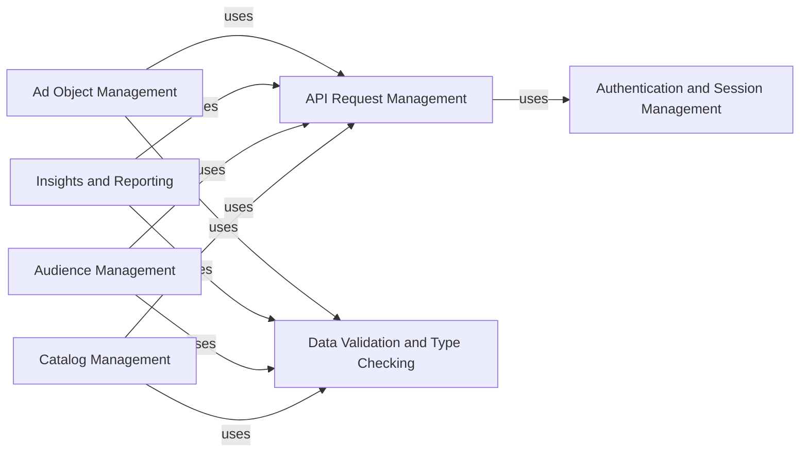

## Component Details

The facebook-python-business-sdk provides a Python interface for interacting with the Facebook Marketing API. It handles authentication, request management, data validation, and provides abstractions for various ad objects and related functionalities. The SDK simplifies the process of creating, managing, and analyzing Facebook ad campaigns, custom audiences, product catalogs, and other business-related tasks.

### Authentication and Session Management
This component manages user authentication, access tokens, and sessions, ensuring secure and authorized access to the Facebook Marketing API. It handles the complexities of OAuth and session persistence, providing a simple interface for developers to authenticate their applications and manage user sessions.
- **Related Classes/Methods**: `facebook_business.bootstrap.Authentication`, `facebook_business.session.FacebookSession`

### API Request Management
This component is responsible for constructing, executing, and processing API requests to the Facebook Marketing API. It handles request formatting, parameter encoding, response parsing, and error handling, providing a simplified interface for interacting with the API endpoints. It also supports batch requests for improved efficiency.
- **Related Classes/Methods**: `facebook_business.api.FacebookRequest`, `facebook_business.api.FacebookAdsApi`, `facebook_business.api.FacebookResponse`, `facebook_business.api.FacebookAdsApiBatch`

### Ad Object Management
This component defines the data structures and methods for interacting with various Facebook ad objects, such as ads, ad sets, campaigns, and creatives. It provides a consistent interface for creating, reading, updating, and deleting ad objects, simplifying the management of ad campaigns.
- **Related Classes/Methods**: `facebook_business.adobjects.ad.Ad`, `facebook_business.adobjects.adaccount.AdAccount`, `facebook_business.adobjects.adset.AdSet`, `facebook_business.adobjects.campaign.Campaign`, `facebook_business.adobjects.adcreative.AdCreative`

### Data Validation and Type Checking
This component provides functionality for data validation and type checking, ensuring that the data being sent to and received from the Facebook API is of the correct type and format. It helps prevent errors and ensures data integrity by enforcing data type constraints and validating input parameters.
- **Related Classes/Methods**: `facebook_business.typechecker.TypeChecker`

### Insights and Reporting
This component provides functionality for retrieving and analyzing insights data related to Facebook ads and campaigns. It handles the construction of insights queries, the retrieval of data, and the formatting of results, enabling developers to gain valuable insights into campaign performance.
- **Related Classes/Methods**: `facebook_business.adobjects.adsinsights.AdsInsights`, `facebook_business.adobjects.adreportrun.AdReportRun`

### Audience Management
This component allows developers to manage custom audiences, which are used for targeting ads to specific groups of users. It provides methods for creating, updating, and deleting custom audiences, as well as adding and removing users from audiences, enabling precise ad targeting.
- **Related Classes/Methods**: `facebook_business.adobjects.customaudience.CustomAudience`

### Catalog Management
This component provides functionality for managing product catalogs, which are used for dynamic product ads. It handles the creation, updating, and deletion of product catalogs, as well as the management of product items within catalogs, enabling personalized product advertising.
- **Related Classes/Methods**: `facebook_business.adobjects.productcatalog.ProductCatalog`, `facebook_business.adobjects.productitem.ProductItem`, `facebook_business.adobjects.productfeed.ProductFeed`