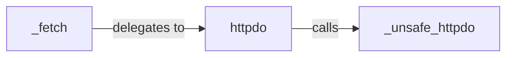

## Details

The `HTTP Transport Layer` subsystem is encapsulated within the `wda/__init__.py` module, specifically focusing on the `_fetch`, `httpdo`, and `_unsafe_httpdo` functions. This subsystem is responsible for abstracting the direct HTTP communication with the WebDriverAgent, handling request serialization, network transmission, and response deserialization.

### _fetch
Acts as the high-level orchestrator for all outgoing WebDriverAgent HTTP requests. It constructs the full request URL, prepares the payload, manages the overall request lifecycle, and handles post-request processing, including error handling and response parsing. It delegates the actual HTTP execution to `httpdo`.

**Related Classes/Methods**:

- <a href="https://github.com/openatx/facebook-wda/blob/master/wda/__init__.py#L369-L410" target="_blank" rel="noopener noreferrer">`wda.__init__._fetch`:369-410</a>

### httpdo
Provides a synchronized wrapper around the raw HTTP operations. Its primary responsibility is to ensure thread-safe execution of HTTP requests by acquiring and releasing a named lock, preventing race conditions when multiple threads attempt to send requests concurrently. It then calls `_unsafe_httpdo` to perform the actual network communication.

**Related Classes/Methods**:

- <a href="https://github.com/openatx/facebook-wda/blob/master/wda/__init__.py#L117-L126" target="_blank" rel="noopener noreferrer">`wda.__init__.httpdo`:117-126</a>

### _unsafe_httpdo
Handles the raw, unsynchronized HTTP communication. This component is directly responsible for sending the prepared HTTP requests over the network and receiving the raw HTTP responses. It interacts with the underlying network stack to perform the actual data transfer.

**Related Classes/Methods**:

- <a href="https://github.com/openatx/facebook-wda/blob/master/wda/__init__.py#L129-L169" target="_blank" rel="noopener noreferrer">`wda.__init__._unsafe_httpdo`:129-169</a>

### [FAQ](https://github.com/CodeBoarding/GeneratedOnBoardings/tree/main?tab=readme-ov-file#faq)