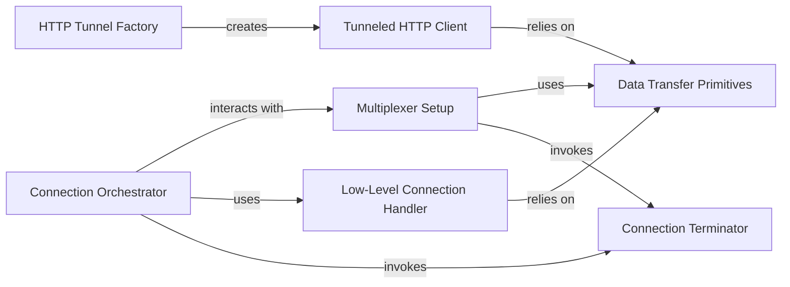

## Details

The USB Mux Connection Manager subsystem is primarily defined by the wda.usbmux.pyusbmux module, with its core functionality residing in the pyusbmux.py file. This module encapsulates all logic related to establishing, maintaining, and tearing down USB multiplexed connections to iOS devices for HTTP tunneling.

### Connection Orchestrator
The primary entry point for establishing and managing the lifecycle of a USB multiplexer connection to an iOS device. It orchestrates the setup, connection, and teardown processes.

**Related Classes/Methods**:

- <a href="https://github.com/openatx/facebook-wda/blob/master/wda/usbmux/pyusbmux.py#L478-L479" target="_blank" rel="noopener noreferrer">`wda.usbmux.pyusbmux.connect`:478-479</a>

### HTTP Tunnel Factory
Responsible for creating instances of the Tunneled HTTP Client, enabling the tunneling of HTTP traffic over the established USB multiplexer connection.

**Related Classes/Methods**:

- <a href="https://github.com/openatx/facebook-wda/blob/master/wda/usbmux/pyusbmux.py#L112-L113" target="_blank" rel="noopener noreferrer">`wda.usbmux.pyusbmux.make_http_connection`:112-113</a>

### Tunneled HTTP Client
Implements the HTTP protocol, specifically designed to route requests and responses through the underlying USB multiplexer channel, effectively creating an HTTP tunnel over USB.

**Related Classes/Methods**:

- <a href="https://github.com/openatx/facebook-wda/blob/master/wda/usbmux/pyusbmux.py#L472-L485" target="_blank" rel="noopener noreferrer">`wda.usbmux.pyusbmux.USBMuxHTTPConnection`:472-485</a>

### Multiplexer Setup
Handles the low-level details of instantiating and configuring the USB multiplexer object, including socket creation, protocol negotiation, and initial communication.

**Related Classes/Methods**:

- <a href="https://github.com/openatx/facebook-wda/blob/master/wda/usbmux/pyusbmux.py#L421-L422" target="_blank" rel="noopener noreferrer">`wda.usbmux.pyusbmux.create_mux`:421-422</a>
- <a href="https://github.com/openatx/facebook-wda/blob/master/wda/usbmux/pyusbmux.py#L187-L208" target="_blank" rel="noopener noreferrer">`wda.usbmux.pyusbmux.create`:187-208</a>

### Low-Level Connection Handler
Manages the handshake and communication flow necessary to establish a stable and active connection over the USB multiplexer, handling the specific protocol details.

**Related Classes/Methods**:

- <a href="https://github.com/openatx/facebook-wda/blob/master/wda/usbmux/pyusbmux.py#L394-L395" target="_blank" rel="noopener noreferrer">`wda.usbmux.pyusbmux._connect`:394-395</a>

### Data Transfer Primitives
Provides the fundamental, low-level operations for sending and receiving raw data packets over the established USB multiplexer channel. These are the building blocks for all higher-level communication.

**Related Classes/Methods**:

- <a href="https://github.com/openatx/facebook-wda/blob/master/wda/usbmux/pyusbmux.py#L397-L404" target="_blank" rel="noopener noreferrer">`wda.usbmux.pyusbmux._send`:397-404</a>
- <a href="https://github.com/openatx/facebook-wda/blob/master/wda/usbmux/pyusbmux.py#L406-L410" target="_blank" rel="noopener noreferrer">`wda.usbmux.pyusbmux._receive`:406-410</a>
- <a href="https://github.com/openatx/facebook-wda/blob/master/wda/usbmux/pyusbmux.py#L412-L418" target="_blank" rel="noopener noreferrer">`wda.usbmux.pyusbmux._send_receive`:412-418</a>

### Connection Terminator
Ensures the proper and graceful closure of the USB multiplexer connection, releasing all associated system resources.

**Related Classes/Methods**:

- <a href="https://github.com/openatx/facebook-wda/blob/master/wda/usbmux/pyusbmux.py#L241-L243" target="_blank" rel="noopener noreferrer">`wda.usbmux.pyusbmux.close`:241-243</a>

### [FAQ](https://github.com/CodeBoarding/GeneratedOnBoardings/tree/main?tab=readme-ov-file#faq)