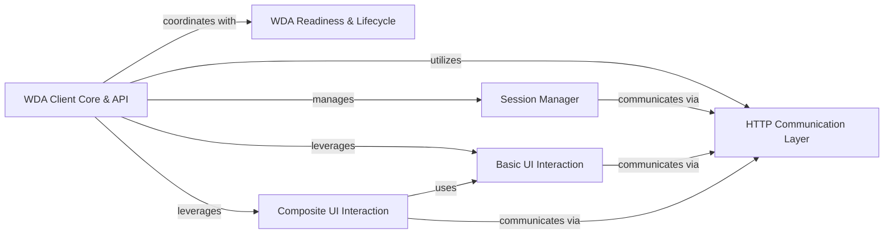

## Details

The `WDA Client Core & API` subsystem serves as the primary interface for users interacting with the WebDriverAgent. It encapsulates the core `Client` class, orchestrates the overall client lifecycle, and exposes high-level automation commands.

### WDA Client Core & API [[Expand]](./WDA_Client_Core_API.md)
The primary interface for users, encapsulating the `Client` class, managing sessions, and exposing high-level automation commands. It orchestrates the overall client lifecycle and acts as a facade over the underlying WDA protocol.

**Related Classes/Methods**:

- <a href="https://github.com/openatx/facebook-wda/blob/master/wda/__init__.py#L1246-L1249" target="_blank" rel="noopener noreferrer">`wda.__init__.Client`:1246-1249</a>

### Session Manager
Handles the creation, management, and termination of WDA sessions, ensuring a valid connection and managing device state (e.g., locking/unlocking).

**Related Classes/Methods**:

- <a href="https://github.com/openatx/facebook-wda/blob/master/wda/__init__.py" target="_blank" rel="noopener noreferrer">`wda.__init__.session`</a>

### HTTP Communication Layer
Manages the underlying HTTP communication with the WebDriverAgent server, handling request sending and receiving. This is the fundamental layer for all client-server interactions.

**Related Classes/Methods**:

- <a href="https://github.com/openatx/facebook-wda/blob/master/wda/__init__.py#L426-L441" target="_blank" rel="noopener noreferrer">`wda.__init__._session_http`:426-441</a>
- <a href="https://github.com/openatx/facebook-wda/blob/master/wda/__init__.py#L1617-L1618" target="_blank" rel="noopener noreferrer">`wda.__init__._req`:1617-1618</a>

### WDA Readiness & Lifecycle
Ensures the WebDriverAgent is running and ready to accept commands, handling its initial startup if necessary. This component is crucial for establishing a functional connection.

**Related Classes/Methods**:

- <a href="https://github.com/openatx/facebook-wda/blob/master/wda/__init__.py#L291-L296" target="_blank" rel="noopener noreferrer">`wda.__init__.is_ready`:291-296</a>
- <a href="https://github.com/openatx/facebook-wda/blob/master/wda/__init__.py#L298-L321" target="_blank" rel="noopener noreferrer">`wda.__init__.wait_ready`:298-321</a>
- <a href="https://github.com/openatx/facebook-wda/blob/master/wda/__init__.py#L215-L231" target="_blank" rel="noopener noreferrer">`wda.__init__._start_wda_xctest`:215-231</a>

### Basic UI Interaction
Provides fundamental low-level UI interactions, such as tapping at specific coordinates on the device screen. These are atomic operations directly translated to WDA commands.

**Related Classes/Methods**:

- <a href="https://github.com/openatx/facebook-wda/blob/master/wda/__init__.py#L1698-L1699" target="_blank" rel="noopener noreferrer">`wda.__init__.tap`:1698-1699</a>

### Composite UI Interaction
Offers higher-level UI interactions that build upon basic interactions, potentially involving element lookups or more complex gestures. This component abstracts common user flows.

**Related Classes/Methods**:

- <a href="https://github.com/openatx/facebook-wda/blob/master/wda/__init__.py#L1701-L1708" target="_blank" rel="noopener noreferrer">`wda.__init__.click`:1701-1708</a>

### [FAQ](https://github.com/CodeBoarding/GeneratedOnBoardings/tree/main?tab=readme-ov-file#faq)