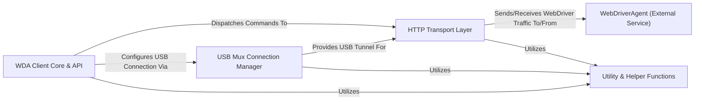

## Details

The `facebook-wda` library acts as a Python client for interacting with the WebDriverAgent, an external iOS application. The core of the library is the **WDA Client Core & API**, which provides a high-level interface for users to send automation commands. These commands are translated and dispatched to the **HTTP Transport Layer**, responsible for serializing requests and deserializing responses according to the WebDriver protocol. For devices connected via USB, the **USB Mux Connection Manager** establishes and maintains a tunnel, allowing the HTTP Transport Layer to communicate with the WebDriverAgent over USB. The **WebDriverAgent (External Service)**, running on the iOS device, is the ultimate recipient of these commands, directly interacting with the iOS system and UI. Various **Utility & Helper Functions** support the internal operations of the client, transport, and connection management components. This architecture clearly delineates the client-side operations from the external iOS automation service, facilitating a clear data flow for diagrammatic representation.

### WDA Client Core & API [[Expand]](./WDA_Client_Core_API.md)
The primary interface for users, encapsulating the `Client` class, managing sessions, and exposing high-level automation commands. It orchestrates the overall client lifecycle.

**Related Classes/Methods**:

- <a href="https://github.com/openatx/facebook-wda/blob/master/wda/__init__.py#L1246-L1249" target="_blank" rel="noopener noreferrer">`wda.__init__.Client`:1246-1249</a>
- <a href="https://github.com/openatx/facebook-wda/blob/master/wda/__init__.py#L1698-L1699" target="_blank" rel="noopener noreferrer">`wda.__init__.tap`:1698-1699</a>

### HTTP Transport Layer [[Expand]](./HTTP_Transport_Layer.md)
Responsible for all direct HTTP communication with the `WebDriverAgent`. It handles request serialization and response deserialization, acting as the direct interface to the WebDriver protocol over network connections.

**Related Classes/Methods**:

- <a href="https://github.com/openatx/facebook-wda/blob/master/wda/__init__.py#L369-L410" target="_blank" rel="noopener noreferrer">`wda.__init__._fetch`:369-410</a>
- <a href="https://github.com/openatx/facebook-wda/blob/master/wda/__init__.py#L117-L126" target="_blank" rel="noopener noreferrer">`wda.__init__.httpdo`:117-126</a>

### USB Mux Connection Manager [[Expand]](./USB_Mux_Connection_Manager.md)
Manages the establishment and maintenance of connections to iOS devices via USB multiplexing (`pyusbmux`). It provides a crucial tunnel for HTTP traffic over USB when direct network access is unavailable.

**Related Classes/Methods**:

- <a href="https://github.com/openatx/facebook-wda/blob/master/wda/usbmux/pyusbmux.py#L478-L479" target="_blank" rel="noopener noreferrer">`wda.usbmux.pyusbmux.connect`:478-479</a>
- <a href="https://github.com/openatx/facebook-wda/blob/master/wda/usbmux/pyusbmux.py#L112-L113" target="_blank" rel="noopener noreferrer">`wda.usbmux.pyusbmux.make_http_connection`:112-113</a>

### WebDriverAgent (External Service)
The iOS application running on the target device or simulator. It implements the WebDriver protocol and directly interacts with the iOS system and UI. As an external, black-box dependency, its source code is not part of the `facebook-wda` project and therefore no internal source code references can be provided. It is a critical external component that the `facebook-wda` library interacts with.

**Related Classes/Methods**: _None_

### Utility & Helper Functions
A collection of general-purpose helper functions and classes used across different parts of the `facebook-wda` library, including data conversion and flexible data structures.

**Related Classes/Methods**:

- <a href="https://github.com/openatx/facebook-wda/blob/master/wda/utils.py#L65-L69" target="_blank" rel="noopener noreferrer">`wda.utils.convert`:65-69</a>
- <a href="https://github.com/openatx/facebook-wda/blob/master/wda/utils.py#L58-L62" target="_blank" rel="noopener noreferrer">`wda.utils.AttrDict`:58-62</a>

### [FAQ](https://github.com/CodeBoarding/GeneratedOnBoardings/tree/main?tab=readme-ov-file#faq)