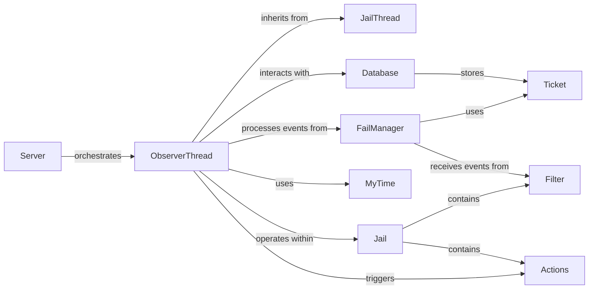

## Component Details

This overview focuses on the Background Tasks (Observer) subsystem, primarily centered around the ObserverThread component. This thread is crucial for managing the lifecycle of bans, handling asynchronous operations, and performing essential database maintenance within Fail2Ban. The selected components are fundamental to understanding how bans are processed, expired, and how the system maintains its integrity over time.

### ObserverThread
The central asynchronous processing unit responsible for managing ban lifecycles. It maintains an internal event queue and timers to handle scheduled tasks, process ban expiry, and perform database maintenance. It is the core orchestrator for unbanning and related operations. It is the dedicated thread for all background and periodic tasks, making it the heart of the ban expiry and database maintenance logic.

**Related Classes/Methods**:

- <a href="https://github.com/fail2ban/fail2ban/blob/master/fail2ban/server/observer.py#L39-L521" target="_blank" rel="noopener noreferrer">`fail2ban.server.observer.ObserverThread` (39:521)</a>

### JailThread
The foundational base class for all threads operating within the Fail2Ban server. ObserverThread inherits from JailThread, gaining core threading capabilities and integration into the Fail2Ban environment. Provides the essential threading framework upon which ObserverThread is built, ensuring proper thread management and interaction within the server.

**Related Classes/Methods**:

- <a href="https://github.com/fail2ban/fail2ban/blob/master/fail2ban/server/jailthread.py#L34-L138" target="_blank" rel="noopener noreferrer">`fail2ban.server.jailthread.JailThread` (34:138)</a>

### Database
Manages the persistent storage and retrieval of ban records, failed attempts, and other operational data. ObserverThread directly interacts with the Database to purge old entries, retrieve ban information, and update ban statuses. Essential for maintaining the state of bans across restarts and for ObserverThread to track and expire bans effectively.

**Related Classes/Methods**:

- <a href="https://github.com/fail2ban/fail2ban/blob/master/fail2ban/server/database.py#L0-L0" target="_blank" rel="noopener noreferrer">`fail2ban.server.database.Database` (0:0)</a>

### Jail
Represents a specific configuration for monitoring logs and applying banning rules. Each Jail instance encapsulates its own set of filters and actions. The ObserverThread processes events and manages bans in the context of these defined jails. Provides the contextual configuration for ObserverThread's operations, defining the rules and actions associated with the bans it manages.

**Related Classes/Methods**:

- <a href="https://github.com/fail2ban/fail2ban/blob/master/fail2ban/server/jail.py#L38-L352" target="_blank" rel="noopener noreferrer">`fail2ban.server.jail.Jail` (38:352)</a>

### FailManager
Responsible for tracking and aggregating failed authentication attempts. It determines when a ban threshold is met and reports these events. The ObserverThread processes failureFound events originating from the FailManager to initiate ban actions. It's the primary source of "failure" events that can lead to bans, which ObserverThread then monitors for expiry or prolongation.

**Related Classes/Methods**:

- <a href="https://github.com/fail2ban/fail2ban/blob/master/fail2ban/server/failmanager.py#L37-L164" target="_blank" rel="noopener noreferrer">`fail2ban.server.failmanager.FailManager` (37:164)</a>

### MyTime
A utility component providing essential functions for handling time-related operations, including timestamp conversions, duration calculations, and time comparisons. This is crucial for ObserverThread's ability to manage ban expiry and schedule tasks. Time management is central to the ObserverThread's role in expiring bans and scheduling periodic tasks like database purges.

**Related Classes/Methods**:

- <a href="https://github.com/fail2ban/fail2ban/blob/master/fail2ban/server/mytime.py#L32-L234" target="_blank" rel="noopener noreferrer">`fail2ban.server.mytime.MyTime` (32:234)</a>

### Ticket
A fundamental data structure representing a ban or a failed attempt. It encapsulates details such as the IP address, timestamp, ban ID, and other relevant information. Ticket objects are stored by the Database and processed by FailManager. It's the core data structure that ObserverThread implicitly works with when interacting with the Database and processing events from FailManager.

**Related Classes/Methods**:

- <a href="https://github.com/fail2ban/fail2ban/blob/master/fail2ban/server/ticket.py#L34-L221" target="_blank" rel="noopener noreferrer">`fail2ban.server.ticket.Ticket` (34:221)</a>

### Server
The main Fail2Ban server component that orchestrates the entire system. It is responsible for initializing, starting, and managing various subsystems, including the ObserverThread, ensuring its proper operation within the Fail2Ban daemon. The Server is the entry point and overall manager that ensures ObserverThread is initialized and running as part of the Fail2Ban application.

**Related Classes/Methods**:

- <a href="https://github.com/fail2ban/fail2ban/blob/master/fail2ban/server/server.py#L73-L952" target="_blank" rel="noopener noreferrer">`fail2ban.server.server.Server` (73:952)</a>

### Actions
Defines and executes specific actions (e.g., blocking an IP address, sending an email notification) when a ban is triggered or unbanned. While ObserverThread primarily manages ban expiry, it interacts with Actions to ensure unban operations are performed. Actions are the mechanism through which ObserverThread performs the actual unbanning of IPs once their ban time expires.

**Related Classes/Methods**:

- <a href="https://github.com/fail2ban/fail2ban/blob/master/fail2ban/server/actions.py#L49-L744" target="_blank" rel="noopener noreferrer">`fail2ban.server.actions.Actions` (49:744)</a>

### Filter
Responsible for parsing log files, applying regular expressions, and identifying patterns indicative of failed attempts or other ban-worthy events. Filters generate events that are then processed by FailManager, which in turn informs the ObserverThread. Although ObserverThread doesn't directly interact with Filter, Filter is the initial component in the chain that identifies the events leading to bans, which ObserverThread then manages the lifecycle of.

**Related Classes/Methods**:

- <a href="https://github.com/fail2ban/fail2ban/blob/master/fail2ban/server/filter.py#L56-L998" target="_blank" rel="noopener noreferrer">`fail2ban.server.filter.Filter` (56:998)</a>

### [FAQ](https://github.com/CodeBoarding/GeneratedOnBoardings/tree/main?tab=readme-ov-file#faq)