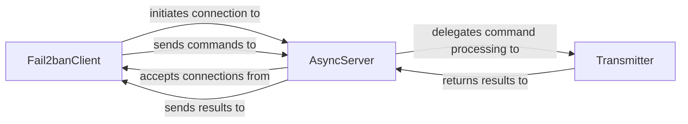

## Component Details

The `Client-Server Communication` subsystem in Fail2ban is crucial for enabling interaction between the `Fail2banClient` (user-facing application) and the `Fail2banServer` (daemon). This asynchronous communication ensures that the server can continuously monitor logs and apply bans without being blocked by client requests.

### Fail2banClient
This component acts as the user interface for Fail2ban. It parses command-line arguments, initiates connections to the `AsyncServer`, sends commands (e.g., start, stop, reload, status), and displays the responses received from the server. It also contains logic to start the Fail2ban daemon if it's not already running.

**Related Classes/Methods**:

- <a href="https://github.com/fail2ban/fail2ban/blob/master/fail2ban/client/fail2banclient.py#L1-L1" target="_blank" rel="noopener noreferrer">`fail2ban.client.fail2banclient` (1:1)</a>

### AsyncServer
This is the central server-side component responsible for handling all incoming client connections. It uses `asyncore.dispatcher` to manage multiple concurrent connections asynchronously, ensuring the daemon remains responsive. It accepts client connections, receives raw commands, and delegates their processing to the `Transmitter`. It also manages the server's lifecycle, including starting and stopping the server and its associated socket.

**Related Classes/Methods**:

- <a href="https://github.com/fail2ban/fail2ban/blob/master/fail2ban/server/asyncserver.py#L1-L1" target="_blank" rel="noopener noreferrer">`fail2ban.server.asyncserver` (1:1)</a>

### Transmitter
This component is the command interpreter and dispatcher on the server-side. It receives parsed commands from the `AsyncServer` and maps them to the appropriate internal `Fail2banServer` methods (e.g., `addJail`, `stopJail`, `setLogLevel`, `status`). It handles the execution of these commands and returns the results or error messages back to the `AsyncServer`.

**Related Classes/Methods**:

- <a href="https://github.com/fail2ban/fail2ban/blob/master/fail2ban/server/transmitter.py#L1-L1" target="_blank" rel="noopener noreferrer">`fail2ban.server.transmitter` (1:1)</a>

### [FAQ](https://github.com/CodeBoarding/GeneratedOnBoardings/tree/main?tab=readme-ov-file#faq)