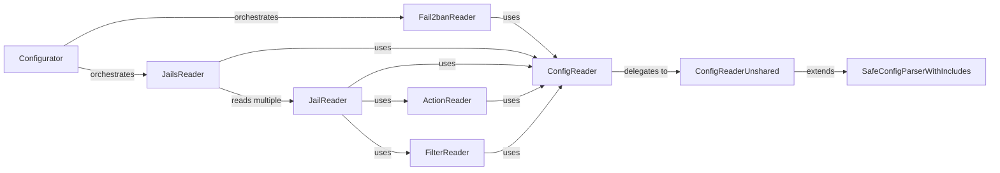

## Component Details

The `Configuration Manager` subsystem in Fail2ban is crucial for reading, parsing, and applying the application's configuration. It handles a hierarchical configuration structure, including file inclusions and variable interpolations, to define jails, filters, and actions. This subsystem is fundamental because it dictates Fail2ban's operational behavior, from what logs to monitor to how to react to malicious activities. Without a robust configuration manager, Fail2ban would not be able to dynamically adapt to user-defined security policies.

### Configurator
This is the top-level orchestrator for loading Fail2ban's configuration. It coordinates the reading of general Fail2ban settings, jails, filters, and actions, assembling them into a complete operational configuration. It acts as the primary interface for the Fail2ban server to access its configuration.

**Related Classes/Methods**:

- <a href="https://github.com/fail2ban/fail2ban/blob/master/fail2ban/client/configurator.py#L34-L90" target="_blank" rel="noopener noreferrer">`fail2ban.client.configurator.Configurator` (34:90)</a>

### ConfigReader
Serves as a caching layer for configuration files. Its main purpose is to prevent redundant reads of the same configuration files by reusing already loaded shared configurations. It delegates the actual file parsing to `ConfigReaderUnshared`. This component is vital for performance and consistency across configuration reads.

**Related Classes/Methods**:

- <a href="https://github.com/fail2ban/fail2ban/blob/master/fail2ban/client/configreader.py#L61-L179" target="_blank" rel="noopener noreferrer">`fail2ban.client.configreader.ConfigReader` (61:179)</a>

### ConfigReaderUnshared
This class is the core component for reading and parsing configuration files directly from the file system. It extends `SafeConfigParserWithIncludes` and handles the logic for locating, reading, and parsing `.conf` and `.local` configuration files, including those in `.d` directories. It also manages the base directory for configuration files.

**Related Classes/Methods**:

- <a href="https://github.com/fail2ban/fail2ban/blob/master/fail2ban/client/configreader.py#L182-L289" target="_blank" rel="noopener noreferrer">`fail2ban.client.configreader.ConfigReaderUnshared` (182:289)</a>

### SafeConfigParserWithIncludes
Provides the foundational functionality for parsing configuration files, extending Python's `ConfigParser` to support an "include" directive. This allows configurations to be modularized across multiple files, promoting reusability and organization. It also handles variable interpolation within configuration values.

**Related Classes/Methods**:

- <a href="https://github.com/fail2ban/fail2ban/blob/master/fail2ban/client/configparserinc.py#L81-L383" target="_blank" rel="noopener noreferrer">`fail2ban.client.configparserinc.SafeConfigParserWithIncludes` (81:383)</a>

### JailReader
Specializes in reading and parsing individual jail configurations. It understands the structure of jail definitions, including their enabled status, backend, and references to associated actions and filters. It also handles the globbing of log paths.

**Related Classes/Methods**:

- <a href="https://github.com/fail2ban/fail2ban/blob/master/fail2ban/client/jailreader.py#L44-L312" target="_blank" rel="noopener noreferrer">`fail2ban.client.jailreader.JailReader` (44:312)</a>

### ActionReader
Responsible for reading and parsing action configurations, which define the commands to be executed when a ban occurs. It handles various action-related options like `actionstart`, `actionstop`, `actionban`, etc., and prepares them for execution.

**Related Classes/Methods**:

- <a href="https://github.com/fail2ban/fail2ban/blob/master/fail2ban/client/actionreader.py#L36-L103" target="_blank" rel="noopener noreferrer">`fail2ban.client.actionreader.ActionReader` (36:103)</a>

### FilterReader
Handles the reading and parsing of filter configurations, which define the regular expressions (`failregex`, `ignoreregex`) used to detect malicious patterns in log files. It also manages options related to DNS usage, maximum lines to check, and date patterns.

**Related Classes/Methods**:

- <a href="https://github.com/fail2ban/fail2ban/blob/master/fail2ban/client/filterreader.py#L36-L98" target="_blank" rel="noopener noreferrer">`fail2ban.client.filterreader.FilterReader` (36:98)</a>

### JailsReader
Manages the reading of the primary `jail.conf` and `jail.local` files, which enumerate and define the various jails to be managed by Fail2ban. It iterates through these definitions and uses `JailReader` for detailed parsing of each individual jail.

**Related Classes/Methods**:

- <a href="https://github.com/fail2ban/fail2ban/blob/master/fail2ban/client/jailsreader.py#L34-L112" target="_blank" rel="noopener noreferrer">`fail2ban.client.jailsreader.JailsReader` (34:112)</a>

### Fail2banReader
A specialized reader for Fail2ban's main configuration file (e.g., `fail2ban.conf`), handling global settings and defaults such as socket paths, PID files, log levels, and database settings.

**Related Classes/Methods**:

- <a href="https://github.com/fail2ban/fail2ban/blob/master/fail2ban/client/fail2banreader.py#L33-L83" target="_blank" rel="noopener noreferrer">`fail2ban.client.fail2banreader.Fail2banReader` (33:83)</a>

### [FAQ](https://github.com/CodeBoarding/GeneratedOnBoardings/tree/main?tab=readme-ov-file#faq)