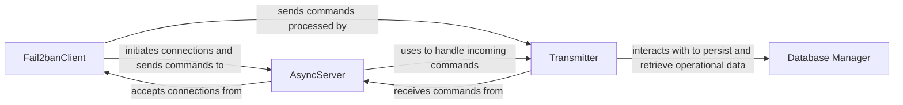

## Component Details

These four components (Fail2banClient, AsyncServer, Transmitter, and Database Manager) are fundamental to Fail2ban's operation as they collectively form the core architecture for client-server communication, command processing, and data persistence. Fail2banClient is the entry point for user interaction. AsyncServer is crucial for enabling communication between the client and the server's internal logic. Transmitter acts as the command processing engine. Database Manager is indispensable for Fail2ban's ability to maintain state across restarts.

### Fail2banClient
The Fail2banClient is the user-facing component that allows administrators to interact with the Fail2ban server. It parses command-line arguments, establishes connections to the server, sends commands, and displays responses. It also handles the initial server startup process if the server is not already running.

**Related Classes/Methods**:

- `Fail2banClient` (1:1)

### AsyncServer
The AsyncServer is the core server component that listens for and accepts client connections. It uses asyncore.dispatcher for asynchronous I/O operations, allowing it to handle multiple client connections concurrently. It delegates the actual command processing to a Transmitter instance.

**Related Classes/Methods**:

- `AsyncServer` (1:1)

### Transmitter
The Transmitter is responsible for interpreting and executing commands received from the Fail2banClient via the AsyncServer. It contains a __commandHandler method that dispatches commands to the appropriate server-side logic (e.g., adding/stopping jails, setting configurations, retrieving status).

**Related Classes/Methods**:

- <a href="https://github.com/fail2ban/fail2ban/blob/master/fail2ban/server/transmitter.py#L36-L522" target="_blank" rel="noopener noreferrer">`Transmitter` (36:522)</a>

### Database Manager
Provides persistent storage for Fail2ban's operational data, including banned IP addresses, their ban times, log file positions, and jail configurations. It encapsulates all database interactions (creation, updates, queries, and schema management), ensuring data integrity and persistence across server restarts.

**Related Classes/Methods**:

- `Database Manager` (1:1)

### [FAQ](https://github.com/CodeBoarding/GeneratedOnBoardings/tree/main?tab=readme-ov-file#faq)