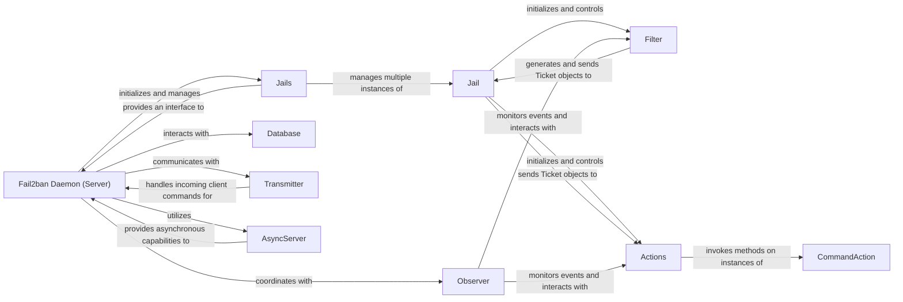

## Component Details

Analysis of the Fail2ban Daemon (Server) subsystem components and their relationships.

### Fail2ban Daemon (Server)
The central orchestrator of the Fail2ban system. It initializes and manages the lifecycle of Jails, handles client commands, and coordinates with other core components like the Database for persistence and the Observer for background tasks. It is the main control hub.

**Related Classes/Methods**:

- <a href="https://github.com/fail2ban/fail2ban/blob/master/fail2ban/server/server.py#L1-L1" target="_blank" rel="noopener noreferrer">`fail2ban.server.server` (1:1)</a>

### Jails
A high-level component responsible for managing a collection of Jail instances. It provides an interface for the Fail2ban Daemon (Server) to interact with and control all configured jails as a group.

**Related Classes/Methods**:

- <a href="https://github.com/fail2ban/fail2ban/blob/master/fail2ban/server/jails.py#L1-L1" target="_blank" rel="noopener noreferrer">`fail2ban.server.jails` (1:1)</a>

### Jail
The Jail acts as the central orchestrator for a specific set of security rules. It manages the lifecycle of a Filter and Actions instance, serving as the conduit for Ticket objects (detected intrusion attempts) between them. It also handles the selection and initialization of the log monitoring backend.

**Related Classes/Methods**:

- <a href="https://github.com/fail2ban/fail2ban/blob/master/fail2ban/server/jail.py#L1-L1" target="_blank" rel="noopener noreferrer">`fail2ban.server.jail` (1:1)</a>

### Filter
The Filter is responsible for monitoring log files, parsing log entries, and identifying patterns that indicate a "failure" (e.g., failed login attempts) using FailRegex. It also filters out ignored entries, extracts timestamps using DateDetector, and manages the count of failed attempts through FailManager before reporting them as Ticket objects to the Jail.

**Related Classes/Methods**:

- <a href="https://github.com/fail2ban/fail2ban/blob/master/fail2ban/server/filter.py#L1-L1" target="_blank" rel="noopener noreferrer">`fail2ban.server.filter` (1:1)</a>

### Actions
The Actions component manages a collection of configured action instances (e.g., CommandAction) for a specific jail. It receives Ticket objects from the Jail and orchestrates the execution of ban, unban, reban, and prolong commands through the registered action instances. It also interacts with a BanManager to keep track of currently banned IPs.

**Related Classes/Methods**:

- <a href="https://github.com/fail2ban/fail2ban/blob/master/fail2ban/server/actions.py#L1-L1" target="_blank" rel="noopener noreferrer">`fail2ban.server.actions` (1:1)</a>

### CommandAction
CommandAction is a concrete implementation of an action that executes external shell commands. It provides methods for various operations like banning, unbanning, starting, and stopping, and handles the substitution of dynamic tags (e.g., <ip>, <port>) within these commands before execution. It may use IPDNS for IP resolution.

**Related Classes/Methods**:

- <a href="https://github.com/fail2ban/fail2ban/blob/master/fail2ban/server/action.py#L1-L1" target="_blank" rel="noopener noreferrer">`fail2ban.server.action` (1:1)</a>

### Database
Handles the persistent storage of Fail2ban's operational state, including active bans, jail configurations, and other relevant data. It ensures that state is preserved across daemon restarts.

**Related Classes/Methods**:

- <a href="https://github.com/fail2ban/fail2ban/blob/master/fail2ban/server/database.py#L1-L1" target="_blank" rel="noopener noreferrer">`fail2ban.server.database` (1:1)</a>

### Observer
A background component responsible for monitoring various aspects of the Fail2ban system, such as file changes, internal events, or specific conditions. It acts as a general-purpose event listener and dispatcher for other components.

**Related Classes/Methods**:

- <a href="https://github.com/fail2ban/fail2ban/blob/master/fail2ban/server/observer.py#L1-L1" target="_blank" rel="noopener noreferrer">`fail2ban.server.observer` (1:1)</a>

### Transmitter
Handles communication with clients. It manages the network interface for receiving commands and sending responses to Fail2ban clients.

**Related Classes/Methods**:

- <a href="https://github.com/fail2ban/fail2ban/blob/master/fail2ban/server/transmitter.py#L1-L1" target="_blank" rel="noopener noreferrer">`fail2ban.server.transmitter` (1:1)</a>

### AsyncServer
Manages asynchronous operations for the server, particularly handling non-blocking I/O and concurrent tasks. It ensures the daemon remains responsive while performing potentially long-running operations.

**Related Classes/Methods**:

- <a href="https://github.com/fail2ban/fail2ban/blob/master/fail2ban/server/asyncserver.py#L1-L1" target="_blank" rel="noopener noreferrer">`fail2ban.server.asyncserver` (1:1)</a>

### [FAQ](https://github.com/CodeBoarding/GeneratedOnBoardings/tree/main?tab=readme-ov-file#faq)