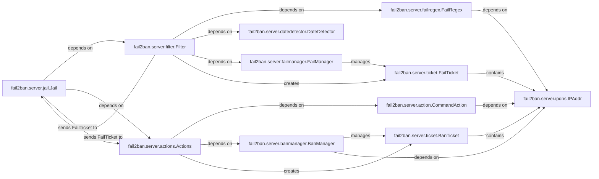

## Component Details

Analysis of the Jail & Action Engine component in Fail2Ban, detailing its core components and their interactions.

### fail2ban.server.jail.Jail
The `Jail` class is the core of the `Jail & Action Engine`. Each instance represents a specific service being protected (e.g., SSH, Apache). It acts as the primary orchestrator, coordinating the filtering of logs and the execution of actions for that service. It initializes and manages a `Filter` and `Actions` object, and handles the flow of "fail tickets" (representing detected failed attempts) between them. It also manages the persistence of ban data through a database.

**Related Classes/Methods**:

- <a href="https://github.com/fail2ban/fail2ban/blob/master/fail2ban/server/jail.py#L38-L352" target="_blank" rel="noopener noreferrer">`fail2ban.server.jail.Jail` (38:352)</a>

### fail2ban.server.filter.Filter
The `Filter` class is responsible for processing log entries, applying regular expressions to detect malicious patterns, and interacting with date detection and fail management. It maintains lists of "fail regex" (patterns to identify failures) and "ignore regex" (patterns to ignore). It uses a `DateDetector` to parse timestamps and a `FailManager` to track failed attempts. When a failed attempt is detected, it creates a `FailTicket` and passes it to the `Jail` for potential banning.

**Related Classes/Methods**:

- <a href="https://github.com/fail2ban/fail2ban/blob/master/fail2ban/server/filter.py#L56-L998" target="_blank" rel="noopener noreferrer">`fail2ban.server.filter.Filter` (56:998)</a>

### fail2ban.server.failregex.FailRegex
`FailRegex` extends the base `Regex` class and is specifically designed to manage and apply regular expressions for identifying malicious patterns within log entries. It ensures that the defined regex patterns include a "failure-id" group, which is crucial for uniquely identifying the source of a failed attempt (e.g., an IP address or hostname).

**Related Classes/Methods**:

- <a href="https://github.com/fail2ban/fail2ban/blob/master/fail2ban/server/failregex.py#L413-L465" target="_blank" rel="noopener noreferrer">`fail2ban.server.failregex.FailRegex` (413:465)</a>

### fail2ban.server.datedetector.DateDetector
The `DateDetector` class is responsible for parsing and detecting timestamps within log lines. It manages a collection of date templates and attempts to match them against log entries to extract the time of an event. This is crucial for the `Filter` to correlate events and for the `FailManager` to determine the age of failed attempts, ensuring that only recent failures contribute to a ban.

**Related Classes/Methods**:

- <a href="https://github.com/fail2ban/fail2ban/blob/master/fail2ban/server/datedetector.py#L221-L549" target="_blank" rel="noopener noreferrer">`fail2ban.server.datedetector.DateDetector` (221:549)</a>

### fail2ban.server.failmanager.FailManager
The `FailManager` class tracks and manages the state of failed attempts for individual IP addresses or other identifiers. It stores `FailTicket` instances and determines when an IP should be banned based on configured thresholds (e.g., `maxretry` within `findtime`). It also handles the cleanup of old, expired failures.

**Related Classes/Methods**:

- <a href="https://github.com/fail2ban/fail2ban/blob/master/fail2ban/server/failmanager.py#L37-L164" target="_blank" rel="noopener noreferrer">`fail2ban.server.failmanager.FailManager` (37:164)</a>

### fail2ban.server.actions.Actions
The `Actions` class manages a collection of individual action instances (e.g., `CommandAction`). It receives `FailTicket` objects from the `Jail` and orchestrates the execution of the configured ban actions. It also interacts with the `BanManager` to add and remove banned IPs and handles the unbanning of expired entries.

**Related Classes/Methods**:

- <a href="https://github.com/fail2ban/fail2ban/blob/master/fail2ban/server/actions.py#L49-L744" target="_blank" rel="noopener noreferrer">`fail2ban.server.actions.Actions` (49:744)</a>

### fail2ban.server.action.CommandAction
`CommandAction` is a concrete implementation of an action that executes OS shell commands. It defines the various commands that Fail2Ban can perform (e.g., `actionstart`, `actionban`, `actionunban`, `actioncheck`, `actionrepair`, `actionflush`, `actionstop`, `actionreload`). It handles the substitution of dynamic tags within these commands and provides methods for executing them securely.

**Related Classes/Methods**:

- <a href="https://github.com/fail2ban/fail2ban/blob/master/fail2ban/server/action.py#L287-L1041" target="_blank" rel="noopener noreferrer">`fail2ban.server.action.CommandAction` (287:1041)</a>

### fail2ban.server.banmanager.BanManager
The `BanManager` class is responsible for maintaining the list of currently banned IP addresses. It adds and removes `BanTicket` instances, manages the ban time for each entry, and provides methods for retrieving the list of banned IPs. It also handles the logic for determining when an IP should be unbanned based on its expiration time.

**Related Classes/Methods**:

- <a href="https://github.com/fail2ban/fail2ban/blob/master/fail2ban/server/banmanager.py#L42-L385" target="_blank" rel="noopener noreferrer">`fail2ban.server.banmanager.BanManager` (42:385)</a>

### fail2ban.server.ticket.FailTicket
`FailTicket` is a data structure that encapsulates information about a single failed attempt. It stores the IP address, the timestamp of the failure, and any matched log lines. It also tracks the number of retries for a given IP, which is used by the `FailManager` to determine if a ban threshold has been reached.

**Related Classes/Methods**:

- <a href="https://github.com/fail2ban/fail2ban/blob/master/fail2ban/server/ticket.py#L224-L280" target="_blank" rel="noopener noreferrer">`fail2ban.server.ticket.FailTicket` (224:280)</a>

### fail2ban.server.ipdns.IPAddr
The `IPAddr` class provides functionality for encapsulating and manipulating IPv4 and IPv6 addresses, including CIDR notation. It offers methods for converting IP strings to binary representations, checking if an IP is within a given network, and performing reverse DNS lookups. This component is used by `FailRegex` and `Filter` for IP-related operations.

**Related Classes/Methods**:

- <a href="https://github.com/fail2ban/fail2ban/blob/master/fail2ban/server/ipdns.py#L318-L692" target="_blank" rel="noopener noreferrer">`fail2ban.server.ipdns.IPAddr` (318:692)</a>

### fail2ban.server.ticket.BanTicket
A data structure representing an active ban, typically containing the banned IP address and its expiration time. It is managed by the `BanManager`.

**Related Classes/Methods**:

- <a href="https://github.com/fail2ban/fail2ban/blob/master/fail2ban/server/ticket.py#L287-L292" target="_blank" rel="noopener noreferrer">`fail2ban.server.ticket.BanTicket` (287:292)</a>

### [FAQ](https://github.com/CodeBoarding/GeneratedOnBoardings/tree/main?tab=readme-ov-file#faq)