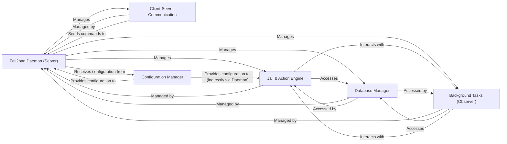

## Component Details

The `fail2ban` architecture is primarily a client-server model, with a central daemon managing security policies based on log file analysis. The core functionality revolves around detecting malicious patterns in logs and executing predefined actions (like banning IP addresses).

### Fail2ban Daemon (Server)
The central orchestrator of the Fail2ban system. It manages the lifecycle of jails, handles client commands, and coordinates with other core components like the database and background observer. It is the main control hub.

**Related Classes/Methods**:

- <a href="https://github.com/fail2ban/fail2ban/blob/master/fail2ban/server/server.py#L73-L952" target="_blank" rel="noopener noreferrer">`fail2ban.server.server.Server` (73:952)</a>

### Jail & Action Engine
Encapsulates the core logic for monitoring log files, detecting malicious patterns, managing failed attempts, and executing ban/unban actions. Each "jail" instance represents a specific service being protected, applying filters and actions.

**Related Classes/Methods**:

- <a href="https://github.com/fail2ban/fail2ban/blob/master/fail2ban/server/jail.py#L38-L352" target="_blank" rel="noopener noreferrer">`fail2ban.server.jail.Jail` (38:352)</a>
- <a href="https://github.com/fail2ban/fail2ban/blob/master/fail2ban/server/filter.py#L56-L998" target="_blank" rel="noopener noreferrer">`fail2ban.server.filter.Filter` (56:998)</a>
- <a href="https://github.com/fail2ban/fail2ban/blob/master/fail2ban/server/failregex.py#L413-L465" target="_blank" rel="noopener noreferrer">`fail2ban.server.failregex.FailRegex` (413:465)</a>
- <a href="https://github.com/fail2ban/fail2ban/blob/master/fail2ban/server/datedetector.py#L221-L549" target="_blank" rel="noopener noreferrer">`fail2ban.server.datedetector.DateDetector` (221:549)</a>
- <a href="https://github.com/fail2ban/fail2ban/blob/master/fail2ban/server/failmanager.py#L37-L164" target="_blank" rel="noopener noreferrer">`fail2ban.server.failmanager.FailManager` (37:164)</a>
- <a href="https://github.com/fail2ban/fail2ban/blob/master/fail2ban/server/action.py#L287-L1041" target="_blank" rel="noopener noreferrer">`fail2ban.server.action.CommandAction` (287:1041)</a>
- <a href="https://github.com/fail2ban/fail2ban/blob/master/fail2ban/server/actions.py#L49-L744" target="_blank" rel="noopener noreferrer">`fail2ban.server.actions.Actions` (49:744)</a>

### Database Manager
Provides persistent storage for Fail2ban's operational data, including banned IP addresses, their ban times, and log file positions. It handles all database interactions (creation, updates, queries).

**Related Classes/Methods**:

- <a href="https://github.com/fail2ban/fail2ban/blob/master/fail2ban/server/database.py#L83-L888" target="_blank" rel="noopener noreferrer">`fail2ban.server.database.Fail2BanDb` (83:888)</a>

### Client-Server Communication
Facilitates asynchronous communication between Fail2ban clients and the central daemon. It handles incoming client connections, parses commands, and dispatches them to the appropriate server-side handlers.

**Related Classes/Methods**:

- <a href="https://github.com/fail2ban/fail2ban/blob/master/fail2ban/server/asyncserver.py#L197-L340" target="_blank" rel="noopener noreferrer">`fail2ban.server.asyncserver.AsyncServer` (197:340)</a>
- <a href="https://github.com/fail2ban/fail2ban/blob/master/fail2ban/server/transmitter.py#L36-L522" target="_blank" rel="noopener noreferrer">`fail2ban.server.transmitter.Transmitter` (36:522)</a>
- <a href="https://github.com/fail2ban/fail2ban/blob/master/fail2ban/client/fail2banclient.py#L53-L461" target="_blank" rel="noopener noreferrer">`fail2ban.client.fail2banclient.Fail2banClient` (53:461)</a>

### Configuration Manager
Responsible for reading, parsing, and applying Fail2ban's configuration files. It handles the hierarchical structure of configuration, including includes and variable interpolation, to set up jails, filters, and actions.

**Related Classes/Methods**:

- <a href="https://github.com/fail2ban/fail2ban/blob/master/fail2ban/client/configurator.py#L34-L90" target="_blank" rel="noopener noreferrer">`fail2ban.client.configurator.Configurator` (34:90)</a>
- <a href="https://github.com/fail2ban/fail2ban/blob/master/fail2ban/client/configreader.py#L61-L179" target="_blank" rel="noopener noreferrer">`fail2ban.client.configreader.ConfigReader` (61:179)</a>
- <a href="https://github.com/fail2ban/fail2ban/blob/master/fail2ban/client/jailreader.py#L44-L312" target="_blank" rel="noopener noreferrer">`fail2ban.client.jailreader.JailReader` (44:312)</a>
- <a href="https://github.com/fail2ban/fail2ban/blob/master/fail2ban/client/actionreader.py#L36-L103" target="_blank" rel="noopener noreferrer">`fail2ban.client.actionreader.ActionReader` (36:103)</a>
- <a href="https://github.com/fail2ban/fail2ban/blob/master/fail2ban/client/filterreader.py#L36-L98" target="_blank" rel="noopener noreferrer">`fail2ban.client.filterreader.FilterReader` (36:98)</a>

### Background Tasks (Observer)
A dedicated thread for handling periodic and asynchronous operations, primarily monitoring for the expiry of bans and triggering unban actions. It also performs database maintenance tasks.

**Related Classes/Methods**:

- <a href="https://github.com/fail2ban/fail2ban/blob/master/fail2ban/server/observer.py#L39-L521" target="_blank" rel="noopener noreferrer">`fail2ban.server.observer.ObserverThread` (39:521)</a>

### [FAQ](https://github.com/CodeBoarding/GeneratedOnBoardings/tree/main?tab=readme-ov-file#faq)