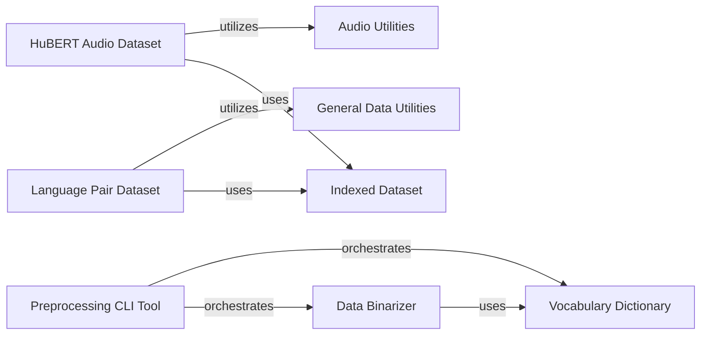

## Details

The fairseq data preprocessing subsystem is centered around efficient data handling for machine learning tasks. The Preprocessing CLI Tool acts as the primary entry point, orchestrating the conversion of raw data into a model-ready format. This process heavily relies on the Data Binarizer to transform input into numerical representations, guided by the Vocabulary Dictionary for consistent token-to-ID mapping. Large datasets are efficiently managed and accessed via the Indexed Dataset component, which serves as a foundational storage layer for both text-based (Language Pair Dataset) and audio-based (HuBERT Audio Dataset) data. Auxiliary functionalities are provided by General Data Utilities for common data manipulations and Audio Utilities for specialized audio processing, ensuring robust and flexible data preparation pipelines.

### Preprocessing CLI Tool
Serves as the primary command-line interface for initiating the data preparation workflow, including vocabulary building and data binarization. It orchestrates the overall preprocessing steps.

**Related Classes/Methods**:

### Data Binarizer
Responsible for converting raw textual or other input data into a numerical, binarized format suitable for model consumption. It handles token-to-ID mapping and efficient storage.

**Related Classes/Methods**:

- <a href="https://github.com/facebookresearch/fairseq/blob/main/fairseq/data/indexed_dataset.py#L323-L382" target="_blank" rel="noopener noreferrer">`fairseq.data.indexed_dataset.IndexedDatasetBuilder`:323-382</a>

### Vocabulary Dictionary
Manages the mapping between string tokens and numerical IDs, providing a consistent vocabulary across the dataset. It supports adding new symbols and loading pre-existing dictionaries.

**Related Classes/Methods**:

- <a href="https://github.com/facebookresearch/fairseq/blob/main/fairseq/data/dictionary.py" target="_blank" rel="noopener noreferrer">`fairseq.data.Dictionary`</a>

### Language Pair Dataset
A specialized dataset implementation for tasks involving source and target language pairs (e.g., machine translation). It handles loading, padding, and batching of linguistic data.

**Related Classes/Methods**:

- <a href="https://github.com/facebookresearch/fairseq/blob/main/fairseq/data/language_pair_dataset.py" target="_blank" rel="noopener noreferrer">`fairseq.data.LanguagePairDataset`</a>

### HuBERT Audio Dataset
A specialized dataset implementation for audio-based tasks, particularly for HuBERT pretraining. It manages the loading of raw audio waveforms and associated labels.

**Related Classes/Methods**:

- <a href="https://github.com/facebookresearch/fairseq/blob/main/fairseq/data/audio/hubert_dataset.py#L115-L356" target="_blank" rel="noopener noreferrer">`fairseq.data.audio.hubert_dataset.HubertDataset`:115-356</a>

### Indexed Dataset
Provides an efficient, memory-mapped mechanism for storing and retrieving large datasets from disk. This allows for fast access to individual samples without loading the entire dataset into memory.

**Related Classes/Methods**:

- <a href="https://github.com/facebookresearch/fairseq/blob/main/fairseq/data/indexed_dataset.py#L146-L216" target="_blank" rel="noopener noreferrer">`fairseq.data.indexed_dataset.IndexedDataset`:146-216</a>

### General Data Utilities
Provides common data manipulation functionalities like padding, batching, and filtering, essential for preparing diverse datasets for model consumption.

**Related Classes/Methods**:

- <a href="https://github.com/facebookresearch/fairseq/blob/main/fairseq/data/data_utils.py" target="_blank" rel="noopener noreferrer">`fairseq.data.data_utils`</a>

### Audio Utilities
Offers audio-specific processing functionalities, such as feature extraction and waveform manipulation, necessary for handling raw audio data within the pipeline.

**Related Classes/Methods**:

- <a href="https://github.com/facebookresearch/fairseq/blob/main/fairseq/data/audio/audio_utils.py" target="_blank" rel="noopener noreferrer">`fairseq.data.audio.audio_utils`</a>

### [FAQ](https://github.com/CodeBoarding/GeneratedOnBoardings/tree/main?tab=readme-ov-file#faq)