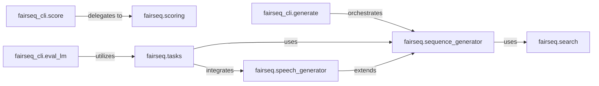

## Details

The `Inference & Generation` subsystem in Fairseq is responsible for generating sequences from trained models and evaluating their performance. It encompasses the core decoding engines, various search algorithms, and command-line interfaces for both generation and evaluation.

### fairseq.sequence_generator
The core inference engine for sequence generation. It manages decoding strategies, interacts with model encoders/decoders, and handles incremental states during the generation process.

**Related Classes/Methods**:

- <a href="https://github.com/facebookresearch/fairseq/blob/main/fairseq/sequence_generator.py" target="_blank" rel="noopener noreferrer">`fairseq.sequence_generator`</a>

### fairseq.speech_generator
A specialized inference engine for speech tasks. It extends `fairseq.sequence_generator` to incorporate speech-specific generation and post-processing logic.

**Related Classes/Methods**:

- <a href="https://github.com/facebookresearch/fairseq/blob/main/fairseq/speech_generator.py" target="_blank" rel="noopener noreferrer">`fairseq.speech_generator`</a>

### fairseq.search
Provides various decoding algorithms (e.g., beam search, greedy search) that are utilized by the sequence generators to produce output sequences.

**Related Classes/Methods**:

- <a href="https://github.com/facebookresearch/fairseq/blob/main/fairseq/search.py" target="_blank" rel="noopener noreferrer">`fairseq.search`</a>

### fairseq_cli.generate
The primary command-line interface for initiating sequence generation. It orchestrates the loading of models and data, parses arguments, and triggers the generation process via `fairseq.sequence_generator`.

**Related Classes/Methods**:

- <a href="https://github.com/facebookresearch/fairseq/blob/main/fairseq_cli/generate.py" target="_blank" rel="noopener noreferrer">`fairseq_cli.generate`</a>

### fairseq_cli.eval_lm
A command-line interface specifically for evaluating language models. It sets up the evaluation context by utilizing `fairseq.tasks` and performs language model-specific assessments.

**Related Classes/Methods**:

- <a href="https://github.com/facebookresearch/fairseq/blob/main/fairseq_cli/eval_lm.py" target="_blank" rel="noopener noreferrer">`fairseq_cli.eval_lm`</a>

### fairseq_cli.score
A command-line utility for scoring generated sequences against reference outputs. It delegates the calculation of various evaluation metrics to `fairseq.scoring`.

**Related Classes/Methods**:

- <a href="https://github.com/facebookresearch/fairseq/blob/main/fairseq_cli/score.py" target="_blank" rel="noopener noreferrer">`fairseq_cli.score`</a>

### fairseq.scoring
Implements and provides various evaluation metrics (e.g., BLEU, chrF, WER) used to assess the quality of generated sequences. It is utilized by evaluation CLI tools.

**Related Classes/Methods**:

- <a href="https://github.com/facebookresearch/fairseq/blob/main/fairseq/scoring/__init__.py" target="_blank" rel="noopener noreferrer">`fairseq.scoring`</a>

### fairseq.tasks
Defines and integrates task-specific logic, including how models are built, data is loaded, and evaluation is performed. It acts as a bridge between the core generation/evaluation components and specific machine learning tasks.

**Related Classes/Methods**:

- <a href="https://github.com/facebookresearch/fairseq/blob/main/fairseq/tasks/__init__.py" target="_blank" rel="noopener noreferrer">`fairseq.tasks`</a>

### [FAQ](https://github.com/CodeBoarding/GeneratedOnBoardings/tree/main?tab=readme-ov-file#faq)