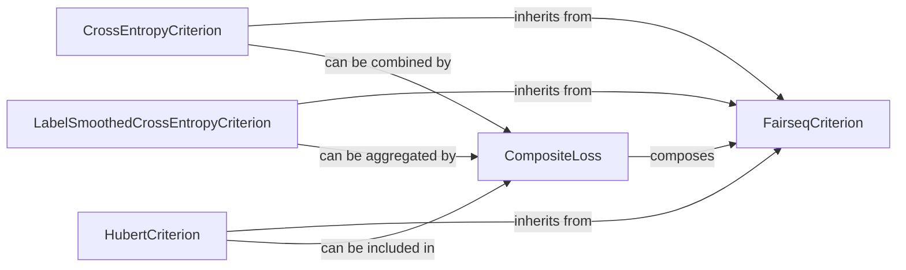

## Details

The `Loss Functions (Criterions)` subsystem in Fairseq is primarily encapsulated within the `fairseq/criterions` directory. Its boundaries are defined by the `FairseqCriterion` abstract base class and its various concrete implementations, which collectively handle the computation of training objectives and associated metrics.

### FairseqCriterion
This is the foundational abstract base class for all loss functions (criterions) within Fairseq. It establishes the core interface and contract that all concrete loss implementations must adhere to. It defines abstract methods for loss computation and provides utilities for metric aggregation and reduction, which are essential for distributed training environments.

**Related Classes/Methods**:

- <a href="https://github.com/facebookresearch/fairseq/blob/main/fairseq/criterions/fairseq_criterion.py#L16-L104" target="_blank" rel="noopener noreferrer">`FairseqCriterion`:16-104</a>

### CrossEntropyCriterion
A concrete implementation of the widely used cross-entropy loss function. It calculates the loss typically applied in classification and sequence prediction tasks, serving as a fundamental and common training objective.

**Related Classes/Methods**:

- <a href="https://github.com/facebookresearch/fairseq/blob/main/fairseq/criterions/cross_entropy.py#L22-L91" target="_blank" rel="noopener noreferrer">`CrossEntropyCriterion`:22-91</a>

### LabelSmoothedCrossEntropyCriterion
A concrete implementation that computes a regularized version of cross-entropy loss by incorporating label smoothing. This technique helps prevent overfitting and promotes more robust model predictions. It also includes logic for calculating prediction accuracy.

**Related Classes/Methods**:

- <a href="https://github.com/facebookresearch/fairseq/blob/main/fairseq/criterions/label_smoothed_cross_entropy_latency_augmented.py#L62-L221" target="_blank" rel="noopener noreferrer">`LabelSmoothedCrossEntropyCriterion`:62-221</a>

### HubertCriterion
A specialized concrete loss function designed specifically for the HuBERT (Hidden Unit BERT) model. Its primary role is to compute the loss and a correctness metric tailored to the HuBERT pre-training objective, which involves predicting masked latent units, showcasing the extensibility for domain-specific models.

**Related Classes/Methods**:

- <a href="https://github.com/facebookresearch/fairseq/blob/main/fairseq/criterions/hubert_criterion.py#L39-L195" target="_blank" rel="noopener noreferrer">`HubertCriterion`:39-195</a>

### CompositeLoss
This component provides a mechanism for combining multiple individual `FairseqCriterion` instances. It enables the creation of complex loss objectives by summing or otherwise aggregating the outputs of its constituent losses, supporting advanced training scenarios with multiple objectives.

**Related Classes/Methods**:

- <a href="https://github.com/facebookresearch/fairseq/blob/main/fairseq/criterions/composite_loss.py#L11-L100" target="_blank" rel="noopener noreferrer">`CompositeLoss`:11-100</a>

### [FAQ](https://github.com/CodeBoarding/GeneratedOnBoardings/tree/main?tab=readme-ov-file#faq)