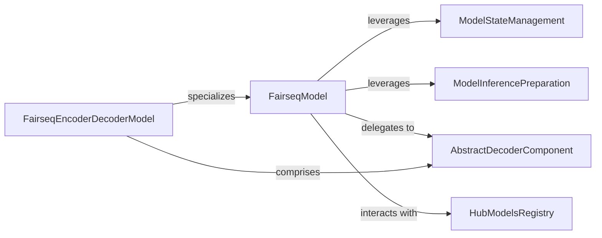

## Details

The Fairseq model subsystem is built around the `FairseqModel` abstract base class, which serves as the core extension point for all neural network models. This foundational component provides essential functionalities for managing model state through `ModelStateManagement` (handling loading and upgrading of model weights) and optimizing models for efficient inference via `ModelInferencePreparation`. For sequence-to-sequence tasks, `FairseqEncoderDecoderModel` specializes `FairseqModel`, explicitly defining the relationship between encoder and decoder components, with the `AbstractDecoderComponent` representing the pluggable interface for decoding strategies. The `HubModelsRegistry` acts as a crucial external interface, facilitating the loading of pre-trained models from a centralized hub and providing a `GeneratorHubInterface` for seamless interaction with these models, encompassing tokenization, BPE, and generation capabilities. This modular design allows for flexible model development, efficient deployment, and easy access to a wide range of pre-trained models.

### FairseqModel
Serves as the abstract base class for all neural network models in Fairseq. It defines the common interface, manages model state (loading, upgrading), and provides basic functionalities for inference preparation. It's the primary extension point for new model architectures, embodying Fairseq's modular design.

**Related Classes/Methods**:

- <a href="https://github.com/facebookresearch/fairseq/blob/main/fairseq/models/fairseq_model.py#L364-L371" target="_blank" rel="noopener noreferrer">`fairseq.models.fairseq_model.FairseqModel`:364-371</a>

### FairseqEncoderDecoderModel
An abstract parent or mixin class that establishes the foundational structure and relationships for encoder-decoder architectures within Fairseq. It specializes FairseqModel for sequence-to-sequence tasks, providing a common interface for models composed of distinct encoder and decoder components.

**Related Classes/Methods**:

- <a href="https://github.com/facebookresearch/fairseq/blob/main/fairseq/models/fairseq_model.py#L287-L361" target="_blank" rel="noopener noreferrer">`fairseq.models.fairseq_model.FairseqEncoderDecoderModel`:287-361</a>

### ModelStateManagement
Encapsulates the internal logic for loading and upgrading model states, ensuring compatibility across different versions of models or Fairseq. This is crucial for an ML toolkit that supports evolving models and allows users to seamlessly use pre-trained weights.

**Related Classes/Methods**:

- <a href="https://github.com/facebookresearch/fairseq/blob/main/fairseq/models/fairseq_model.py#L400-L402" target="_blank" rel="noopener noreferrer">`fairseq.models.fairseq_model.FairseqModel:load_state_dict`:400-402</a>
- <a href="https://github.com/facebookresearch/fairseq/blob/main/fairseq/models/fairseq_model.py#L404-L410" target="_blank" rel="noopener noreferrer">`fairseq.models.fairseq_model.FairseqModel:upgrade_state_dict`:404-410</a>
- <a href="https://github.com/facebookresearch/fairseq/blob/main/fairseq/models/fairseq_model.py#L412-L413" target="_blank" rel="noopener noreferrer">`fairseq.models.fairseq_model.FairseqModel:do_upgrade`:412-413</a>

### ModelInferencePreparation
Contains the internal logic to prepare the model for efficient inference, potentially involving optimizations like graph freezing or specific hardware optimizations. This component is vital for deploying models in production or for fast experimentation.

**Related Classes/Methods**:

- <a href="https://github.com/facebookresearch/fairseq/blob/main/fairseq/models/fairseq_model.py#L415-L420" target="_blank" rel="noopener noreferrer">`fairseq.models.fairseq_model.FairseqModel:make_generation_fast_`:415-420</a>
- <a href="https://github.com/facebookresearch/fairseq/blob/main/fairseq/models/fairseq_model.py#L422-L423" target="_blank" rel="noopener noreferrer">`fairseq.models.fairseq_model.FairseqModel:apply_make_generation_fast_`:422-423</a>

### AbstractDecoderComponent
Represents an abstract interface or property within FairseqModel (specifically for encoder-decoder models) that directs the decoding process. It enforces separation of concerns for sequence generation, allowing different decoding strategies or decoder architectures to be plugged in.

**Related Classes/Methods**:

- <a href="https://github.com/facebookresearch/fairseq/blob/main/fairseq/models/fairseq_model.py#L396-L397" target="_blank" rel="noopener noreferrer">`fairseq.models.fairseq_model.FairseqModel:decoder`:396-397</a>

### HubModelsRegistry
Acts as a centralized utility for loading pre-trained models and providing a standardized interface (`GeneratorHubInterface`) for sequence generation tasks. It handles the complexities of model and data archive loading, tokenization, BPE, and binarization, enabling users to easily access and utilize community or official models.

**Related Classes/Methods**:

- <a href="https://github.com/facebookresearch/fairseq/blob/main/fairseq/hub_utils.py#L23-L94" target="_blank" rel="noopener noreferrer">`fairseq.hub_utils.from_pretrained`:23-94</a>
- <a href="https://github.com/facebookresearch/fairseq/blob/main/fairseq/hub_utils.py#L97-L294" target="_blank" rel="noopener noreferrer">`fairseq.hub_utils.GeneratorHubInterface`:97-294</a>

### [FAQ](https://github.com/CodeBoarding/GeneratedOnBoardings/tree/main?tab=readme-ov-file#faq)