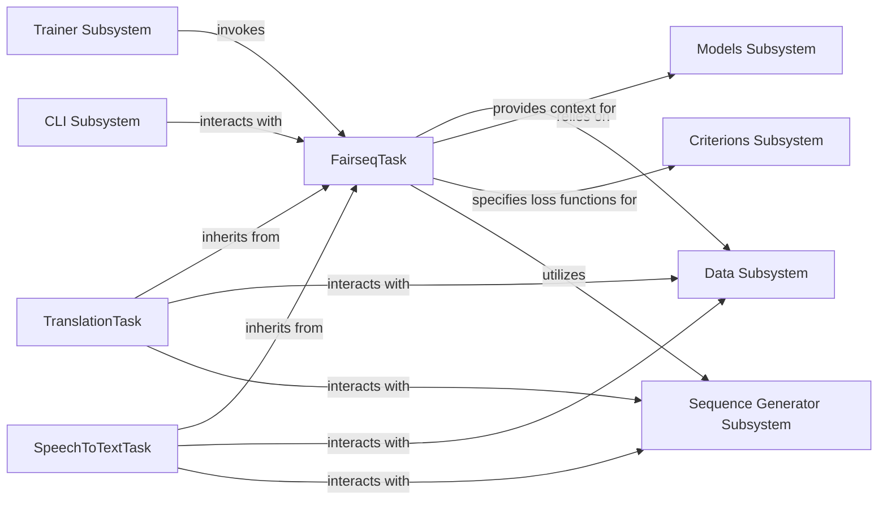

## Details

The feedback highlights missing destination and source components in the relationships, indicating that the analysis needs to define these components to accurately represent the system's interactions. The current analysis focuses on specific task implementations but lacks the broader subsystems they interact with. Addressing this will improve both the documentation's completeness and the clarity of the architectural flow graph.

### FairseqTask
Serves as the abstract base class for all machine learning tasks within Fairseq. It provides a standardized interface and common functionalities such as data loading, batching, model interaction context, metric handling, and state management. This component is fundamental to Fairseq's extensibility, allowing new tasks to be defined by extending this base class.

**Related Classes/Methods**:

- <a href="https://github.com/facebookresearch/fairseq/blob/main/fairseq/tasks/fairseq_task.py#L50-L656" target="_blank" rel="noopener noreferrer">`fairseq.tasks.fairseq_task.FairseqTask`:50-656</a>

### TranslationTask
A concrete implementation of FairseqTask specifically tailored for neural machine translation (NMT). It handles the unique aspects of NMT, such as managing language-pair datasets, tokenization, and computing translation-specific metrics like BLEU scores.

**Related Classes/Methods**:

- <a href="https://github.com/facebookresearch/fairseq/blob/main/fairseq/tasks/translation.py#L268-L498" target="_blank" rel="noopener noreferrer">`fairseq.tasks.translation.TranslationTask`:268-498</a>

### SpeechToTextTask
Another concrete implementation of FairseqTask, designed for speech-to-text (STT) tasks. This component manages audio and text datasets, handles audio processing specifics, and provides specialized generators for STT models.

**Related Classes/Methods**:

- <a href="https://github.com/facebookresearch/fairseq/blob/main/fairseq/tasks/speech_to_text.py#L25-L307" target="_blank" rel="noopener noreferrer">`fairseq.tasks.speech_to_text.SpeechToTextTask`:25-307</a>

### Data Subsystem
Manages the loading, preprocessing, and batching of datasets for various machine learning tasks. It provides the necessary data structures and iterators for FairseqTask to consume.

**Related Classes/Methods**: _None_

### Models Subsystem
Responsible for defining, building, and managing the neural network models used in Fairseq tasks. It provides the model architectures that FairseqTask interacts with during training and inference.

**Related Classes/Methods**: _None_

### Criterions Subsystem
Encapsulates the loss functions and evaluation metrics used to train and assess models within Fairseq tasks. It computes the loss based on model outputs and target data.

**Related Classes/Methods**: _None_

### Sequence Generator Subsystem
Provides functionalities for generating sequences (e.g., text, audio) from trained models, typically used during inference or decoding. It implements various search strategies like beam search.

**Related Classes/Methods**: _None_

### Trainer Subsystem
Orchestrates the entire training and validation process, including managing optimization, gradient updates, and epoch progression. It invokes the core training and validation steps defined in FairseqTask.

**Related Classes/Methods**: _None_

### CLI Subsystem
Serves as the command-line interface for users to interact with the Fairseq framework. It parses arguments, configures tasks, models, and training parameters, and initiates the execution flow.

**Related Classes/Methods**: _None_

### [FAQ](https://github.com/CodeBoarding/GeneratedOnBoardings/tree/main?tab=readme-ov-file#faq)