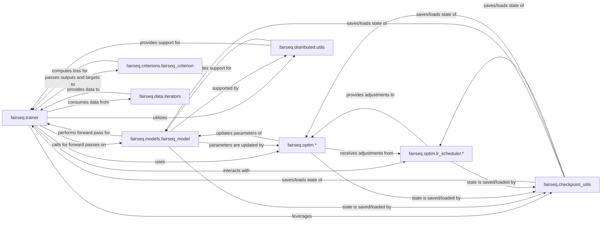

## Details

The Training & Optimization Engine subsystem in Fairseq is centered around the fairseq.trainer component, which orchestrates the entire training process. This subsystem embodies the core machine learning loop, managing data flow, model execution, loss computation, parameter updates, and distributed training aspects. Its design emphasizes modularity, allowing various components like optimizers, learning rate schedulers, and models to be plugged in.

### fairseq.trainer
The central orchestrator of the training process. It manages the training loop, handles forward and backward passes, coordinates gradient computation, parameter updates, learning rate adjustments, and facilitates distributed training. It also manages checkpointing and logging.

**Related Classes/Methods**:

- <a href="https://github.com/facebookresearch/fairseq/blob/main/fairseq/trainer.py" target="_blank" rel="noopener noreferrer">`fairseq.trainer`</a>

### fairseq.models.fairseq_model
Represents the neural network architecture being trained. It defines the model's layers and its forward pass logic, processing input data to produce predictions.

**Related Classes/Methods**:

- <a href="https://github.com/facebookresearch/fairseq/blob/main/fairseq/models/fairseq_model.py" target="_blank" rel="noopener noreferrer">`fairseq.models.fairseq_model`</a>

### fairseq.criterions.fairseq_criterion
Computes the loss value, quantifying the discrepancy between model predictions and target values. This loss guides the optimization process by providing a signal for gradient computation.

**Related Classes/Methods**:

- <a href="https://github.com/facebookresearch/fairseq/blob/main/fairseq/criterions/fairseq_criterion.py" target="_blank" rel="noopener noreferrer">`fairseq.criterions.fairseq_criterion`</a>

### fairseq.optim.*
Implements various optimization algorithms (e.g., Adam, SGD) responsible for updating model parameters based on computed gradients to minimize the loss function.

**Related Classes/Methods**:

- <a href="https://github.com/facebookresearch/fairseq/blob/main/fairseq/optim" target="_blank" rel="noopener noreferrer">`fairseq.optim`</a>

### fairseq.optim.lr_scheduler.*
Defines strategies for dynamically adjusting the learning rate during training, such as step-wise decay, warm-up, or cosine annealing, to improve convergence and performance.

**Related Classes/Methods**:

- <a href="https://github.com/facebookresearch/fairseq/blob/main/fairseq/optim/lr_scheduler" target="_blank" rel="noopener noreferrer">`fairseq.optim.lr_scheduler`</a>

### fairseq.data.iterators
Manages the iteration over datasets, providing training and validation batches to the trainer. It handles aspects like batching, shuffling, and data loading.

**Related Classes/Methods**:

- <a href="https://github.com/facebookresearch/fairseq/blob/main/fairseq/data/iterators.py" target="_blank" rel="noopener noreferrer">`fairseq.data.iterators`</a>

### fairseq.checkpoint_utils
Provides functionalities to save and load the complete training state, including model parameters, optimizer state, and learning rate scheduler state, enabling training resumption and model persistence.

**Related Classes/Methods**:

- <a href="https://github.com/facebookresearch/fairseq/blob/main/fairseq/checkpoint_utils.py" target="_blank" rel="noopener noreferrer">`fairseq.checkpoint_utils`</a>

### fairseq.distributed.utils
Offers helper functions and abstractions to manage and facilitate distributed training environments, including gradient synchronization, data parallelism, and communication across multiple devices or nodes.

**Related Classes/Methods**:

- <a href="https://github.com/facebookresearch/fairseq/blob/main/fairseq/distributed/utils.py" target="_blank" rel="noopener noreferrer">`fairseq.distributed.utils`</a>

### [FAQ](https://github.com/CodeBoarding/GeneratedOnBoardings/tree/main?tab=readme-ov-file#faq)