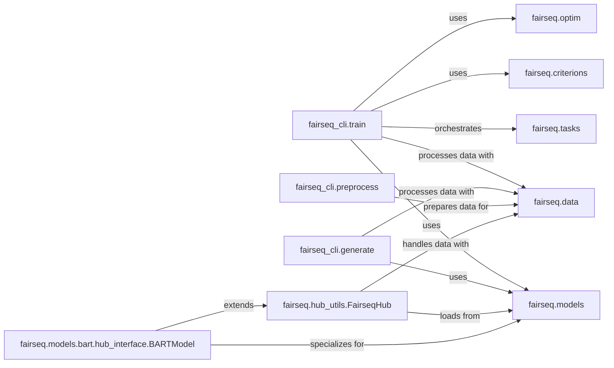

## Details

The `fairseq` project's architecture is designed around a modular approach for neural sequence modeling. Command-line interface (CLI) components, such as `fairseq_cli.train`, `fairseq_cli.generate`, and `fairseq_cli.preprocess`, serve as primary user entry points, orchestrating complex workflows. These CLIs interact extensively with core machine learning components: `fairseq.tasks` defines specific ML problems, `fairseq.models` provides the neural network architectures, `fairseq.criterions` handles loss computation, `fairseq.optim` manages model parameter updates, and `fairseq.data` facilitates efficient data handling and preprocessing. Complementing the CLI, the `fairseq.hub_utils.FairseqHub` offers a simplified Python API for interacting with pre-trained models, with specialized interfaces like `fairseq.models.bart.hub_interface.BARTModel` extending its functionality for specific model types. This structure ensures a clear separation of concerns, promoting reusability and extensibility across various sequence modeling tasks.

### fairseq_cli.train
Serves as the primary entry point for users to initiate and manage the training lifecycle of Fairseq models. It handles argument parsing, sets up the training environment, orchestrates the training loop, manages validation, and handles checkpointing.

**Related Classes/Methods**:

- <a href="https://github.com/facebookresearch/fairseq/blob/main/fairseq_cli/train.py" target="_blank" rel="noopener noreferrer">`fairseq_cli.train`</a>

### fairseq_cli.generate
Provides the command-line interface for performing inference and sequence generation using trained Fairseq models. It manages input data processing, loads pre-trained models, executes the inference process, and formats the output.

**Related Classes/Methods**:

- <a href="https://github.com/facebookresearch/fairseq/blob/main/fairseq_cli/generate.py" target="_blank" rel="noopener noreferrer">`fairseq_cli.generate`</a>

### fairseq_cli.preprocess
Manages the end-to-end data preparation pipeline. This includes building vocabularies (dictionaries), binarizing text and alignment data, and handling file path management for datasets, preparing them for consumption by training and generation components.

**Related Classes/Methods**:

- <a href="https://github.com/facebookresearch/fairseq/blob/main/fairseq_cli/preprocess.py" target="_blank" rel="noopener noreferrer">`fairseq_cli.preprocess`</a>

### fairseq.hub_utils.FairseqHub
Offers a high-level, simplified Python API that abstracts away the complexities of direct model and data handling within Fairseq. It provides common functionalities such as translation, sequence sampling, and scoring, making it easier for developers to integrate Fairseq models into their applications. This component embodies the "Pre-trained Model Hub" aspect.

**Related Classes/Methods**:

- <a href="https://github.com/facebookresearch/fairseq/blob/main/fairseq/hub_utils.py" target="_blank" rel="noopener noreferrer">`fairseq.hub_utils.FairseqHub`</a>

### fairseq.models.bart.hub_interface.BARTModel
Provides a specialized interface tailored for interacting with pre-trained BART models. It extends the general `FairseqHub` to offer BART-specific functionalities, such as mask filling, leveraging the underlying hub utilities and specifically interacting with the `fairseq.models.bart` sub-package.

**Related Classes/Methods**:

- <a href="https://github.com/facebookresearch/fairseq/blob/main/fairseq/models/bart/hub_interface.py" target="_blank" rel="noopener noreferrer">`fairseq.models.bart.hub_interface.BARTModel`</a>

### fairseq.tasks
Defines specific machine learning tasks (e.g., translation, language modeling) by providing task-specific data loading, batching, and loss computation logic. It acts as an interface between data and models.

**Related Classes/Methods**: _None_

### fairseq.models
Contains the neural network architectures (models) used in Fairseq, such as Transformers, LSTMs, etc. It defines how models are built, initialized, and perform forward passes.

**Related Classes/Methods**: _None_

### fairseq.criterions
Implements the loss functions (criterions) used to train Fairseq models. These define how the model's output is compared against the target to compute a loss value for optimization.

**Related Classes/Methods**: _None_

### fairseq.optim
Provides optimization algorithms (optimizers) and learning rate schedulers used to update model parameters during training.

**Related Classes/Methods**: _None_

### fairseq.data
Manages data loading, preprocessing, and batching utilities. It handles datasets, dictionaries (vocabularies), and iterators to efficiently feed data to models.

**Related Classes/Methods**: _None_

### [FAQ](https://github.com/CodeBoarding/GeneratedOnBoardings/tree/main?tab=readme-ov-file#faq)