```mermaid
graph LR
    Data_Pipeline["Data Pipeline"]
    Model_Architectures["Model Architectures"]
    Task_Definitions["Task Definitions"]
    Training_Optimization_Engine["Training & Optimization Engine"]
    Loss_Functions_Criterions_["Loss Functions (Criterions)"]
    Inference_Generation["Inference & Generation"]
    User_Interface_Hub["User Interface & Hub"]
    User_Interface_Hub -- "initiates" --> Data_Pipeline
    Data_Pipeline -- "provides data to" --> Task_Definitions
    User_Interface_Hub -- "initiates" --> Training_Optimization_Engine
    Task_Definitions -- "provides training steps to" --> Training_Optimization_Engine
    Training_Optimization_Engine -- "interacts with" --> Model_Architectures
    Model_Architectures -- "outputs to" --> Loss_Functions_Criterions_
    Loss_Functions_Criterions_ -- "computes loss for" --> Training_Optimization_Engine
    User_Interface_Hub -- "initiates" --> Inference_Generation
    Inference_Generation -- "uses" --> Model_Architectures
    Inference_Generation -- "outputs results to" --> User_Interface_Hub
    User_Interface_Hub -- "loads models from" --> Model_Architectures
    Training_Optimization_Engine -- "uses" --> Loss_Functions_Criterions_
    click Data_Pipeline href "https://github.com/CodeBoarding/GeneratedOnBoardings/blob/main/fairseq/Data_Pipeline.md" "Details"
    click Model_Architectures href "https://github.com/CodeBoarding/GeneratedOnBoardings/blob/main/fairseq/Model_Architectures.md" "Details"
    click Task_Definitions href "https://github.com/CodeBoarding/GeneratedOnBoardings/blob/main/fairseq/Task_Definitions.md" "Details"
    click Training_Optimization_Engine href "https://github.com/CodeBoarding/GeneratedOnBoardings/blob/main/fairseq/Training_Optimization_Engine.md" "Details"
    click Loss_Functions_Criterions_ href "https://github.com/CodeBoarding/GeneratedOnBoardings/blob/main/fairseq/Loss_Functions_Criterions_.md" "Details"
    click Inference_Generation href "https://github.com/CodeBoarding/GeneratedOnBoardings/blob/main/fairseq/Inference_Generation.md" "Details"
    click User_Interface_Hub href "https://github.com/CodeBoarding/GeneratedOnBoardings/blob/main/fairseq/User_Interface_Hub.md" "Details"
```

## Details

The Fairseq architecture is a highly modular and extensible ML toolkit, primarily designed for sequence modeling tasks. At its core, the Data Pipeline meticulously prepares raw data, which is then fed into specific Task Definitions that encapsulate the problem's objectives. The Training & Optimization Engine drives the learning process, leveraging Model Architectures and Loss Functions (Criterions) to iteratively refine model parameters. For deployment, the Inference & Generation component facilitates sequence output and model evaluation. All user interactions, from data preprocessing and training to model generation and pre-trained model loading, are managed through the User Interface & Hub, providing a unified entry point to the system's capabilities. This clear separation of concerns and well-defined interfaces make Fairseq adaptable for diverse research and application needs, emphasizing a pipeline-driven data flow from input to model output.

### Data Pipeline [[Expand]](./Data_Pipeline.md)
Manages the entire lifecycle of data, from raw input to batched, model-ready tensors, including preprocessing steps like tokenization and binarization.

**Related Classes/Methods**:

- <a href="https://github.com/facebookresearch/fairseq/blob/main/fairseq/data/language_pair_dataset.py" target="_blank" rel="noopener noreferrer">`fairseq/data/language_pair_dataset.py`</a>
- <a href="https://github.com/facebookresearch/fairseq/blob/main/fairseq/data/audio/hubert_dataset.py" target="_blank" rel="noopener noreferrer">`fairseq/data/audio/hubert_dataset.py`</a>
- <a href="https://github.com/facebookresearch/fairseq/blob/main/fairseq/binarizer.py" target="_blank" rel="noopener noreferrer">`fairseq/binarizer.py`</a>
- <a href="https://github.com/facebookresearch/fairseq/blob/main/fairseq_cli/preprocess.py" target="_blank" rel="noopener noreferrer">`fairseq_cli/preprocess.py`</a>

### Model Architectures [[Expand]](./Model_Architectures.md)
Defines the neural network models used in Fairseq, encompassing a wide range from standard Transformers to specialized models.

**Related Classes/Methods**:

- <a href="https://github.com/facebookresearch/fairseq/blob/main/fairseq/models/fairseq_model.py" target="_blank" rel="noopener noreferrer">`fairseq/models/fairseq_model.py`</a>

### Task Definitions [[Expand]](./Task_Definitions.md)
Encapsulates the specific objectives and logic for different machine learning tasks, defining data preparation, batch iteration, and metric computation.

**Related Classes/Methods**:

- <a href="https://github.com/facebookresearch/fairseq/blob/main/fairseq/tasks/fairseq_task.py" target="_blank" rel="noopener noreferrer">`fairseq/tasks/fairseq_task.py`</a>
- <a href="https://github.com/facebookresearch/fairseq/blob/main/fairseq/tasks/translation.py" target="_blank" rel="noopener noreferrer">`fairseq/tasks/translation.py`</a>
- <a href="https://github.com/facebookresearch/fairseq/blob/main/fairseq/tasks/speech_to_text.py" target="_blank" rel="noopener noreferrer">`fairseq/tasks/speech_to_text.py`</a>

### Training & Optimization Engine [[Expand]](./Training_Optimization_Engine.md)
Manages the core training loop, including optimization, gradient updates, checkpointing, and distributed training.

**Related Classes/Methods**:

- <a href="https://github.com/facebookresearch/fairseq/blob/main/fairseq/trainer.py" target="_blank" rel="noopener noreferrer">`fairseq/trainer.py`</a>

### Loss Functions (Criterions) [[Expand]](./Loss_Functions_Criterions_.md)
Implements various loss functions and metric computation logic used during training and validation.

**Related Classes/Methods**:

- <a href="https://github.com/facebookresearch/fairseq/blob/main/fairseq/criterions/fairseq_criterion.py" target="_blank" rel="noopener noreferrer">`fairseq/criterions/fairseq_criterion.py`</a>
- <a href="https://github.com/facebookresearch/fairseq/blob/main/fairseq/criterions/cross_entropy.py" target="_blank" rel="noopener noreferrer">`fairseq/criterions/cross_entropy.py`</a>
- <a href="https://github.com/facebookresearch/fairseq/blob/main/fairseq/criterions/label_smoothed_cross_entropy.py" target="_blank" rel="noopener noreferrer">`fairseq/criterions/label_smoothed_cross_entropy.py`</a>
- <a href="https://github.com/facebookresearch/fairseq/blob/main/fairseq/criterions/hubert_criterion.py" target="_blank" rel="noopener noreferrer">`fairseq/criterions/hubert_criterion.py`</a>

### Inference & Generation [[Expand]](./Inference_Generation.md)
Handles the generation of sequences from trained models using various decoding strategies and provides tools for model evaluation.

**Related Classes/Methods**:

- <a href="https://github.com/facebookresearch/fairseq/blob/main/fairseq/sequence_generator.py" target="_blank" rel="noopener noreferrer">`fairseq/sequence_generator.py`</a>
- <a href="https://github.com/facebookresearch/fairseq/blob/main/fairseq/speech_generator.py" target="_blank" rel="noopener noreferrer">`fairseq/speech_generator.py`</a>
- <a href="https://github.com/facebookresearch/fairseq/blob/main/fairseq_cli/generate.py" target="_blank" rel="noopener noreferrer">`fairseq_cli/generate.py`</a>
- <a href="https://github.com/facebookresearch/fairseq/blob/main/fairseq_cli/eval_lm.py" target="_blank" rel="noopener noreferrer">`fairseq_cli/eval_lm.py`</a>
- <a href="https://github.com/facebookresearch/fairseq/blob/main/fairseq_cli/score.py" target="_blank" rel="noopener noreferrer">`fairseq_cli/score.py`</a>

### User Interface & Hub [[Expand]](./User_Interface_Hub.md)
Provides the primary command-line entry points for users to interact with Fairseq functionalities (preprocessing, training, generation) and a simplified interface for loading and using pre-trained models.

**Related Classes/Methods**:

- <a href="https://github.com/facebookresearch/fairseq/blob/main/fairseq_cli/train.py" target="_blank" rel="noopener noreferrer">`fairseq_cli/train.py`</a>
- <a href="https://github.com/facebookresearch/fairseq/blob/main/fairseq_cli/generate.py" target="_blank" rel="noopener noreferrer">`fairseq_cli/generate.py`</a>
- <a href="https://github.com/facebookresearch/fairseq/blob/main/fairseq_cli/preprocess.py" target="_blank" rel="noopener noreferrer">`fairseq_cli/preprocess.py`</a>
- <a href="https://github.com/facebookresearch/fairseq/blob/main/fairseq/hub_utils.py" target="_blank" rel="noopener noreferrer">`fairseq/hub_utils.py`</a>
- <a href="https://github.com/facebookresearch/fairseq/blob/main/fairseq/models/bart/hub_interface.py" target="_blank" rel="noopener noreferrer">`fairseq/models/bart/hub_interface.py`</a>

### [FAQ](https://github.com/CodeBoarding/GeneratedOnBoardings/tree/main?tab=readme-ov-file#faq)