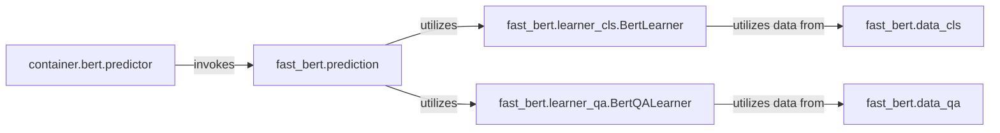

## Details

The BERT Prediction Service is a specialized subsystem within the larger project, designed to provide general BERT-based text classification and question answering capabilities. It acts as a dedicated microservice, exposing an API for predictions and internally managing the lifecycle and inference of various BERT models.

### container.bert.predictor
Serves as the external API gateway for the BERT Prediction Service. It exposes high-level endpoints (`predict`, `predict_batch`, `ping`, `transformation`) allowing external clients to request BERT-based predictions. It also manages the readiness and availability of the underlying prediction models.

**Related Classes/Methods**:

- <a href="https://github.com/appvision-ai/fast-bert/blob/main/container/bert/predictor.py" target="_blank" rel="noopener noreferrer">`container.bert.predictor`</a>
- <a href="https://github.com/appvision-ai/fast-bert/blob/main/container/bert/predictor.py" target="_blank" rel="noopener noreferrer">`container.bert.predictor:predict`</a>
- <a href="https://github.com/appvision-ai/fast-bert/blob/main/container/bert/predictor.py" target="_blank" rel="noopener noreferrer">`container.bert.predictor:predict_batch`</a>
- <a href="https://github.com/appvision-ai/fast-bert/blob/main/container/bert/predictor.py" target="_blank" rel="noopener noreferrer">`container.bert.predictor:ping`</a>
- <a href="https://github.com/appvision-ai/fast-bert/blob/main/container/bert/predictor.py" target="_blank" rel="noopener noreferrer">`container.bert.predictor:transformation`</a>

### fast_bert.prediction
Orchestrates the core prediction workflow. It acts as a central dispatcher, handling both single and batch prediction requests. It abstracts the specifics of different BERT model types (classification, QA) and applies necessary post-processing steps, such as softmax, to the model outputs.

**Related Classes/Methods**:

- <a href="https://github.com/appvision-ai/fast-bert/blob/main/fast_bert/prediction.py" target="_blank" rel="noopener noreferrer">`fast_bert.prediction`</a>
- <a href="https://github.com/appvision-ai/fast-bert/blob/main/fast_bert/prediction.py" target="_blank" rel="noopener noreferrer">`fast_bert.prediction:predict`</a>
- <a href="https://github.com/appvision-ai/fast-bert/blob/main/fast_bert/prediction.py" target="_blank" rel="noopener noreferrer">`fast_bert.prediction:predict_batch`</a>

### fast_bert.learner_cls.BertLearner
Encapsulates and manages the lifecycle of BERT models specifically configured for text classification tasks. This includes loading pre-trained models, handling inference requests, and potentially managing model training (though the service primarily focuses on prediction).

**Related Classes/Methods**:

- <a href="https://github.com/appvision-ai/fast-bert/blob/main/fast_bert/learner_cls.py#L203-L1038" target="_blank" rel="noopener noreferrer">`fast_bert.learner_cls.BertLearner`:203-1038</a>
- <a href="https://github.com/appvision-ai/fast-bert/blob/main/fast_bert/learner_cls.py" target="_blank" rel="noopener noreferrer">`fast_bert.learner_cls.BertLearner:load_model`</a>
- <a href="https://github.com/appvision-ai/fast-bert/blob/main/fast_bert/learner_cls.py" target="_blank" rel="noopener noreferrer">`fast_bert.learner_cls.BertLearner:infer`</a>

### fast_bert.learner_qa.BertQALearner
Encapsulates and manages the lifecycle of BERT models tailored for question answering tasks. Its responsibilities include loading QA models, performing inference, and extracting answers from model outputs.

**Related Classes/Methods**:

- <a href="https://github.com/appvision-ai/fast-bert/blob/main/fast_bert/learner_qa.py#L33-L274" target="_blank" rel="noopener noreferrer">`fast_bert.learner_qa.BertQALearner`:33-274</a>
- <a href="https://github.com/appvision-ai/fast-bert/blob/main/fast_bert/learner_qa.py" target="_blank" rel="noopener noreferrer">`fast_bert.learner_qa.BertQALearner:load_model`</a>
- <a href="https://github.com/appvision-ai/fast-bert/blob/main/fast_bert/learner_qa.py" target="_blank" rel="noopener noreferrer">`fast_bert.learner_qa.BertQALearner:infer`</a>
- <a href="https://github.com/appvision-ai/fast-bert/blob/main/fast_bert/learner_qa.py" target="_blank" rel="noopener noreferrer">`fast_bert.learner_qa.BertQALearner:extract_answers`</a>

### fast_bert.data_cls
Responsible for preparing raw text data into the specific format required by BERT classification models. This involves tasks like tokenization, creating attention masks, and generating segment IDs.

**Related Classes/Methods**:

- <a href="https://github.com/appvision-ai/fast-bert/blob/main/fast_bert/data_cls.py" target="_blank" rel="noopener noreferrer">`fast_bert.data_cls`</a>
- <a href="https://github.com/appvision-ai/fast-bert/blob/main/fast_bert/data_cls.py" target="_blank" rel="noopener noreferrer">`fast_bert.data_cls:tokenize`</a>
- <a href="https://github.com/appvision-ai/fast-bert/blob/main/fast_bert/data_cls.py" target="_blank" rel="noopener noreferrer">`fast_bert.data_cls:create_attention_masks`</a>
- <a href="https://github.com/appvision-ai/fast-bert/blob/main/fast_bert/data_cls.py" target="_blank" rel="noopener noreferrer">`fast_bert.data_cls:generate_segment_ids`</a>

### fast_bert.data_qa
Responsible for preparing raw text (contexts and questions) into the specific format required by BERT question answering models. This includes tokenization and other pre-processing steps necessary for QA inference.

**Related Classes/Methods**:

- <a href="https://github.com/appvision-ai/fast-bert/blob/main/fast_bert/data_qa.py" target="_blank" rel="noopener noreferrer">`fast_bert.data_qa`</a>
- <a href="https://github.com/appvision-ai/fast-bert/blob/main/fast_bert/data_qa.py" target="_blank" rel="noopener noreferrer">`fast_bert.data_qa:tokenize`</a>
- <a href="https://github.com/appvision-ai/fast-bert/blob/main/fast_bert/data_qa.py" target="_blank" rel="noopener noreferrer">`fast_bert.data_qa:preprocess`</a>

### [FAQ](https://github.com/CodeBoarding/GeneratedOnBoardings/tree/main?tab=readme-ov-file#faq)