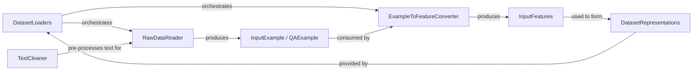

## Details

The `fast_bert.data` subsystem is responsible for the entire data preparation pipeline, transforming raw text into numerical features suitable for BERT models. This process involves several key components that handle data ingestion, cleaning, structuring, and conversion. The `BertDataBunch` acts as the central orchestrator, managing the flow from raw data to a ready-to-use dataset. Raw data is first processed by `DataProcessor` subclasses, which read and structure it into `InputExample` objects. While explicit text cleaning functions are not directly visible, the `TextProcessor` component conceptually represents the step of preparing raw text before it's structured into `InputExample`s. These `InputExample` objects are then converted into numerical `InputFeatures` by the `convert_examples_to_features` function. Finally, `BertDataBunch` encapsulates these `InputFeatures` into `TensorDataset` objects, making them accessible for model training and evaluation.

### DatasetLoaders
Orchestrates the entire preprocessing pipeline for a specific task, from reading raw data to creating and returning a ready-to-use dataset or data loader. It acts as the primary interface for users to get processed data.

**Related Classes/Methods**:

- <a href="https://github.com/appvision-ai/fast-bert/blob/main/fast_bert/data.py#L299-L488" target="_blank" rel="noopener noreferrer">`fast_bert.data.BertDataBunch`:299-488</a>

### RawDataReader
Ingests raw data from various file formats (e.g., columnar files, CSVs) and structures it into initial `InputExample` or `QAExample` objects.

**Related Classes/Methods**:

- <a href="https://github.com/appvision-ai/fast-bert/blob/main/fast_bert/data.py#L142-L159" target="_blank" rel="noopener noreferrer">`fast_bert.data.DataProcessor`:142-159</a>

### TextCleaner
Conceptually represents the normalization and cleaning of raw text data, preparing it for subsequent structuring into `InputExample` objects by the `RawDataReader`. While specific cleaning methods are not explicitly defined in the referenced code, this component signifies the pre-processing step.

**Related Classes/Methods**:

- <a href="https://github.com/appvision-ai/fast-bert/blob/main/fast_bert/data.py#L228-L275" target="_blank" rel="noopener noreferrer">`fast_bert.data.TextProcessor`:228-275</a>

### InputExample / QAExample
Represents a single, structured instance of raw input data (e.g., a sentence, a document-question pair) before numerical conversion.

**Related Classes/Methods**:

- <a href="https://github.com/appvision-ai/fast-bert/blob/main/fast_bert/data.py#L23-L46" target="_blank" rel="noopener noreferrer">`fast_bert.data.InputExample`:23-46</a>

### ExampleToFeatureConverter
The central logic for transforming structured `InputExample` (or `QAExample`) objects into numerical `InputFeatures` suitable for BERT models. This involves tokenization, sequence truncation, and mapping text to numerical IDs.

**Related Classes/Methods**:

- <a href="https://github.com/appvision-ai/fast-bert/blob/main/fast_bert/data.py#L76-L139" target="_blank" rel="noopener noreferrer">`fast_bert.data.convert_examples_to_features`:76-139</a>

### InputFeatures
Represents the numerical features derived from an `InputExample`, formatted for direct consumption by a BERT model (e.g., input token IDs, attention masks, token type IDs).

**Related Classes/Methods**:

- <a href="https://github.com/appvision-ai/fast-bert/blob/main/fast_bert/data.py#L49-L56" target="_blank" rel="noopener noreferrer">`fast_bert.data.InputFeatures`:49-56</a>

### DatasetRepresentations
Encapsulates the processed data (often `InputFeatures`) into PyTorch `TensorDataset` objects, making data accessible for batching and iteration. This component is closely managed by `DatasetLoaders`.

**Related Classes/Methods**:

- <a href="https://github.com/appvision-ai/fast-bert/blob/main/fast_bert/data.py#L299-L488" target="_blank" rel="noopener noreferrer">`fast_bert.data.BertDataBunch`:299-488</a>

### [FAQ](https://github.com/CodeBoarding/GeneratedOnBoardings/tree/main?tab=readme-ov-file#faq)