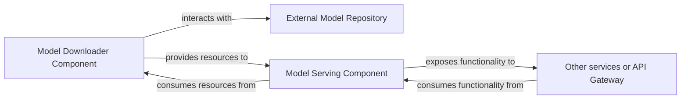

## Details

The `fast-bert` prediction subsystem is designed to efficiently download, load, and serve pre-trained machine learning models. It primarily interacts with an external model repository to retrieve model artifacts and exposes a prediction interface to other services or API gateways. The core flow involves a dedicated component for model acquisition, followed by a serving component that handles inference requests, ensuring a clear separation of concerns between model management and prediction delivery.

### External Model Repository [[Expand]](./External_Model_Repository.md)
An external source (e.g., Hugging Face, S3 bucket, or mounted volume) from which pre-trained model weights and configuration files are downloaded or accessed by the prediction and training services. This component is external to the `fast-bert` project and thus has no internal source code references.

**Related Classes/Methods**: _None_

### Model Downloader Component
This component is responsible for securely and efficiently retrieving pre-trained model artifacts (weights, configurations) from external sources (the "External Model Repository"). It handles the initiation of downloads and manages the underlying HTTP communication or other protocols required to access these external resources.

**Related Classes/Methods**:

- <a href="https://github.com/appvision-ai/fast-bert/blob/main/container/bert/download_pretrained_models.py" target="_blank" rel="noopener noreferrer">`container/bert/download_pretrained_models.py`</a>
- <a href="https://github.com/appvision-ai/fast-bert/blob/main/container_lm/bert/download_pretrained_models.py" target="_blank" rel="noopener noreferrer">`container_lm/bert/download_pretrained_models.py`</a>
- <a href="https://github.com/appvision-ai/fast-bert/blob/main/container_ner/bert/download_pretrained_models.py" target="_blank" rel="noopener noreferrer">`container_ner/bert/download_pretrained_models.py`</a>
- <a href="https://github.com/appvision-ai/fast-bert/blob/main/container_t5/t5/download_pretrained_models.py" target="_blank" rel="noopener noreferrer">`container_t5/t5/download_pretrained_models.py`</a>

### Model Serving Component
This component loads the pre-trained models (downloaded by the Model Downloader Component) into memory and exposes interfaces for performing predictions (inference) and health checks. It acts as the runtime environment for the machine learning models, serving predictions to other services or the user interface.

**Related Classes/Methods**:

- <a href="https://github.com/appvision-ai/fast-bert/blob/main/container/bert/predictor.py" target="_blank" rel="noopener noreferrer">`container/bert/predictor.py`</a>
- <a href="https://github.com/appvision-ai/fast-bert/blob/main/container/bert_batch/predictor.py" target="_blank" rel="noopener noreferrer">`container/bert_batch/predictor.py`</a>
- <a href="https://github.com/appvision-ai/fast-bert/blob/main/container_ner/bert/predictor.py" target="_blank" rel="noopener noreferrer">`container_ner/bert/predictor.py`</a>
- <a href="https://github.com/appvision-ai/fast-bert/blob/main/container_t5/t5/predictor.py" target="_blank" rel="noopener noreferrer">`container_t5/t5/predictor.py`</a>

### Other services or API Gateway
Represents other services or an API Gateway that consume functionality from the Model Serving Component. This component is external to the `fast-bert` project and thus has no internal source code references.

**Related Classes/Methods**: _None_

### [FAQ](https://github.com/CodeBoarding/GeneratedOnBoardings/tree/main?tab=readme-ov-file#faq)