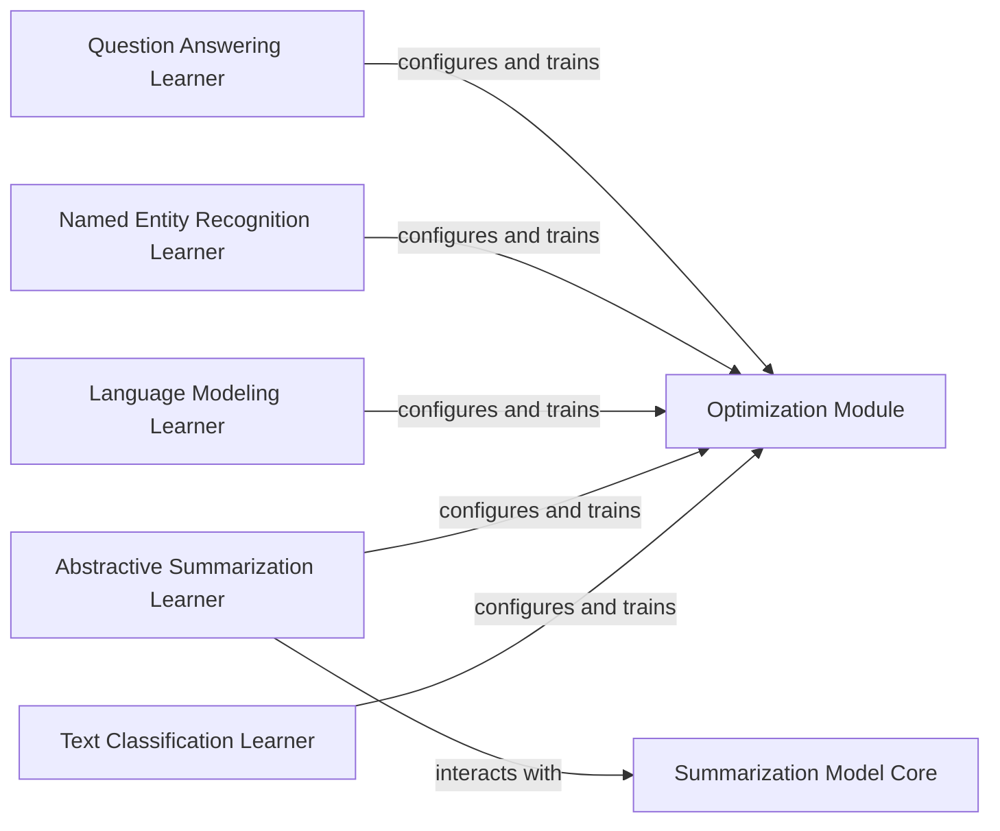

## Details

The system is designed around a set of specialized "Learner" components, each responsible for the end-to-end lifecycle of a specific Natural Language Processing (NLP) task, such as text classification, abstractive summarization, language modeling, named entity recognition, and question answering. These Learners, primarily built upon the `fast_bert.learner_cls.BertLearner` or similar specialized `Learner` classes, encapsulate the data preparation, training, validation, and prediction logic. A central `Optimization Module`, integrated within the `Learner` components, provides the necessary utilities for fine-tuning model training parameters, including learning rate scheduling and optimizer selection. For tasks like abstractive summarization, dedicated "Model Core" components (e.g., `Summarization Model Core` for T5-based models) represent the underlying neural network architectures that the respective Learners interact with for model execution. This modular design allows for task-specific adaptations while leveraging common training and optimization patterns.

### Text Classification Learner
Manages the training, validation, and prediction processes specifically for text classification models. It encapsulates the logic for preparing data, executing training epochs, and evaluating model performance for classification tasks. This component leverages the `BertLearner` class from the `fast_bert` library, configured for text classification.

**Related Classes/Methods**:

- <a href="https://github.com/appvision-ai/fast-bert/blob/main/fast_bert/learner_cls.py#L203-L1038" target="_blank" rel="noopener noreferrer">`fast_bert.learner_cls.BertLearner`:203-1038</a>

### Abstractive Summarization Learner
Orchestrates the entire lifecycle of abstractive summarization models, from data preparation and model loading to training, validation, and inference. It handles the specific requirements of sequence-to-sequence summarization tasks, likely utilizing a specialized learner for T5 models.

**Related Classes/Methods**:

### Language Modeling Learner
Responsible for handling the training and validation phases of language models. This includes tasks such as masked language modeling or causal language modeling, focusing on learning language representations. This component likely uses a `BertLearner` or a similar specialized learner for language modeling tasks.

**Related Classes/Methods**:

- <a href="https://github.com/appvision-ai/fast-bert/blob/main/container_lm/bert/train" target="_blank" rel="noopener noreferrer">`container_lm.bert.train`</a>

### Named Entity Recognition Learner
Provides comprehensive functionalities for training, validating, and performing inference for Named Entity Recognition (NER) tasks. It manages the process of identifying and classifying named entities in text, likely through a specialized learner.

**Related Classes/Methods**:

- <a href="https://github.com/appvision-ai/fast-bert/blob/main/container_ner/bert/train" target="_blank" rel="noopener noreferrer">`container_ner.bert.train`</a>

### Question Answering Learner
Facilitates the training, validation, and inference for Question Answering (QA) models. It handles the complexities of extracting answers from given contexts based on specific questions. Given the project structure, it's probable that a similar learner pattern is followed for QA, although a dedicated container for QA was not immediately apparent in the file structure. It might be integrated within one of the existing BERT containers or a separate one not explicitly named "qa". For now, we'll assume a similar learner pattern.

**Related Classes/Methods**: _None_

### Optimization Module
Offers a collection of general utilities and strategies for optimizing the model training process. Its primary focus is on managing learning rates, applying various scheduling techniques, and potentially other optimization algorithms to enhance model convergence and performance. This functionality is embedded within the `BertLearner` class and its associated methods for optimizer and scheduler management.

**Related Classes/Methods**:

- <a href="https://github.com/appvision-ai/fast-bert/blob/main/fast_bert/learner_cls.py#L203-L1038" target="_blank" rel="noopener noreferrer">`fast_bert.learner_cls.BertLearner`:203-1038</a>

### Summarization Model Core
Implements the fundamental transformer architecture specifically tailored for abstractive summarization. This component represents the core neural network model that the `Abstractive Summarization Learner` interacts with for model instantiation and forward passes. Given the `container_t5` directory, this likely refers to a T5-based model.

**Related Classes/Methods**:

### [FAQ](https://github.com/CodeBoarding/GeneratedOnBoardings/tree/main?tab=readme-ov-file#faq)