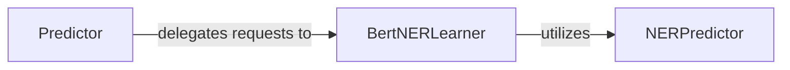

## Details

The NER Prediction Service subsystem is responsible for handling Named Entity Recognition (NER) predictions, including entity grouping, and internally leverages a Core NLP Model Library.

### Predictor
This component serves as the external API endpoint for the NER Prediction Service. In a Web Application context, it's the public interface that receives incoming HTTP requests, orchestrates the overall prediction flow, and manages the availability of the underlying model within its containerized environment. It acts as the entry point for all NER prediction requests.

**Related Classes/Methods**:

- <a href="https://github.com/appvision-ai/fast-bert/blob/main/container/bert/predictor.py" target="_blank" rel="noopener noreferrer">`Predictor`</a>

### BertNERLearner
This component embodies the core business logic for NER prediction. It's responsible for the higher-level orchestration of the prediction process, including loading pre-trained BERT models, performing batch predictions, and crucial post-processing steps such as entity grouping. It represents the "Core NLP Model Library" utilization and is central to the service's domain functionality.

**Related Classes/Methods**:

- <a href="https://github.com/appvision-ai/fast-bert/blob/main/fast_bert/learner_ner.py#L58-L352" target="_blank" rel="noopener noreferrer">`BertNERLearner`:58-352</a>

### NERPredictor
This component handles the low-level execution of NER predictions. It takes the raw outputs from the underlying BERT model and applies final transformations (e.g., softmax) to convert them into meaningful, probabilistic predictions. It is a specialized utility consumed by the `BertNERLearner` to finalize prediction results.

**Related Classes/Methods**:

- <a href="https://github.com/appvision-ai/fast-bert/blob/main/fast_bert/prediction_ner.py#L18-L90" target="_blank" rel="noopener noreferrer">`NERPredictor`:18-90</a>

### [FAQ](https://github.com/CodeBoarding/GeneratedOnBoardings/tree/main?tab=readme-ov-file#faq)