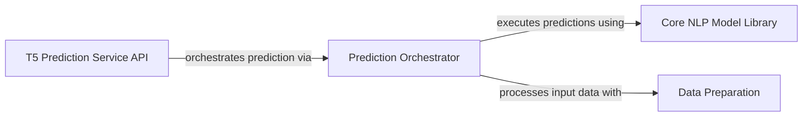

## Details

The T5 Prediction Service is a dedicated subsystem within the project, primarily responsible for handling T5 model predictions for tasks such as summarization or text generation. It encapsulates the core logic for model inference, data preparation, and exposing prediction capabilities via an API.

### T5 Prediction Service API
This component serves as the external interface for the T5 Prediction Service. It is responsible for receiving incoming prediction requests, validating them, and orchestrating the subsequent prediction workflow. It also provides essential service health checks. In a Web Application, this acts as the API Endpoint, handling external communication.

**Related Classes/Methods**:

- <a href="https://github.com/appvision-ai/fast-bert/blob/main/container_t5/t5/predictor.py" target="_blank" rel="noopener noreferrer">`container_t5.t5.predictor`</a>

### Prediction Orchestrator
This component embodies the core business logic for performing T5 model inference. It is responsible for loading pre-trained models, managing the execution of batch predictions, and handling the post-processing and formatting of the model's output. It acts as the central coordinator, delegating tasks to the model implementation and data preparation components. This aligns with a Service Layer or Business Logic component in a Web Application.

**Related Classes/Methods**:

- <a href="https://github.com/appvision-ai/fast-bert/blob/main/fast_bert/learner_abs.py" target="_blank" rel="noopener noreferrer">`fast_bert.learner_abs`</a>

### Core NLP Model Library
This component implements the neural network architecture for abstractive summarization, specifically the T5 model. It defines the model's layers, attention mechanisms, and the forward pass logic, performing the actual computation and generation of summaries. This is the fundamental computational engine of the service.

**Related Classes/Methods**:

- <a href="https://github.com/appvision-ai/fast-bert/blob/main/fast_bert/summarisation/modeling_bertabs.py" target="_blank" rel="noopener noreferrer">`fast_bert.summarisation.modeling_bertabs`</a>

### Data Preparation
This component manages the entire data pipeline required for abstractive summarization. Its responsibilities include processing raw text, tokenization, creating suitable datasets, and collating data into batches that can be efficiently consumed by the T5 model. This ensures that input data is correctly formatted for inference. This acts as a specialized data processing utility.

**Related Classes/Methods**:

- <a href="https://github.com/appvision-ai/fast-bert/blob/main/fast_bert/data_abs.py" target="_blank" rel="noopener noreferrer">`fast_bert.data_abs`</a>

### [FAQ](https://github.com/CodeBoarding/GeneratedOnBoardings/tree/main?tab=readme-ov-file#faq)