```mermaid
graph LR
    Client_Application["Client Application"]
    API_Gateway["API Gateway"]
    BERT_Prediction_Service["BERT Prediction Service"]
    NER_Prediction_Service["NER Prediction Service"]
    T5_Prediction_Service["T5 Prediction Service"]
    Model_Training_Management_Service["Model Training & Management Service"]
    Data_Preprocessing_Module["Data Preprocessing Module"]
    External_Model_Repository["External Model Repository"]
    Client_Application -- "Sends Requests To" --> API_Gateway
    API_Gateway -- "Routes Requests To" --> BERT_Prediction_Service
    API_Gateway -- "Routes Requests To" --> NER_Prediction_Service
    API_Gateway -- "Routes Requests To" --> T5_Prediction_Service
    BERT_Prediction_Service -- "Downloads Models From" --> External_Model_Repository
    NER_Prediction_Service -- "Downloads Models From" --> External_Model_Repository
    T5_Prediction_Service -- "Downloads Models From" --> External_Model_Repository
    Model_Training_Management_Service -- "Downloads Models From" --> External_Model_Repository
    Model_Training_Management_Service -- "Processes Data From" --> Data_Preprocessing_Module
    Model_Training_Management_Service -- "Generates Trained Models For" --> BERT_Prediction_Service
    Model_Training_Management_Service -- "Generates Trained Models For" --> NER_Prediction_Service
    Model_Training_Management_Service -- "Generates Trained Models For" --> T5_Prediction_Service
    Data_Preprocessing_Module -- "Provides Prepared Data To" --> Model_Training_Management_Service
    External_Model_Repository -- "Provides Pretrained Models To" --> BERT_Prediction_Service
    External_Model_Repository -- "Provides Pretrained Models To" --> NER_Prediction_Service
    External_Model_Repository -- "Provides Pretrained Models To" --> T5_Prediction_Service
    External_Model_Repository -- "Provides Pretrained Models To" --> Model_Training_Management_Service
    BERT_Prediction_Service -- "Receives Trained Models From" --> Model_Training_Management_Service
    NER_Prediction_Service -- "Receives Trained Models From" --> Model_Training_Management_Service
    T5_Prediction_Service -- "Receives Trained Models From" --> Model_Training_Management_Service
    click BERT_Prediction_Service href "https://github.com/CodeBoarding/GeneratedOnBoardings/blob/main/fast-bert/BERT_Prediction_Service.md" "Details"
    click NER_Prediction_Service href "https://github.com/CodeBoarding/GeneratedOnBoardings/blob/main/fast-bert/NER_Prediction_Service.md" "Details"
    click T5_Prediction_Service href "https://github.com/CodeBoarding/GeneratedOnBoardings/blob/main/fast-bert/T5_Prediction_Service.md" "Details"
    click Model_Training_Management_Service href "https://github.com/CodeBoarding/GeneratedOnBoardings/blob/main/fast-bert/Model_Training_Management_Service.md" "Details"
    click Data_Preprocessing_Module href "https://github.com/CodeBoarding/GeneratedOnBoardings/blob/main/fast-bert/Data_Preprocessing_Module.md" "Details"
    click External_Model_Repository href "https://github.com/CodeBoarding/GeneratedOnBoardings/blob/main/fast-bert/External_Model_Repository.md" "Details"
```

## Details

The fast-bert project is structured around a set of specialized NLP prediction services, each designed to handle specific model types (BERT, NER, T5). These services are exposed via a unified API Gateway, which routes external client requests to the appropriate backend. Model training and data preprocessing are handled by dedicated internal modules, ensuring a clear separation of concerns. Models, whether pre-trained or fine-tuned, are sourced from or stored in an external model repository, facilitating model lifecycle management. This architecture promotes modularity, scalability, and efficient deployment of NLP capabilities.

### Client Application
Represents an external user interface or system that initiates requests to the NLP services. This component is external to the fast-bert codebase and interacts with the system via the API Gateway.

**Related Classes/Methods**: _None_

### API Gateway
The central entry point for all external requests, responsible for routing incoming traffic to the appropriate prediction microservice. In this project, the Flask applications within each prediction service act as distributed API gateways.

**Related Classes/Methods**:

- <a href="https://github.com/appvision-ai/fast-bert/blob/main/container/bert/predictor.py#L118-L198" target="_blank" rel="noopener noreferrer">`container/bert/predictor.py`:118-198</a>

### BERT Prediction Service [[Expand]](./BERT_Prediction_Service.md)
Handles general BERT-based text classification, question answering, or other non-NER/T5 predictions. Utilizes the Core NLP Model Library internally.

**Related Classes/Methods**: _None_

### NER Prediction Service [[Expand]](./NER_Prediction_Service.md)
Specializes in Named Entity Recognition (NER) predictions, including entity grouping. Utilizes the Core NLP Model Library internally.

**Related Classes/Methods**: _None_

### T5 Prediction Service [[Expand]](./T5_Prediction_Service.md)
Dedicated to T5 model predictions, primarily for tasks like summarization or text generation. Utilizes the Core NLP Model Library internally.

**Related Classes/Methods**: _None_

### Model Training & Management Service [[Expand]](./Model_Training_Management_Service.md)
Manages the entire lifecycle of NLP models, including loading pre-trained weights, defining training loops, applying optimization strategies, and saving fine-tuned models. It orchestrates the training process and interacts with the Evaluation & Metrics Module for performance feedback.

**Related Classes/Methods**: _None_

### Data Preprocessing Module [[Expand]](./Data_Preprocessing_Module.md)
Responsible for reading raw data, converting it into structured examples, tokenizing text, and generating numerical features suitable for model input.

**Related Classes/Methods**: _None_

### External Model Repository [[Expand]](./External_Model_Repository.md)
An external source (e.g., Hugging Face, S3 bucket, or mounted volume) from which pre-trained model weights and configuration files are downloaded or accessed by the prediction and training services.

**Related Classes/Methods**:

- <a href="https://github.com/appvision-ai/fast-bert/blob/main/container/bert/predictor.py#L42-L52" target="_blank" rel="noopener noreferrer">`container/bert/predictor.py`:42-52</a>

### [FAQ](https://github.com/CodeBoarding/GeneratedOnBoardings/tree/main?tab=readme-ov-file#faq)