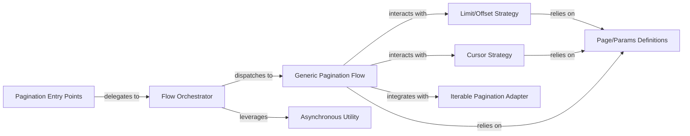

## Details

The `Core Pagination Logic` subsystem encompasses the foundational components within the `fastapi_pagination` library responsible for defining generic pagination strategies (limit/offset, cursor) and orchestrating the overall pagination flow. It operates independently of specific database integrations or FastAPI routing, focusing solely on the core mechanics of transforming data into paginated responses. Its boundaries are primarily defined by the `fastapi_pagination` package's core modules, including `bases.py`, `types.py`, `paginator.py`, `async_paginator.py`, `flow.py`, `flows.py`, `limit_offset.py`, `cursor.py`, `iterables.py`, and `utils.py`.

### Page/Params Definitions
Establishes the fundamental data structures (`Page`, `Params`, `LimitOffsetPage`, `CursorPage`, `LimitOffsetParams`, `CursorParams`) and abstract interfaces that define how pagination requests and responses are structured. It also provides utilities for type identification (`is_limit_offset`, `is_cursor`) and context linking (`connect_page_and_params`). This component is crucial as it defines the universal language for pagination within the library.

**Related Classes/Methods**:

- <a href="https://github.com/uriyyo/fastapi-pagination/blob/main/fastapi_pagination/bases.py#L37-L38" target="_blank" rel="noopener noreferrer">`fastapi_pagination.bases.py`:37-38</a>
- <a href="https://github.com/uriyyo/fastapi-pagination/blob/main/fastapi_pagination/types.py" target="_blank" rel="noopener noreferrer">`fastapi_pagination/types.py`</a>

### Pagination Entry Points
Serve as the primary public interfaces for users to initiate pagination. They abstract the underlying flow execution, providing a unified API for both synchronous and asynchronous pagination. These components are the user-facing facade of the core pagination logic.

**Related Classes/Methods**:

- <a href="https://github.com/uriyyo/fastapi-pagination/blob/main/fastapi_pagination/paginator.py" target="_blank" rel="noopener noreferrer">`fastapi_pagination/paginator.py`</a>
- <a href="https://github.com/uriyyo/fastapi-pagination/blob/main/fastapi_pagination/async_paginator.py" target="_blank" rel="noopener noreferrer">`fastapi_pagination/async_paginator.py`</a>

### Flow Orchestrator
Acts as the central dispatcher for pagination requests, determining whether to execute a synchronous or asynchronous flow based on the callable provided. It ensures the correct pagination strategy is applied, acting as the "central coordinator" for the pagination process.

**Related Classes/Methods**:

- <a href="https://github.com/uriyyo/fastapi-pagination/blob/main/fastapi_pagination/flow.py" target="_blank" rel="noopener noreferrer">`fastapi_pagination/flow.py`</a>

### Generic Pagination Flow
Implements the common, reusable logic for creating a paginated response, independent of the specific data source or pagination strategy (e.g., limit/offset vs. cursor). It focuses on the transformation of raw data into a `Page` object. This component embodies the core, reusable pagination algorithm.

**Related Classes/Methods**:

- <a href="https://github.com/uriyyo/fastapi-pagination/blob/main/fastapi_pagination/flows.py" target="_blank" rel="noopener noreferrer">`fastapi_pagination/flows.py`</a>

### Limit/Offset Strategy
Encapsulates the specific algorithms and data transformations required for limit/offset based pagination, including applying limits and offsets to data sources and calculating total counts. This component represents a concrete implementation of a pagination strategy.

**Related Classes/Methods**:

- <a href="https://github.com/uriyyo/fastapi-pagination/blob/main/fastapi_pagination/limit_offset.py" target="_blank" rel="noopener noreferrer">`fastapi_pagination/limit_offset.py`</a>

### Cursor Strategy
Encapsulates the specific algorithms and data transformations required for cursor-based pagination, including encoding and decoding cursor values to maintain state across requests. This component, alongside Limit/Offset Strategy, exemplifies the Strategy Pattern within the core logic.

**Related Classes/Methods**:

- <a href="https://github.com/uriyyo/fastapi-pagination/blob/main/fastapi_pagination/cursor.py" target="_blank" rel="noopener noreferrer">`fastapi_pagination/cursor.py`</a>

### Iterable Pagination Adapter
Provides utilities and logic for applying pagination specifically to Python iterables, allowing the core pagination logic to work with in-memory collections. This component extends the applicability of the core logic to a common data structure.

**Related Classes/Methods**:

- <a href="https://github.com/uriyyo/fastapi-pagination/blob/main/fastapi_pagination/iterables.py" target="_blank" rel="noopener noreferrer">`fastapi_pagination/iterables.py`</a>

### Asynchronous Utility
Provides a utility to conditionally await a callable if it is a coroutine, ensuring that the pagination flow can seamlessly handle both synchronous and asynchronous data retrieval functions. This component is a crucial helper for the `Flow Orchestrator` to support modern async Python applications.

**Related Classes/Methods**:

- <a href="https://github.com/uriyyo/fastapi-pagination/blob/main/fastapi_pagination/utils.py" target="_blank" rel="noopener noreferrer">`fastapi_pagination/utils.py`</a>

### [FAQ](https://github.com/CodeBoarding/GeneratedOnBoardings/tree/main?tab=readme-ov-file#faq)