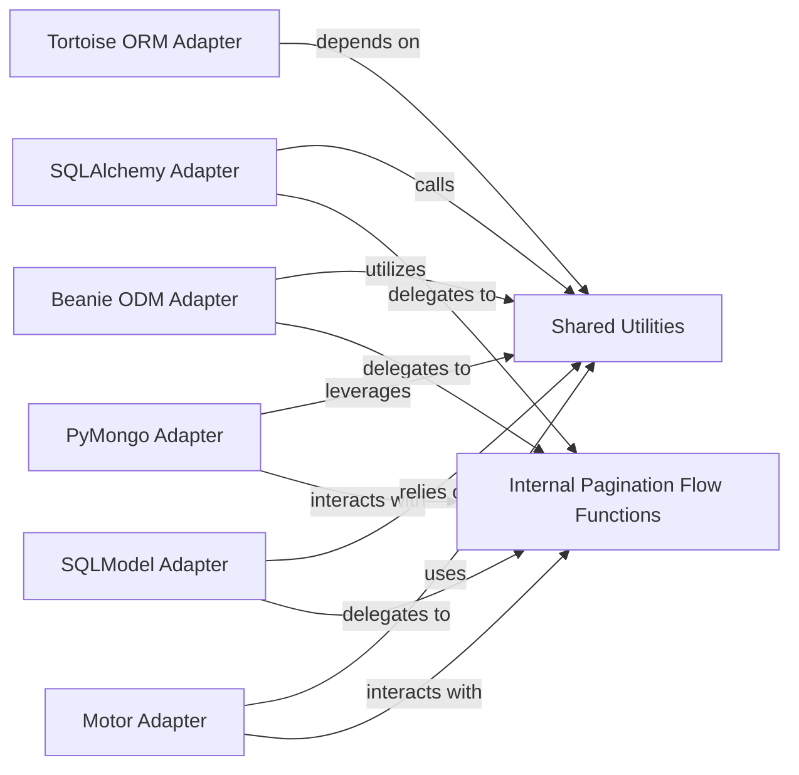

## Details

The `Database/ORM Adapters` subsystem provides specific implementations for integrating the core pagination logic with various database ORMs/ODMs, translating generic pagination requests into database-specific queries.

### SQLAlchemy Adapter
Provides pagination logic for SQLAlchemy queries, supporting both synchronous and asynchronous operations. It translates generic pagination requests into SQLAlchemy-specific query modifications (e.g., `limit`, `offset`) and exposes public pagination functions.

**Related Classes/Methods**:

- <a href="https://github.com/uriyyo/fastapi-pagination/blob/main/fastapi_pagination/ext/sqlalchemy.py" target="_blank" rel="noopener noreferrer">`fastapi_pagination.ext.sqlalchemy`</a>

### Beanie ODM Adapter
Implements pagination for Beanie ODM, primarily for MongoDB, including cursor-based pagination. It provides public API functions for Beanie models.

**Related Classes/Methods**:

- <a href="https://github.com/uriyyo/fastapi-pagination/blob/main/fastapi_pagination/ext/beanie.py" target="_blank" rel="noopener noreferrer">`fastapi_pagination.ext.beanie`</a>

### Tortoise ORM Adapter
Integrates pagination with Tortoise ORM, handling query modifications for asynchronous relational database operations and exposing pagination functions.

**Related Classes/Methods**:

- <a href="https://github.com/uriyyo/fastapi-pagination/blob/main/fastapi_pagination/ext/tortoise.py" target="_blank" rel="noopener noreferrer">`fastapi_pagination.ext.tortoise`</a>

### PyMongo Adapter
Focuses on pagination for raw PyMongo aggregation pipelines, adapting pagination concepts to MongoDB's aggregation framework and providing corresponding public API.

**Related Classes/Methods**:

- <a href="https://github.com/uriyyo/fastapi-pagination/blob/main/fastapi_pagination/ext/pymongo.py" target="_blank" rel="noopener noreferrer">`fastapi_pagination.ext.pymongo`</a>

### SQLModel Adapter
Extends pagination capabilities to SQLModel, leveraging its SQLAlchemy foundation for query construction and offering SQLModel-specific pagination functions.

**Related Classes/Methods**:

- <a href="https://github.com/uriyyo/fastapi-pagination/blob/main/fastapi_pagination/ext/sqlmodel.py" target="_blank" rel="noopener noreferrer">`fastapi_pagination.ext.sqlmodel`</a>

### Motor Adapter
Provides asynchronous pagination for Motor, the async PyMongo driver, similar to PyMongo but for async contexts, with dedicated pagination functions.

**Related Classes/Methods**:

- <a href="https://github.com/uriyyo/fastapi-pagination/blob/main/fastapi_pagination/ext/motor.py" target="_blank" rel="noopener noreferrer">`fastapi_pagination.ext.motor`</a>

### Shared Utilities
Contains common helper functions, decorators, and base classes used across various ORM/ODM adapters to reduce code duplication and enforce consistency in pagination logic.

**Related Classes/Methods**:

- <a href="https://github.com/uriyyo/fastapi-pagination/blob/main/fastapi_pagination/ext/__init__.py" target="_blank" rel="noopener noreferrer">`fastapi_pagination.ext.__init__`</a>

### Internal Pagination Flow Functions
Encapsulate the specific logic for applying pagination (e.g., limit-offset, cursor-based, or aggregation) to the underlying database query, including query modification and result processing. These functions are internal to each adapter's implementation.

**Related Classes/Methods**:

- <a href="https://github.com/uriyyo/fastapi-pagination/blob/main/fastapi_pagination/ext/sqlalchemy.py" target="_blank" rel="noopener noreferrer">`fastapi_pagination.ext.sqlalchemy._flow`</a>
- <a href="https://github.com/uriyyo/fastapi-pagination/blob/main/fastapi_pagination/ext/beanie.py" target="_blank" rel="noopener noreferrer">`fastapi_pagination.ext.beanie._flow`</a>
- <a href="https://github.com/uriyyo/fastapi-pagination/blob/main/fastapi_pagination/ext/pymongo.py" target="_blank" rel="noopener noreferrer">`fastapi_pagination.ext.pymongo._flow`</a>

### [FAQ](https://github.com/CodeBoarding/GeneratedOnBoardings/tree/main?tab=readme-ov-file#faq)