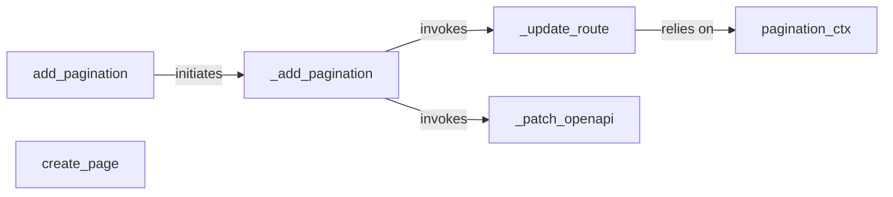

## Details

The `fastapi-pagination` subsystem primarily focuses on seamlessly integrating pagination capabilities into FastAPI applications. It achieves this by dynamically modifying FastAPI's routing and OpenAPI schema. The core flow begins with `add_pagination`, which orchestrates the setup. This function, in turn, calls `_add_pagination` to iterate through existing routes and apply pagination logic via `_update_route`. Concurrently, `_patch_openapi` ensures that the API documentation reflects the new pagination parameters. The `pagination_ctx` and `_page_ctx_dependency` components are crucial for managing pagination state within the request context, making pagination parameters accessible to route handlers. Finally, `create_page` is responsible for constructing the standardized paginated response object.

### add_pagination
Serves as the primary public API for users to enable pagination on a FastAPI application. It orchestrates the initial setup process by invoking the internal integration logic.

**Related Classes/Methods**:

- <a href="https://github.com/uriyyo/fastapi-pagination/blob/main/fastapi_pagination/api.py#L337-L351" target="_blank" rel="noopener noreferrer">`fastapi_pagination.api.add_pagination`:337-351</a>

### _add_pagination
An internal orchestrator that coordinates the dynamic modification of FastAPI routes and the OpenAPI schema to incorporate pagination. It acts as the central control flow for applying pagination logic to the application's API layer.

**Related Classes/Methods**:

- <a href="https://github.com/uriyyo/fastapi-pagination/blob/main/fastapi_pagination/api.py#L324-L334" target="_blank" rel="noopener noreferrer">`fastapi_pagination.api._add_pagination`:324-334</a>

### _update_route
Dynamically alters individual FastAPI `APIRoute` definitions. This involves injecting pagination parameters into the route's dependencies and potentially modifying its response model to align with paginated output, ensuring pagination parameters are correctly handled by FastAPI's routing system.

**Related Classes/Methods**:

- <a href="https://github.com/uriyyo/fastapi-pagination/blob/main/fastapi_pagination/api.py#L292-L313" target="_blank" rel="noopener noreferrer">`fastapi_pagination.api._update_route`:292-313</a>

### _patch_openapi
Modifies the FastAPI application's OpenAPI (Swagger) schema. This ensures that pagination parameters (e.g., page, size) and the structure of paginated responses are correctly documented in the API specification, providing accurate and up-to-date API documentation for consumers.

**Related Classes/Methods**:

- <a href="https://github.com/uriyyo/fastapi-pagination/blob/main/fastapi_pagination/api.py#L316-L321" target="_blank" rel="noopener noreferrer">`fastapi_pagination.api._patch_openapi`:316-321</a>

### pagination_ctx
Acts as a FastAPI dependency provider. It makes pagination-related parameters (like page and size) available to route handlers through FastAPI's dependency injection system, abstracting the pagination state for downstream logic.

**Related Classes/Methods**:

- <a href="https://github.com/uriyyo/fastapi-pagination/blob/main/fastapi_pagination/api.py#L241-L271" target="_blank" rel="noopener noreferrer">`fastapi_pagination.api.pagination_ctx`:241-271</a>

### create_page
Constructs the final paginated response object (the "page" object) by encapsulating the paginated items along with relevant metadata (total items, page number, etc.). This component is responsible for formatting the output according to the pagination schema.

**Related Classes/Methods**:

- <a href="https://github.com/uriyyo/fastapi-pagination/blob/main/fastapi_pagination/api.py#L83-L102" target="_blank" rel="noopener noreferrer">`fastapi_pagination.api.create_page`:83-102</a>

### [FAQ](https://github.com/CodeBoarding/GeneratedOnBoardings/tree/main?tab=readme-ov-file#faq)