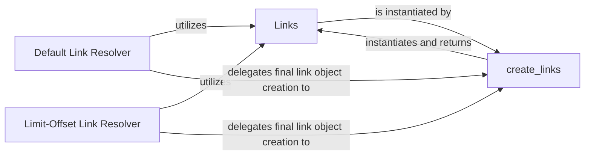

## Details

The `Pagination Link Generation` subsystem is a crucial part of `fastapi-pagination`, focusing on creating HATEOAS-style navigation links to enhance API discoverability and client-side navigation. It embodies the "API Layer Extension" and "Strategy Pattern" architectural principles, providing a modular and extensible way to generate pagination links.

### Links
A Pydantic data model that encapsulates the generated navigation links (e.g., "self", "first", "last", "next", "prev"). It serves as the primary integration point with FastAPI's response handling by adding these links to the response headers. Its internal methods manage the lifecycle of link generation and header injection.

**Related Classes/Methods**:

- <a href="https://github.com/uriyyo/fastapi-pagination/blob/main/fastapi_pagination/links/bases.py" target="_blank" rel="noopener noreferrer">`fastapi_pagination.links.bases.Links`</a>

### create_links
This is the fundamental function responsible for constructing the actual HATEOAS links. It takes raw link data (first, last, next, previous) and formats them into a `Links` object, handling URL resolution and path manipulation. It acts as a factory for `Links` instances.

**Related Classes/Methods**:

- <a href="https://github.com/uriyyo/fastapi-pagination/blob/main/fastapi_pagination/links/bases.py#L68-L85" target="_blank" rel="noopener noreferrer">`fastapi_pagination.links.bases.create_links`:68-85</a>

### Default Link Resolver
Provides the default strategy for resolving and generating pagination links for common scenarios. It abstracts the specific logic required to determine the "first," "last," "next," and "previous" page parameters based on a generic pagination context.

**Related Classes/Methods**:

- <a href="https://github.com/uriyyo/fastapi-pagination/blob/main/fastapi_pagination/links/default.py#L1-L1000" target="_blank" rel="noopener noreferrer">`fastapi_pagination.links.default.DefaultLinkResolver`:1-1000</a>

### Limit-Offset Link Resolver
Offers a specialized strategy for resolving links specifically tailored to limit-offset based pagination. This component demonstrates the extensibility of the link generation mechanism by providing an alternative, concrete implementation of a pagination strategy.

**Related Classes/Methods**:

- <a href="https://github.com/uriyyo/fastapi-pagination/blob/main/fastapi_pagination/links/limit_offset.py#L1-L1000" target="_blank" rel="noopener noreferrer">`fastapi_pagination.links.limit_offset.LimitOffsetLinkResolver`:1-1000</a>

### [FAQ](https://github.com/CodeBoarding/GeneratedOnBoardings/tree/main?tab=readme-ov-file#faq)