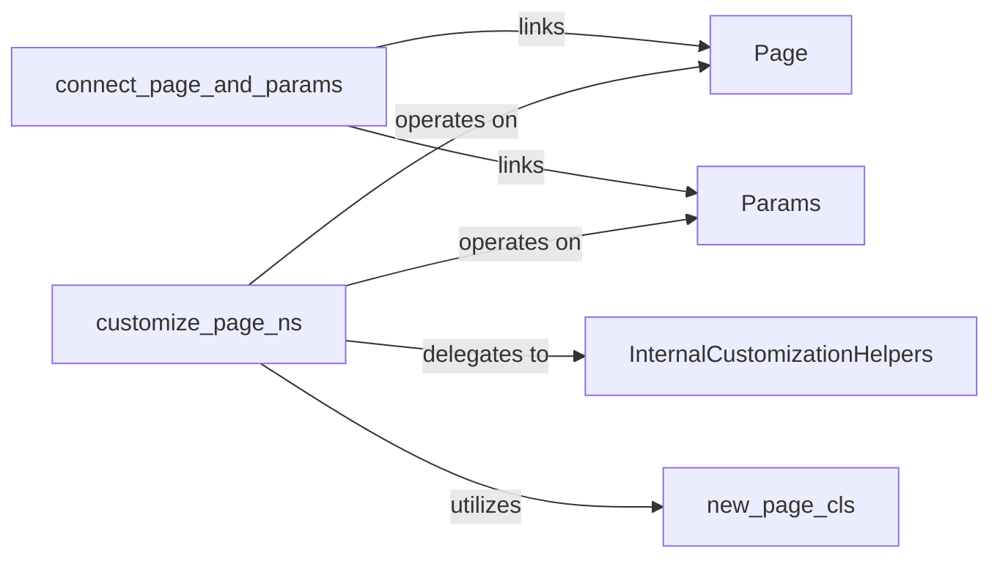

## Details

The `fastapi-pagination` core subsystem is built around two fundamental Pydantic models: `Page` for representing paginated responses and `Params` for defining pagination requests. The `connect_page_and_params` utility ensures the consistent alignment and bidirectional relationship between these two models. A key architectural pattern is the dynamic customization of these pagination schemas, primarily orchestrated by the `customize_page_ns` function. This function leverages `new_page_cls` to dynamically generate modified `Page` classes and delegates granular schema alterations to a set of `InternalCustomizationHelpers`. This design allows for flexible and powerful runtime modification of pagination behavior without requiring manual class redefinition, making the subsystem highly adaptable to diverse pagination requirements.

### Page
The foundational Pydantic model representing a paginated response. It encapsulates the list of items for the current page, the total number of items, and other pagination metadata.

**Related Classes/Methods**:

- <a href="https://github.com/uriyyo/fastapi-pagination/blob/main/examples/pagination_scylla.py" target="_blank" rel="noopener noreferrer">`Page`</a>

### Params
The foundational Pydantic model defining the request parameters for pagination, such as `page` number and `size` (items per page).

**Related Classes/Methods**:

- <a href="https://github.com/uriyyo/fastapi-pagination/blob/main/fastapi_pagination/async_paginator.py" target="_blank" rel="noopener noreferrer">`Params`</a>

### connect_page_and_params
A crucial utility function that establishes and maintains the bidirectional relationship and consistency between the `Page` and `Params` models. This ensures that pagination responses and requests are correctly aligned.

**Related Classes/Methods**:

- <a href="https://github.com/uriyyo/fastapi-pagination/blob/main/fastapi_pagination/bases.py#L99-L101" target="_blank" rel="noopener noreferrer">`connect_page_and_params`:99-101</a>

### customize_page_ns
The primary public API function within the subsystem for applying various customization options (e.g., renaming fields, making fields optional) to the Pydantic schemas of both `Page` and `Params` models. It orchestrates the entire customization process.

**Related Classes/Methods**:

- <a href="https://github.com/uriyyo/fastapi-pagination/blob/main/fastapi_pagination/customization.py#L534-L536" target="_blank" rel="noopener noreferrer">`customize_page_ns`:534-536</a>

### new_page_cls
A function responsible for dynamically generating new `Page` Pydantic classes. This is a key mechanism for implementing the customizations defined by `customize_page_ns`, allowing for flexible schema modifications without direct manual class definition.

**Related Classes/Methods**:

- <a href="https://github.com/uriyyo/fastapi-pagination/blob/main/fastapi_pagination/customization.py#L80-L87" target="_blank" rel="noopener noreferrer">`new_page_cls`:80-87</a>

### InternalCustomizationHelpers
A conceptual grouping of internal helper functions (e.g., `_make_field_optional`, `_get_model_fields`) that perform the low-level, granular modifications on Pydantic model schemas. These functions are not directly exposed but are crucial for the internal workings of `customize_page_ns`.

**Related Classes/Methods**:

- <a href="https://github.com/uriyyo/fastapi-pagination/blob/main/fastapi_pagination/customization.py#L383-L386" target="_blank" rel="noopener noreferrer">`_make_field_optional`:383-386</a>
- <a href="https://github.com/uriyyo/fastapi-pagination/blob/main/fastapi_pagination/customization.py#L340-L344" target="_blank" rel="noopener noreferrer">`_get_model_fields`:340-344</a>

### [FAQ](https://github.com/CodeBoarding/GeneratedOnBoardings/tree/main?tab=readme-ov-file#faq)