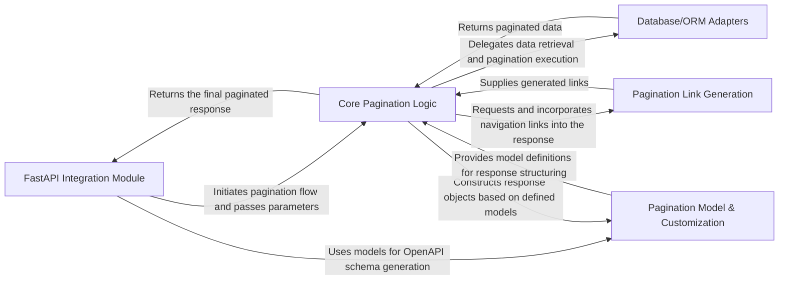

## Details

The `fastapi-pagination` library is designed as a modular extension for FastAPI, providing a clear separation of concerns for pagination. At its core, the **FastAPI Integration Module** acts as the entry point, seamlessly weaving pagination capabilities into FastAPI applications by dynamically modifying routes and OpenAPI schemas. This module hands off control to the **Core Pagination Logic**, which serves as the central orchestrator, applying generic pagination strategies. The **Core Pagination Logic** then delegates data-layer specific operations to various **Database/ORM Adapters**, ensuring compatibility across different data stores. Furthermore, the library leverages the **Pagination Model & Customization** component for flexible response structuring and the **Pagination Link Generation** component for HATEOAS-style navigation. This architecture promotes extensibility, allowing for easy integration with new database backends and customization of pagination behavior, making it ideal for diagramming as a series of interconnected, specialized components facilitating a clear data and control flow from API request to paginated response.

### FastAPI Integration Module [[Expand]](./FastAPI_Integration_Module.md)
Handles the integration with FastAPI's routing and dependency injection system, dynamically modifying routes and OpenAPI schemas to support pagination.

**Related Classes/Methods**:

- <a href="https://github.com/uriyyo/fastapi-pagination/blob/main/fastapi_pagination/api.py" target="_blank" rel="noopener noreferrer">`fastapi_pagination/api.py`</a>

### Core Pagination Logic [[Expand]](./Core_Pagination_Logic.md)
Encapsulates the generic pagination strategies (limit/offset, cursor) and orchestrates the overall pagination flow, acting as the central coordinator.

**Related Classes/Methods**:

- <a href="https://github.com/uriyyo/fastapi-pagination/blob/main/fastapi_pagination/bases.py#L37-L38" target="_blank" rel="noopener noreferrer">`fastapi_pagination.bases.py`:37-38</a>
- <a href="https://github.com/uriyyo/fastapi-pagination/blob/main/fastapi_pagination/async_paginator.py" target="_blank" rel="noopener noreferrer">`fastapi_pagination/async_paginator.py`</a>
- <a href="https://github.com/uriyyo/fastapi-pagination/blob/main/fastapi_pagination/paginator.py" target="_blank" rel="noopener noreferrer">`fastapi_pagination/paginator.py`</a>
- <a href="https://github.com/uriyyo/fastapi-pagination/blob/main/fastapi_pagination/flow.py" target="_blank" rel="noopener noreferrer">`fastapi_pagination/flow.py`</a>
- <a href="https://github.com/uriyyo/fastapi-pagination/blob/main/fastapi_pagination/flows.py" target="_blank" rel="noopener noreferrer">`fastapi_pagination/flows.py`</a>
- <a href="https://github.com/uriyyo/fastapi-pagination/blob/main/fastapi_pagination/limit_offset.py" target="_blank" rel="noopener noreferrer">`fastapi_pagination/limit_offset.py`</a>
- <a href="https://github.com/uriyyo/fastapi-pagination/blob/main/fastapi_pagination/iterables.py" target="_blank" rel="noopener noreferrer">`fastapi_pagination/iterables.py`</a>
- <a href="https://github.com/uriyyo/fastapi-pagination/blob/main/fastapi_pagination/types.py" target="_blank" rel="noopener noreferrer">`fastapi_pagination/types.py`</a>
- <a href="https://github.com/uriyyo/fastapi-pagination/blob/main/fastapi_pagination/utils.py" target="_blank" rel="noopener noreferrer">`fastapi_pagination/utils.py`</a>

### Database/ORM Adapters [[Expand]](./Database_ORM_Adapters.md)
Provides specific implementations for integrating the core pagination logic with various database ORMs/ODMs, translating generic pagination requests into database-specific queries.

**Related Classes/Methods**:

- <a href="https://github.com/uriyyo/fastapi-pagination/blob/main/fastapi_pagination/ext/__init__.py" target="_blank" rel="noopener noreferrer">`fastapi_pagination/ext/__init__.py`</a>
- <a href="https://github.com/uriyyo/fastapi-pagination/blob/main/fastapi_pagination/ext/sqlalchemy.py" target="_blank" rel="noopener noreferrer">`fastapi_pagination/ext/sqlalchemy.py`</a>
- <a href="https://github.com/uriyyo/fastapi-pagination/blob/main/fastapi_pagination/ext/beanie.py" target="_blank" rel="noopener noreferrer">`fastapi_pagination.ext.beanie.py`</a>
- <a href="https://github.com/uriyyo/fastapi-pagination/blob/main/fastapi_pagination/ext/tortoise.py" target="_blank" rel="noopener noreferrer">`fastapi_pagination/ext/tortoise.py`</a>
- <a href="https://github.com/uriyyo/fastapi-pagination/blob/main/fastapi_pagination/ext/pymongo.py" target="_blank" rel="noopener noreferrer">`fastapi_pagination/ext/pymongo.py`</a>

### Pagination Model & Customization [[Expand]](./Pagination_Model_Customization.md)
Defines the Pydantic models for pagination (e.g., `Page`, `Params`) and offers mechanisms for users to customize these models and their schemas.

**Related Classes/Methods**:

- <a href="https://github.com/uriyyo/fastapi-pagination/blob/main/fastapi_pagination/customization.py" target="_blank" rel="noopener noreferrer">`fastapi_pagination/customization.py`</a>
- <a href="https://github.com/uriyyo/fastapi-pagination/blob/main/fastapi_pagination/bases.py#L37-L38" target="_blank" rel="noopener noreferrer">`fastapi_pagination.bases.py`:37-38</a>

### Pagination Link Generation [[Expand]](./Pagination_Link_Generation.md)
Responsible for creating HATEOAS-style navigation links (e.g., "next", "previous") to enhance API discoverability and client-side navigation.

**Related Classes/Methods**:

- <a href="https://github.com/uriyyo/fastapi-pagination/blob/main/fastapi_pagination/links/bases.py" target="_blank" rel="noopener noreferrer">`fastapi_pagination/links/bases.py`</a>
- <a href="https://github.com/uriyyo/fastapi-pagination/blob/main/fastapi_pagination/links/default.py" target="_blank" rel="noopener noreferrer">`fastapi_pagination/links/default.py`</a>
- <a href="https://github.com/uriyyo/fastapi-pagination/blob/main/fastapi_pagination/links/limit_offset.py" target="_blank" rel="noopener noreferrer">`fastapi_pagination/links/limit_offset.py`</a>

### [FAQ](https://github.com/CodeBoarding/GeneratedOnBoardings/tree/main?tab=readme-ov-file#faq)