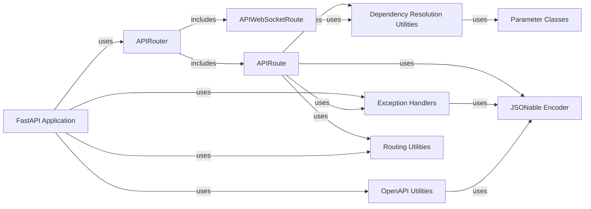

## Component Details

The FastAPI application core orchestrates the initialization, configuration, and routing of API endpoints. It leverages APIRouter for modular route management, APIRoute and APIWebSocketRoute for defining individual endpoints, and Dependency Resolution Utilities for managing dependencies. Exception Handlers provide default error responses, while OpenAPI Utilities generate the API schema. The JSONable Encoder ensures data compatibility, and Routing Utilities handle request and response processing. This system allows for a structured and efficient way to build and manage APIs.

### FastAPI Application
The FastAPI class is the core of the framework. It's responsible for creating the application instance, setting up routes, handling events, and generating the OpenAPI schema. It uses APIRouter to organize routes and includes methods for defining API endpoints (get, post, put, delete, etc.).
- **Related Classes/Methods**:

['[`fastapi.fastapi.applications.FastAPI:__init__` (64:964)](https://github.com/fastapi/fastapi/blob/master/fastapi/applications.py#L64-L964)', '[`fastapi.fastapi.applications.FastAPI:setup` (998:1049)](https://github.com/fastapi/fastapi/blob/master/fastapi/applications.py#L998-L1049)', '[`fastapi.fastapi.applications.FastAPI:add_api_route` (1056:1113)](https://github.com/fastapi/fastapi/blob/master/fastapi/applications.py#L1056-L1113)', '[`fastapi.fastapi.applications.FastAPI:api_route` (1115:1173)](https://github.com/fastapi/fastapi/blob/master/fastapi/applications.py#L1115-L1173)', '[`fastapi.fastapi.applications.FastAPI:add_api_websocket_route` (1175:1188)](https://github.com/fastapi/fastapi/blob/master/fastapi/applications.py#L1175-L1188)', '[`fastapi.fastapi.applications.FastAPI:websocket` (1190:1253)](https://github.com/fastapi/fastapi/blob/master/fastapi/applications.py#L1190-L1253)', '[`fastapi.fastapi.applications.FastAPI:include_router` (1255:1458)](https://github.com/fastapi/fastapi/blob/master/fastapi/applications.py#L1255-L1458)', '[`fastapi.fastapi.applications.FastAPI:on_event` (4476:4495)](https://github.com/fastapi/fastapi/blob/master/fastapi/applications.py#L4476-L4495)', '[`fastapi.fastapi.applications.FastAPI:openapi` (966:996)](https://github.com/fastapi/fastapi/blob/master/fastapi/applications.py#L966-L996)']

### APIRouter
The APIRouter class is used to create modular sets of routes. It allows grouping related API endpoints and including them in the main FastAPI application. It handles adding routes, including other routers, and managing events.
- **Related Classes/Methods**:

['[`fastapi.fastapi.routing.APIRouter:__init__` (622:860)](https://github.com/fastapi/fastapi/blob/master/fastapi/routing.py#L622-L860)', '[`fastapi.fastapi.routing.APIRouter:add_api_route` (881:961)](https://github.com/fastapi/fastapi/blob/master/fastapi/routing.py#L881-L961)', '[`fastapi.fastapi.routing.APIRouter:api_route` (963:1023)](https://github.com/fastapi/fastapi/blob/master/fastapi/routing.py#L963-L1023)', '[`fastapi.fastapi.routing.APIRouter:add_api_websocket_route` (1025:1044)](https://github.com/fastapi/fastapi/blob/master/fastapi/routing.py#L1025-L1044)', '[`fastapi.fastapi.routing.APIRouter:websocket` (1046:1111)](https://github.com/fastapi/fastapi/blob/master/fastapi/routing.py#L1046-L1111)', '[`fastapi.fastapi.routing.APIRouter:include_router` (1122:1364)](https://github.com/fastapi/fastapi/blob/master/fastapi/routing.py#L1122-L1364)']

### APIRoute
The APIRoute class represents a single API endpoint. It's responsible for defining the route's path, HTTP methods, endpoint function, and dependencies. It also handles request validation and response serialization.
- **Related Classes/Methods**:

['[`fastapi.fastapi.routing.APIRoute:__init__` (429:569)](https://github.com/fastapi/fastapi/blob/master/fastapi/routing.py#L429-L569)', '[`fastapi.fastapi.routing.APIRoute:get_route_handler` (571:586)](https://github.com/fastapi/fastapi/blob/master/fastapi/routing.py#L571-L586)']

### APIWebSocketRoute
The APIWebSocketRoute class represents a WebSocket endpoint. It handles WebSocket connections, manages dependencies, and executes the endpoint function.
- **Related Classes/Methods**:

['[`fastapi.fastapi.routing.APIWebSocketRoute:__init__` (389:419)](https://github.com/fastapi/fastapi/blob/master/fastapi/routing.py#L389-L419)']

### Dependency Resolution Utilities
The `fastapi.dependencies.utils` module provides utilities for resolving dependencies. It includes functions for analyzing parameters, solving dependencies, and injecting dependencies into endpoint functions. It interacts with the parameter classes (Path, Query, Body, etc.) and security utilities.
- **Related Classes/Methods**:

['[`fastapi.fastapi.dependencies.utils:get_dependant` (265:314)](https://github.com/fastapi/fastapi/blob/master/fastapi/dependencies/utils.py#L265-L314)', '[`fastapi.fastapi.dependencies.utils:solve_dependencies` (572:695)](https://github.com/fastapi/fastapi/blob/master/fastapi/dependencies/utils.py#L572-L695)']

### Parameter Classes
The `fastapi.params` module defines classes for different types of parameters (Path, Query, Header, Cookie, Body, Form, File, Depends, Security). These classes are used to declare parameters in endpoint functions and provide metadata for request validation and OpenAPI schema generation.
- **Related Classes/Methods**:

['[`fastapi.fastapi.params.Path:__init__` (142:222)](https://github.com/fastapi/fastapi/blob/master/fastapi/params.py#L142-L222)', '[`fastapi.fastapi.params.Query:__init__` (228:306)](https://github.com/fastapi/fastapi/blob/master/fastapi/params.py#L228-L306)']

### Exception Handlers
The `fastapi.exception_handlers` module provides default exception handlers for HTTP exceptions, request validation errors, and WebSocket request validation errors. These handlers are used to return appropriate error responses to the client.
- **Related Classes/Methods**:

['[`fastapi.fastapi.exception_handlers:http_exception_handler` (11:17)](https://github.com/fastapi/fastapi/blob/master/fastapi/exception_handlers.py#L11-L17)', '[`fastapi.fastapi.exception_handlers:request_validation_exception_handler` (20:26)](https://github.com/fastapi/fastapi/blob/master/fastapi/exception_handlers.py#L20-L26)']

### OpenAPI Utilities
The `fastapi.openapi.utils` module provides utilities for generating the OpenAPI schema. It includes functions for extracting information from routes, generating operation IDs, and creating OpenAPI objects.
- **Related Classes/Methods**:

['[`fastapi.fastapi.openapi.utils:get_openapi` (477:569)](https://github.com/fastapi/fastapi/blob/master/fastapi/openapi/utils.py#L477-L569)']

### JSONable Encoder
The `fastapi.encoders.jsonable_encoder` function is used to convert Python objects into JSON-compatible data types. It handles various data types, including datetime objects, UUIDs, and Pydantic models.
- **Related Classes/Methods**:

['[`fastapi.fastapi.encoders:jsonable_encoder` (102:343)](https://github.com/fastapi/fastapi/blob/master/fastapi/encoders.py#L102-L343)']

### Routing Utilities
The `fastapi.routing` module provides utilities for handling request and response processing. It includes functions for preparing response content and serializing responses.
- **Related Classes/Methods**:

['[`fastapi.fastapi.routing:_prepare_response_content` (79:123)](https://github.com/fastapi/fastapi/blob/master/fastapi/routing.py#L79-L123)', '[`fastapi.fastapi.routing:serialize_response` (143:201)](https://github.com/fastapi/fastapi/blob/master/fastapi/routing.py#L143-L201)']