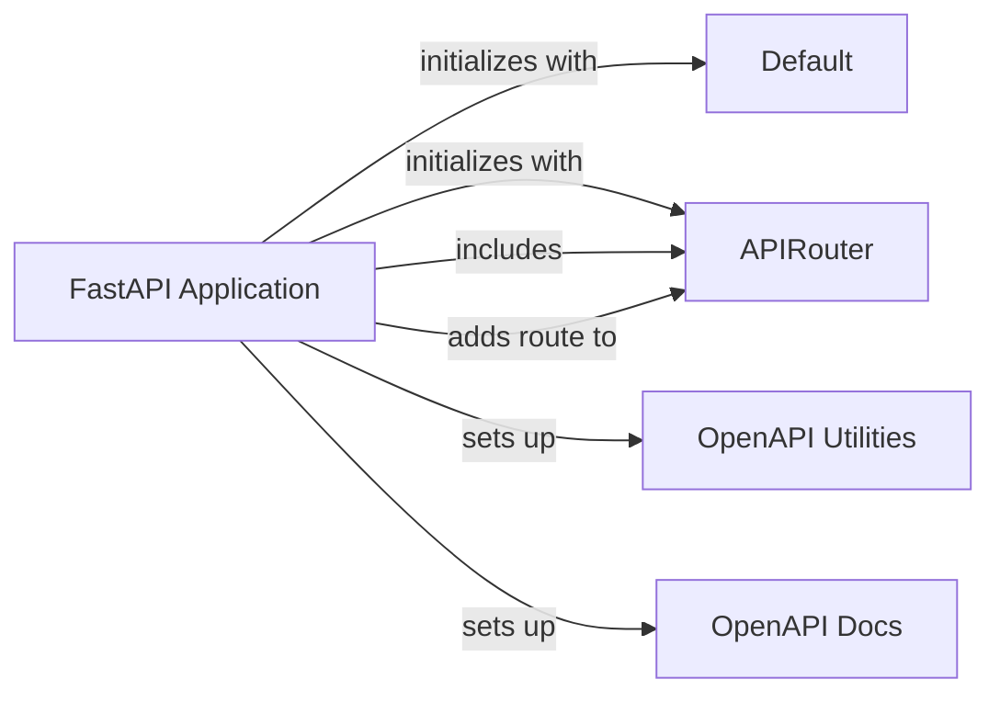

## Component Details

The FastAPI application serves as the central orchestrator for the API. It initializes the application, configures middleware, sets up exception handlers, and manages the overall lifecycle of the API. It integrates various components like routers, OpenAPI utilities, and data structures to handle requests, generate API documentation, and ensure proper data handling. The application's lifecycle events, such as startup and shutdown, are also managed within this core component.

### FastAPI Application
The core of the FastAPI framework, responsible for creating the API application, handling routes, and managing the application's lifecycle. It initializes the API with configurations, sets up the OpenAPI schema, and provides methods for adding routes and handling events.
- **Related Classes/Methods**:

- <a href="https://github.com/fastapi/fastapi/blob/master/fastapi/applications.py#L64-L964" target="_blank" rel="noopener noreferrer">`fastapi.fastapi.applications.FastAPI:__init__` (64:964)</a>
- <a href="https://github.com/fastapi/fastapi/blob/master/fastapi/applications.py#L998-L1049" target="_blank" rel="noopener noreferrer">`fastapi.fastapi.applications.FastAPI:setup` (998:1049)</a>
- <a href="https://github.com/fastapi/fastapi/blob/master/fastapi/applications.py#L1056-L1113" target="_blank" rel="noopener noreferrer">`fastapi.fastapi.applications.FastAPI:add_api_route` (1056:1113)</a>
- <a href="https://github.com/fastapi/fastapi/blob/master/fastapi/applications.py#L1115-L1173" target="_blank" rel="noopener noreferrer">`fastapi.fastapi.applications.FastAPI:api_route` (1115:1173)</a>
- <a href="https://github.com/fastapi/fastapi/blob/master/fastapi/applications.py#L1175-L1188" target="_blank" rel="noopener noreferrer">`fastapi.fastapi.applications.FastAPI:add_api_websocket_route` (1175:1188)</a>
- <a href="https://github.com/fastapi/fastapi/blob/master/fastapi/applications.py#L1190-L1253" target="_blank" rel="noopener noreferrer">`fastapi.fastapi.applications.FastAPI:websocket` (1190:1253)</a>
- <a href="https://github.com/fastapi/fastapi/blob/master/fastapi/applications.py#L1255-L1458" target="_blank" rel="noopener noreferrer">`fastapi.fastapi.applications.FastAPI:include_router` (1255:1458)</a>
- <a href="https://github.com/fastapi/fastapi/blob/master/fastapi/applications.py#L4476-L4495" target="_blank" rel="noopener noreferrer">`fastapi.fastapi.applications.FastAPI:on_event` (4476:4495)</a>
- <a href="https://github.com/fastapi/fastapi/blob/master/fastapi/applications.py#L966-L996" target="_blank" rel="noopener noreferrer">`fastapi.fastapi.applications.FastAPI:openapi` (966:996)</a>

### APIRouter
Used to create modular sets of routes, grouping related endpoints together and including them in the main FastAPI application. It handles adding routes for different HTTP methods and managing event handlers.
- **Related Classes/Methods**:

- <a href="https://github.com/fastapi/fastapi/blob/master/fastapi/routing.py#L595-L4439" target="_blank" rel="noopener noreferrer">`fastapi.routing.APIRouter` (595:4439)</a>
- <a href="https://github.com/fastapi/fastapi/blob/master/fastapi/routing.py#L881-L961" target="_blank" rel="noopener noreferrer">`fastapi.routing.APIRouter.add_api_route` (881:961)</a>
- <a href="https://github.com/fastapi/fastapi/blob/master/fastapi/routing.py#L1025-L1044" target="_blank" rel="noopener noreferrer">`fastapi.routing.APIRouter.add_api_websocket_route` (1025:1044)</a>
- <a href="https://github.com/fastapi/fastapi/blob/master/fastapi/routing.py#L1122-L1364" target="_blank" rel="noopener noreferrer">`fastapi.routing.APIRouter.include_router` (1122:1364)</a>
- <a href="https://github.com/fastapi/fastapi/blob/master/fastapi/routing.py#L4415-L4439" target="_blank" rel="noopener noreferrer">`fastapi.routing.APIRouter.on_event` (4415:4439)</a>

### Default
A sentinel value used to indicate that a parameter has not been explicitly set. This allows FastAPI to differentiate between a parameter that has been set to `None` and one that has not been provided at all, enabling default values to be applied correctly.
- **Related Classes/Methods**:

- <a href="https://github.com/fastapi/fastapi/blob/master/fastapi/datastructures.py#L197-L204" target="_blank" rel="noopener noreferrer">`fastapi.datastructures.Default` (197:204)</a>

### OpenAPI Utilities
Responsible for generating the OpenAPI schema for the FastAPI application. It gathers information about the defined routes, request/response models, and other API configurations to create a comprehensive specification that can be used for documentation and API exploration.
- **Related Classes/Methods**:

- <a href="https://github.com/fastapi/fastapi/blob/master/fastapi/openapi/utils.py#L477-L569" target="_blank" rel="noopener noreferrer">`fastapi.openapi.utils.get_openapi` (477:569)</a>

### OpenAPI Docs
Provides the HTML for the interactive API documentation (Swagger UI and ReDoc). It includes functions to generate the HTML pages, handle OAuth2 redirects, and customize the appearance of the documentation.
- **Related Classes/Methods**:

- <a href="https://github.com/fastapi/fastapi/blob/master/fastapi/openapi/docs.py#L26-L158" target="_blank" rel="noopener noreferrer">`fastapi.openapi.docs.get_swagger_ui_html` (26:158)</a>
- <a href="https://github.com/fastapi/fastapi/blob/master/fastapi/openapi/docs.py#L256-L344" target="_blank" rel="noopener noreferrer">`fastapi.openapi.docs.get_swagger_ui_oauth2_redirect_html` (256:344)</a>
- <a href="https://github.com/fastapi/fastapi/blob/master/fastapi/openapi/docs.py#L161-L253" target="_blank" rel="noopener noreferrer">`fastapi.openapi.docs.get_redoc_html` (161:253)</a>