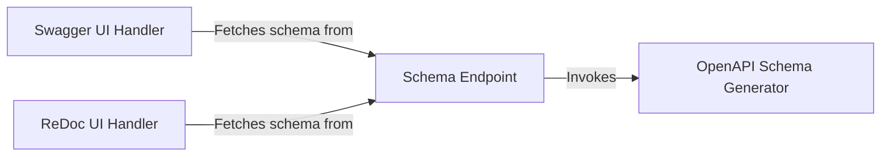

## Details

One paragraph explaining the functionality which is represented by this graph. What the main flow is and what is its purpose.

### OpenAPI Schema Generator
The central engine responsible for creating the OpenAPI specification. It introspects the application's APIRoute objects to analyze paths, HTTP methods, and parameters. It also converts Pydantic models used in requests and responses into their corresponding JSON Schema representations, which are embedded within the final OpenAPI document.

**Related Classes/Methods**:

- `fastapi/openapi/utils.py`

### Schema Endpoint
An API endpoint, typically /openapi.json, that serves the generated OpenAPI schema. When a request is made to this endpoint, it calls the OpenAPI Schema Generator and returns the resulting schema as a JSON response.

**Related Classes/Methods**:

- `fastapi/applications.py`

### Swagger UI Handler
A request handler that serves a complete HTML page rendering the Swagger UI. The page includes all necessary CSS and JavaScript assets and is configured to make a client-side request to the Schema Endpoint to fetch the API definition for rendering.

**Related Classes/Methods**:

- `fastapi/openapi/docs.py`

### ReDoc UI Handler
A request handler that serves a complete HTML page rendering the ReDoc documentation interface. Similar to the Swagger handler, its client-side code is configured to fetch the API definition from the Schema Endpoint.

**Related Classes/Methods**:

- `fastapi/openapi/docs.py`

### [FAQ](https://github.com/CodeBoarding/GeneratedOnBoardings/tree/main?tab=readme-ov-file#faq)