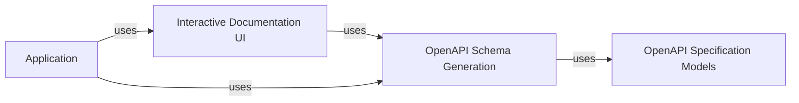

## Details

The `API Documentation & Schema Generation` subsystem in FastAPI is fundamental for creating self-documenting APIs, a key feature for modern web frameworks. It leverages the OpenAPI specification to provide both machine-readable API schemas and human-friendly interactive documentation.

### OpenAPI Specification Models
This component defines the data structures (Pydantic models) that strictly adhere to the OpenAPI Specification. These models are the backbone for constructing the OpenAPI document, ensuring its validity and adherence to the standard. They represent various elements of an API, such as paths, operations, parameters, schemas, and security schemes.

**Related Classes/Methods**:

- <a href="https://github.com/fastapi/fastapi/fastapi/openapi/models.py#L0-L0" target="_blank" rel="noopener noreferrer">`fastapi/openapi/models.py` (0:0)</a>

### OpenAPI Schema Generation
This component is responsible for dynamically generating the OpenAPI JSON schema for the entire API. It introspects the defined routes, parameters, request bodies, responses, and security schemes within a FastAPI application. It uses the `OpenAPI Specification Models` to build a comprehensive OpenAPI document that describes the API's surface.

**Related Classes/Methods**:

- <a href="https://github.com/fastapi/fastapi/fastapi/openapi/utils.py#L0-L0" target="_blank" rel="noopener noreferrer">`fastapi/openapi/utils.py` (0:0)</a>

### Interactive Documentation UI
This component provides the built-in interactive documentation user interfaces, primarily Swagger UI and ReDoc. It serves the necessary HTML, CSS, and JavaScript assets to render these UIs. These UIs then consume the OpenAPI JSON schema generated by the `OpenAPI Schema Generation` component, allowing developers to explore API endpoints, understand their parameters, and even test them directly in the browser.

**Related Classes/Methods**:

- <a href="https://github.com/fastapi/fastapi/fastapi/openapi/docs.py#L0-L0" target="_blank" rel="noopener noreferrer">`fastapi/openapi/docs.py` (0:0)</a>

### Application
The main FastAPI application instance that orchestrates and uses the API documentation and schema generation components.

**Related Classes/Methods**: _None_

### [FAQ](https://github.com/CodeBoarding/GeneratedOnBoardings/tree/main?tab=readme-ov-file#faq)